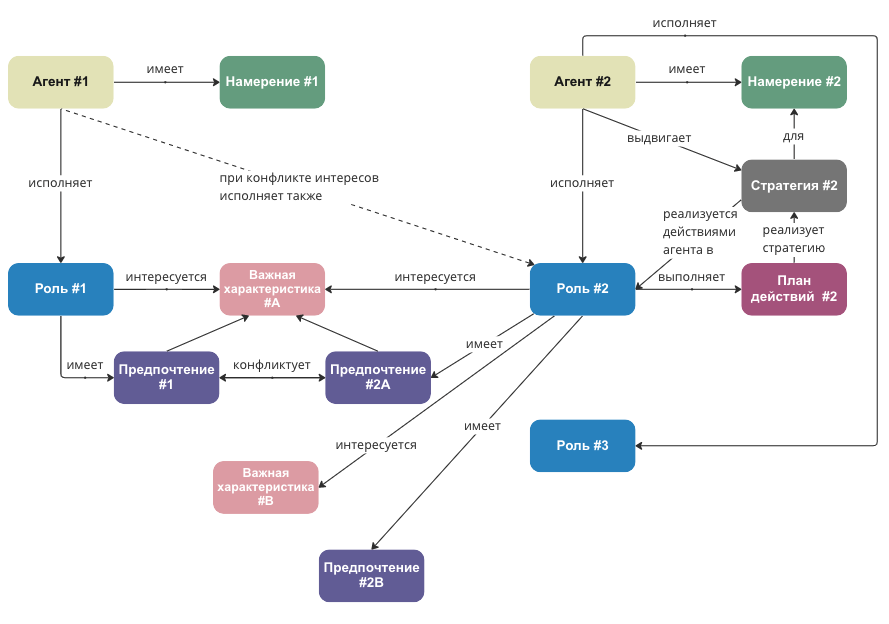

# Аннотирование типами

Существуют разные способы моделирования ситуаций. Графические представления визуально привлекательны, но даже самые простые ситуации моделировать совершенно не эффективно.[^1] Вот пример попытки такого моделирования:

Для Агента #1 добавляем его намерение, проектную роль, важную характеристику и предпочтение. Затем тоже самое делаем для второго агента. Добавление каждого следующего агента будет кратно усложнять нашу схему. И если учесть, что схема нам нужна не статическая, а динамическая (роли и предпочтения будут меняться в ходе развития ситуации), очень быстро мы запутаемся. А ведь мы только начали моделирование и ещё указали далеко не все объекты внимания, за которыми нам нужно следить.

В моделировании нам нужно учесть все важные объекты, касающиеся ситуации. И чтобы не обсуждать каждый объект в отдельности, не вводить для него свой уникальный метод рассуждения, мы *типизируем* объекты. Это помогает нам понимать, какие операции с объектом можно делать, а какие нельзя.

Какой способ моделирования сложных ситуаций использовать?

Всё моделирование мы проводим либо в текстовом, либо в табличном виде. Типов объектов сильно меньше, чем самих объектов, поэтому при табличном моделировании мы задаём типы в заголовках столбцов, а объекты указываются и описываются в ячеях.

В текстовом моделировании тип мы обозначаем значком “::” (два двоеточия). В обычной речи это или "тип объекта" — "агент Игорь", или "объект-тип" — "Игорь-агент". В жизни мы часто опускаем обозначения типа — мы не говорим "система самолёт", но для уточнения коммуникации такая типизация будет полезной. При моделировании мы используем такой синтаксис:

| Игорь::агент продавец::роль |
| --- |

Если объект и тип названы несколькими словами, то тогда значение типа и/или объекта берём в скобки:

| (Лариса Борисовна)::(учитель английского языка) |
| --- |

Главное для каждого объекта разобраться с его типом. Системное мышление (и все остальные виды мышления) — это способ управлять вниманием в сложной ситуации, чтобы найти объекты, для которых удобно обсуждать причинно-следственные связи, удобно строить объяснения. Если вы нашли в жизни какую-то роль, то ищите и агента, а если нашли агента, то должны найти роль.

Когда нашли роль, у этой роли просто обязаны быть какие-то предметы интереса (беспокоящие роль важные характеристики), в которых роль будет иметь свои предпочтения. То есть нашли продавца::роль, значит должен быть Некто::исполнитель роли/агент/актёр. Если есть "продавец", то у него ищем предмет интереса (цена) и предпочтение (цена должна быть повыше). Дальше можно уже выдвигать свои стратегии и строить реализующие их планы. Например, искать вторую роль у агента (Игоря, играющего роль продавца) и находить конфликт интересов, приводящий к возможным скидкам, или идти искать другого продавца, или предлагать сотрудничество (обнаружить, что нужно по таким ценам у Игоря не покупать, а становиться его дилером и бросать свой предыдущий проект, то есть выходить из одной своей роли, а то и проекта, и реализовывать совсем другую стратегию).

[^1]: Читайте подробнее об этом в докладе "Визуальное мышление" https://ridero.ru/books/vizualnoe_myshlenie
