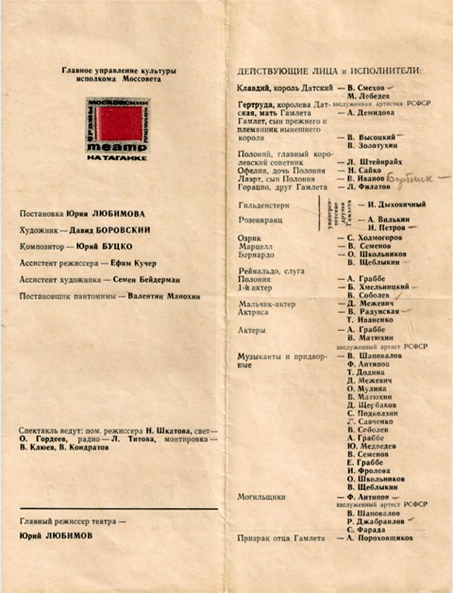

# Театральная метафора

Проще всего обсуждать деятельностный метод как театральную пьесу, которую разыгрывают по ролям в разных театрах. Несмотря на огромную разницу в интерпретации этих ролей актёрами и режиссёрами в разных театрах, или даже в одном театре в разные дни, есть огромный смысл обсуждать сами пьесы ("методологическую действительность" — нечто общее, типовое), а не только их отдельные исполнения ("операционную действительность отдельных исполнений работ на дату исполнения").

Театральная метафора сравнивает деятельность с пьесой, задаваемой сценарием этой пьесы. Сценарий состоит из перечисления действий разных ролей. Пьеса играется много раз, деятельность повторяется много раз — хотя каждое исполнение пьесы и каждое действие в чём-то уникальны, но мышление экономится за счёт "выноса за скобки" всего того, что повторяемо, и знание принципов освобождает от знания фактов.

Театральная программка содержит важнейшую информацию: "действующие лица и исполнители".

Действующие лица — это вдумчивый Принц Гамлет и безумная Офелия. У них есть своё назначение в пьесе, это ролевые/функциональные объекты.

Исполнители — это весёлый актёр-стажёр Вася Пупкин в утренних спектаклях и мрачный народный артист Василий Петрович Черезколеноногузадерищенский в вечерних спектаклях, оба играющие Принца Гамлета, плюс педантичная Елена Ефимовна во всех спектаклях, и она не болеет и не замещается. Исполнители — физические объекты, это люди, играющие роли в пьесе-проекте. Мышление тут то же самое, что про микроскоп или молоток, которые играют роли или гвоздезабивального устройства. Физические/конструктивные объекты играют роли функциональных объектов. Люди играют роли, роли — это функциональные объекты. Действующие лица — это функциональные объекты.

На момент исполнения роли Принц Гамлет и Вася Пупкин это один и тот же объект — ролевой и физический объект, которые занимают в пространстве-времени одно и то же место. Но мы всё-таки не должны их путать: Принц Гамлет существует только во время спектакля, когда Вася Пупкин играет его роль. А Вася Пупкин существует независимо от этого, и нас мало волнует Вася Пупкин, когда он чихает или звонит по телефону подруге — это не Принц Гамлет чихает и звонит по телефону, это Вася Пупкин в других ролях.

У Принца Гамлета (у роли) свои предметы интересов и интересы в них — его волнует вопрос "быть, или не быть?". И у него есть предпочтение в характеристике состояния "быть" перед состоянием не быть" по отношению к себе как системе. Он действует, исходя из этого предпочтения. Принц Гамлет::роль действует, а не Вася Пупкин::актёр, и не Василий Петрович Черезколеноногузадерищенский. Действуют не люди, а люди-в-ролях, действуют проектные роли! А люди? Люди действуют только играя роли! Если Вася Пупкин заболел, то это не Принц Гамлет заболел, но это Вася Пупкин стал играть роль пациента в проекте его лечения. И лечат пациента (Васю Пупкина, играющего роль пациента), а не Принца Гамлета. "Пациент" — это имя роли в “пьесе”/типе проекта "лечение".

В системном мышлении, когда говорим о ролях, то всегда имеем в виду действующее лицо — Принца Гамлета, роль, функциональный объект, и мы рассматриваем поведение человека как игру его ролей в деятельности-пьесе, то есть поведение человека-в-роли. Нам нужно научиться воспринимать сначала роль, и уже потом исполнителя роли — человека-актёра.

| Знание принципов освобождает от знания множества фактов |
| --- |

Огромное достижение цивилизации в том, что роли культурно-обусловлены, они знакомы многим людям, и при необходимости мы можем потребовать заменить актёра-исполнителя (безвестного Пупкина на талантливого народного артиста Черезколеноногузадерищенского), но мы не можем потребовать заменить действующее лицо: вместо Принца Гамлета вдруг потребовать вставить в пьесу Бармалея и Бэтмена.

Про "игру по роли", например, инженера-программиста, преподавателя физкультуры, врача-окулиста и т.д., написаны учебники, а исполнители/агенты привносят в них собственное творческое видение.
