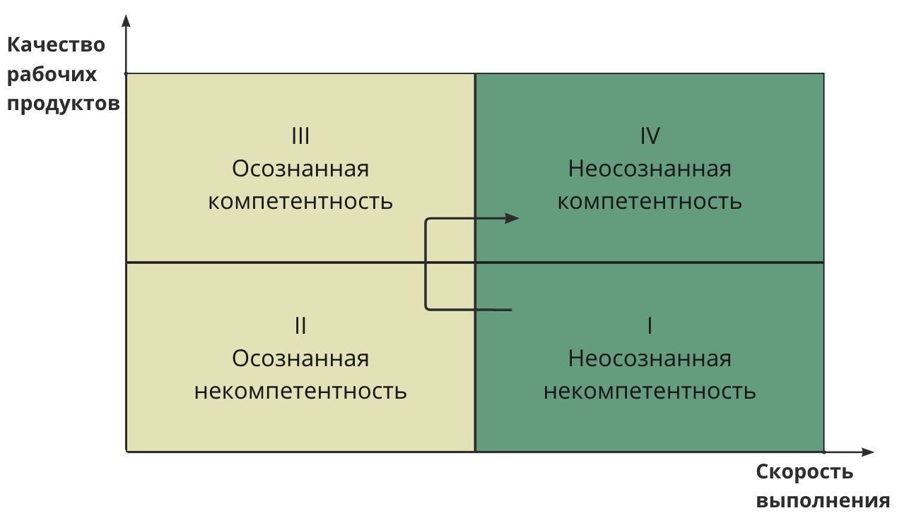

# Роль — метод — рабочий продукт

Чтобы не путаться со словом "проект", значения которого могут пониматься разными людьми совершенно по-разному, мы вводим понятие "**система создания**" — человек или команда, действия которой согласованы для изменения какой-то части мира, реализации какой-то цели — системы, которая будет удовлетворять потребности различных стейкхолдеров. Так вот под проектом мы будем понимать работу *систем создания*.

Понятие метода нам нужно для того, чтобы говорить о формальном описании действий проектных ролей в рамках проекта. Проектные роли действуют по методу, и для создания рабочих продуктов, в ходе проекта каждая роль использует множество разных методов.

Существуют роли, например, бухгалтера, стоматолога, инженера, маркетолога и т.д. и их методы, соответственно — бухгалтерии, стоматологии, инженерии, маркетинга и т.д. Люди изучают прикладные методы, чтобы эффективнее создавать рабочие продукты — некий описанный и согласованный результат работы одного или нескольких исполнителей в определённых ролях.

| <u>Исполнитель</u> | <u>Роль</u> | <u>Метод</u> | <u>Рабочий продукт</u> |
| --- | --- | --- | --- |
| Игорь | Архитектор | Проектирование | Эскизный проект |
| Оксана | UX-дизайнер | Прототипирование | Концепция использования |

Обсуждение метода первично — если не знаешь, как ты будешь работать, то ничего про саму работу сказать нельзя. Например, скрепить две детали — каким методом? Если не знаешь, это сварка, склейка, болтовое соединение, то и как работать неизвестно. Поэтому метод (функциональное рассмотрение поведения) обсуждается всегда логически сначала. Работа — всегда логически потом, потому что это конструктивное рассмотрение (на поведение назначается актор). Метод и работа итеративно “утрясаются”, чтобы удовлетворять условиям доступности в проекте, экономической эффективности и прочим *архитектурным характеристикам*.

Под архитектурными характеристиками понимаются основные характеристики системы, изменение которых влияют на большое число факторов. Например, тип двигателя автомобиля — электро и внутреннего сгорания — это архитектурная характеристика. Она влияет на конструктивное устройство автомобиля как такового.

Метод роли в проекте — это не любое поведение, а выполняющееся по дисциплине — по учебникам, на которые можно сослаться, по правилам, которые можно обсудить. Наличие такого обоснования обеспечивает возможность проверить, скорректировать и исправить результат работы по методу — рабочий продукт — если он был получен "как-то", непонятно как. Кроме того, в учебниках/стандартах/статьях экспертов дополнительно указываются типичные ошибки применения метода. Эти ошибки можно избежать при первом же использовании метода, для этого надо следовать "инструкции", а не действовать наобум.

Можно говорить о "профессиональном исполнении метода", имея в виду качественное выполнение работы по методу, уровень мастерства. Например, музыкант-дилетант может по вдохновению выиграть какой-нибудь конкурс, но его мастерство нестабильно: на следующий день он сыграет плохо, "нет вдохновения". У профессионала всегда будет достигнут какой-то результат, даже в самых неблагоприятных условиях, он не будет делать новичковых ошибок, его работа стабильна. Профессиональный музыкант с больной головой и проблемами в семье, сидя на неудобном стуле отыграет какой-то концерт, а хоть и "на троечку", а вот дилетант в таких условиях часто вообще ничего не сможет сыграть. Так что профессионализм — это "про людей", а "методы" — это про то, что нужно делать.

Например, метод подготовки презентаций. Презентации готовят очень многие люди, мастерство какого-то уровня по подготовке презентаций есть у всех них, но отнюдь не все они готовы считать себя профессиональными “презентаторами".

| Тип двигателя — архитектурная характеристика автомобиля. |
| --- |

Чтобы применить метод в проекте, его надо сначала изучить и поставить. Для обсуждения постановки метод можно применить модель "квадрата компетенций".

**4 стадии квадрата компетенций**

Эта модель осознанности в постановке и применении (какого бы то ни было) метода представляет из себя стадии, где на вертикальной оси шкалы показано качество рабочих продуктов: от низкого к высокому. На горизонтальной — скорость применения метода (выполнения работ): от медленного к быстрому.

- **I Неосознанная некомпетентность**. Исполнитель роли делает "что-то" быстро, но качество рабочих продуктов, получаемых при помощи этого "что-то", низкое, либо рабочий продукт отсутствует совсем. Например, мы описываем концепцию использования продукта на основе наших собственных представлений, или в принципе затрудняемся составить вменяемое описание. На этой стадии нет понимания, что для получения рабочего продукта можно применить какой-то метод, который уже описана в учебниках и стандартах. Для перехода на следующую стадию нужно столкнуться с проблемой низкого качества рабочего продукта и/или узнать о существовании соответствующих методов.
- **II Осознанная некомпетентность**. Стадия постановки метода: исполнитель роли ищет, выбирает и начинает применять метод, чтобы получить более качественный рабочий продукт. На этой стадии качество рабочего продукта будет лучше, чем нафантазированный ("я так вижу"), но пока в нём будут встречаться недочёты. Скорость выдачи рабочих продуктов снижается, так как исполнителю нужно задумываться над каждым шагом.
- **III Осознанная компетентность**. Стадия тренировки мастерства: повышается качество рабочего продукта за счёт того, что исполнитель не забывает ключевых характеристики использования метода и знает, на какие особенности при использовании нужно обратить внимание. Кроме того, повышается скорость выдачи рабочих продуктов, но не исключены паузы для проверки собственных действий и консультаций.
- **IV Неосознанная компетентность**. Стадия шлифовки мастерства и с минимальным участием сознания. Исполнитель выдаёт рабочие продукты "с закрытыми глазами": быстро и качественно. Выполнение метода бессознательно по заранее известным правилам. На этой стадии метод максимально автоматизируется, пишутся инструкции и скрипты/плагины, автоматизирующие отдельные действия.

Сегодня в инженерной литературе кроме "метод" говорят "процесс" (process) или "way of working" для подчёркивания возможности управления работами. Также часто про метод говорят "деятельность" (activity или action) или даже более узкое "труд", когда речь идёт о выполнении работ каким-то методом ролями, исполнители которых обладают какими-то предметными (domain) компетенциями в сфере человеческой деятельности (инженерия, менеджмент, инвестиции и технологическое предпринимательство, здравоохранение, правоохрана, культурное строительство, политическое переустройство общества, и т.д). По этой терминологической традиции инженерные методы называют "инженерной деятельностью", метод управления конфигурацией называют "деятельностью по управлению конфигурацией".

Хотя слова "метод" и "профессия" близки, обсуждать метод удобней. Неправильно говорить, что это "профессии", потому как речь идёт об умении (компетенции или мастерстве) человека действовать в условиях реальных проектов, а не именно "работать по профессии". Понятие "профессии" сейчас быстро меняется, и мы избегаем говорить о профессии как пожизненном занятии в какой-то сфере — человек просто овладевает мастерством многочисленных методов.
