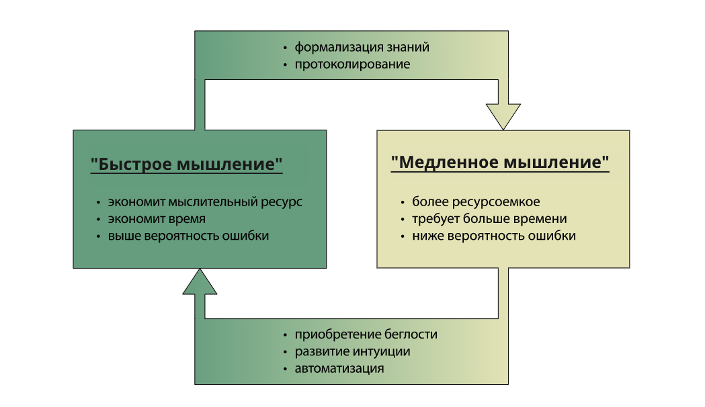

# Ролевое мастерство

В театральной деятельности человек учится актерскому мастерству, аналогичное мастерство в жизни мы будем называть **ролевым мастерством**. Оказывается, так же, как актер учиться играть разные роли, можно научиться видеть роли в жизни, быстро учиться им и уметь переключаться между ними.

| Я – совокупность всех ролей |
| --- |

Человека можно представить как совокупность ролей, которые он играет. Внимание к разным своим ролям помогает разбираться в сложных ситуациях в работе или жизни в целом. Различение человека и играемой роли означает, что человек может входить в роль, выходить из одной роли и переходить в другую. Также человек может застревать в роли и вовремя не переключаться на другие роли. Например, думает о работе перед сном или просматривает ленту соцсети на семейном обеде.

Вхождение в роль и переключение между ролями требует отдельного мастерства. Для этого нужно "доставать из своего я" требуемую роль. Важно вовремя менять роли исходя из контекста ситуации и следить за качеством исполнения ролей. Качественное исполнение ролей повышает шансы на устранение неудовлетворенностей и дарит радостные переживания. Именно ролевое мастерство призвано управляться с многочисленными ролями и позволяет получать потоковые переживания от игры по роли.

Ролевое мастерство присутствует у каждого человека, ведь мы так или иначе перестраиваемся из роли в роль. С возрастом и опытом это мастерство повышается практически у каждого. Однако выделяя ролевое мастерство как объект внимания, вы можете быстрее добиться результатов, которые даёт ролевое мастерство. Ролевое мастерство является необходимым условием для того, чтобы человек быстрее:

- **вписывался в новые проекты** и разбирался в сложных жизненных ситуациях;
- **достигал состояния потока** в новых ролях.

**Что значит вписываться в различные проекты и как это делать быстрее остальных?**

**Имея развитое ролевое мастерство, человек видит в людях исполнителей ролей, которые они играют.** Соблюдение культуры поведения, знание этики и морали — это неотъемлемые качества любого командного игрока, и когда он приходит в новую команду, то именно ролевое мастерство помогает отделять людей от ролей, а соответственно коммуницировать не только уважительно и с эмпатией, но и понимать профессиональные интересы проектных ролей, в которых находятся представители команды. С помощью деятельного кругозора идентифицируются ролевые поведения людей в проекте и выявляются используемые этими ролями методы.

**Достижение потока является важной задачей ролевого мастерства**. Ролевая осознанность помогает в ситуациях дискомфорта или стресса. В таких случаях необходимо абстрагироваться от стрессовой ситуации, определить задействованные роли и выбрать лучший метод для последующих действий. Через исполнение роли удовлетворяются человеческие потребности. Одни неудовлетворенности устраняются в процессе исполнения роли, а другие — за счёт получаемого результата. Ролевое мастерство помогает быстрее доходить до состояния потока в новой деятельности, при этом тратить меньше усилий и времени. А вот за итоговый результат (рабочий продукт) отвечает прикладное мастерство. Например, ролевое мастерство может помочь с тем, чтобы вы быстрее начали плавать в бассейне в состоянии потока и тем самым получать удовольствие. А вот за результаты (время, рекорды, победы) отвечает прикладное мастерство пловца кролем.

**Основные методы ролевого мастерства это:**

- Выявление ролей;
- Выбор личных ролей;
- Вход и выход из роли;
- Самоконтроль (ролевая осознанность).

К деятельностному кругозору относятся знания различных предметных областей и трансдисциплин. Освоение ролевого мастерства может быть рассмотрено в соответствии с моделью спектра формальности мышления (см. ниже). Сначала изучаются дисциплины методов ролевого мастерства и расширяется деятельностный кругозор, а затем за счёт тренировок на реальных жизненных ситуациях эти знания переводятся в левый спектр мышления. Таким образом ролевое мастерство доводится до уровня автоматизма. Примерно так происходит неосознанное развитие ролевого мастерства. Но так как оно происходит неосознанно, то люди не выделяют его как специальный объект внимания и поэтому не влияют на постановку ролевого мастерства, чтобы ускорить процесс постановки или улучшить ролевое мастерство сознательно. Потому обучение ролевому мастерству происходит долго, а полученный навык сложно переносится из одной профессиональной области в другую.

**Спектр формальности мышления**

На примере квадрата компетенций, который мы рассматривали в Разделе #2, можно описать осознанное обучение методу и скорость его освоения. Эта скорость обусловлена способностью нашего мозга, которую объяснил нобелевский лауреат 2002 года по поведенческой экономике Даниэль Канеман в своей книге "Думай медленно, решай быстро".[^1]

Канеман вводит понятия двух режимов работы мышления:

- **S1** — быстрое, автоматическое, неосознанное мышление. Используется когда мы что-то делаем "на автомате": или какие-то привычные, регулярные действия (например, чистка зубов и весь утренний моцион), или какие-то "поспешные" реакции, "плохие автоматизмы" (например, даём комментарий не рассмотрев ситуацию с разных сторон). Этому режиму соответствует I и IV квадранты компетенций.[^2]
- **S2** — медленное, вдумчивое мышление. Используется когда мы не торопимся с выводами, потому что не можем (например, при умножении двузначных чисел в уме) или сознательно даём себе время подумать, потому что "успели" сообразить, что поспешный вывод гарантированно даст более худший исход. Этому режиму соответствует II и III квадранты компетенций.

**Перенос знаний из одной части спектра в другую:**

Для постановки ролевого мастерства, как и для постановки любого прикладного мастерства, необходима собранность, и мастерство собранности ставится отдельно.[^3]

**Ролевое мастерство**

Ролевое мастерство неспроста относится к мыслительному мастерству и помогает осваивать и играть разные проектные роли. **Ролевое мастерство – это проявление интеллекта**. Интеллект задействуется в выборе подходящей роли так, чтобы учесть множество разных интересов. Человек попадает в разные ситуации, в которых от него требуются определенные действия. В большинстве случаев интеллект не задействуется, а действия совершаются исходя из рефлексов, опыта или интуитивно. Нам необходимо осознанно определять нужные роли.

**Ролевое мастерство — необходимое условие для разбирательства с новыми ситуациями**. Но чтобы легко вписываться в новые проекты, одного ролевого мастерства недостаточно. Чтобы совмещать разные интересы и работать с предпочтениями и намерениями многочисленных проектных ролей необходимо системное мышление и знание всех фундаментальных методов мышления интеллект-стека.[^4]

Ролевое мастерство помогает обращать внимание на то, как определенные роли влияют на наше психологическое состояние. **Исполнение некоторых ролей приводит к негативному аспекту, и нам это нужно улавливать, и менять исполняемые роли соответственно.** Здесь ролевое мастерство опирается на психопрактики собранности и посредством самонаблюдения за исполнением роли позволяет обращать внимание на негативные эмоции от исполнения роли. Некоторые исполняемые роли не приносят нам удовлетворенности, поэтому важно это осознавать, и стараться изменить свое поведение.

С другой стороны, нельзя смешивать внутренние ощущения человека и те эмоции, которые не свойственны при исполнении роли. Например, человек может волноваться перед сложным разговором, но как менеджер он должен тембром голоса, жестами, мимикой сопровождать свою речь по роли. **Передаваемое волнение от человека к исполняемой роли – это плохое ролевое мастерство**. Поэтому разделяем эмоции человека как исполнителя роли и отдельно эмоции человека от исполнения роли.

**Знание конкретной роли не входит в ролевое мастерство**. Этим нужно заниматься отдельно, учить отдельно конкретный прикладной метод. Здесь подходит аналогия с актёром. Актёрское мастерство помогает человеку-актёру передать эмоции: правильно сыграть царя, Петрушку или Гамлета. Актер понимает, как падает свет, как держать внимание зрителя и т.п. А вот разучиванием поведения и текста по роли царя, Петрушки или Гамлета надо заниматься отдельно. Поэтому различаем знание конкретной проектной роли и ролевое мастерство.

Ролевое мастерство позволяет управляться с многочисленными ролями, которые играет человек, в том числе быстрее достигать состояния потока в новых ролях. Ролевое мастерство относится к мыслительному мастерству (интеллекту), оно помогает быстрее разбираться в новых ситуациях, осваивать и играть проектные роли.

[^1]: https://www.litres.ru/book/dumay-medlenno-reshay-bystro-6444517
[^2]: см. Раздел 2
[^3]: см. курс "Моделирование и собранность" https://system-school.ru/1-org-dev
[^4]: https://aisystant.system-school.ru/lk/#/course/practical-systems-thinking/2025-05-19T1258/67882
