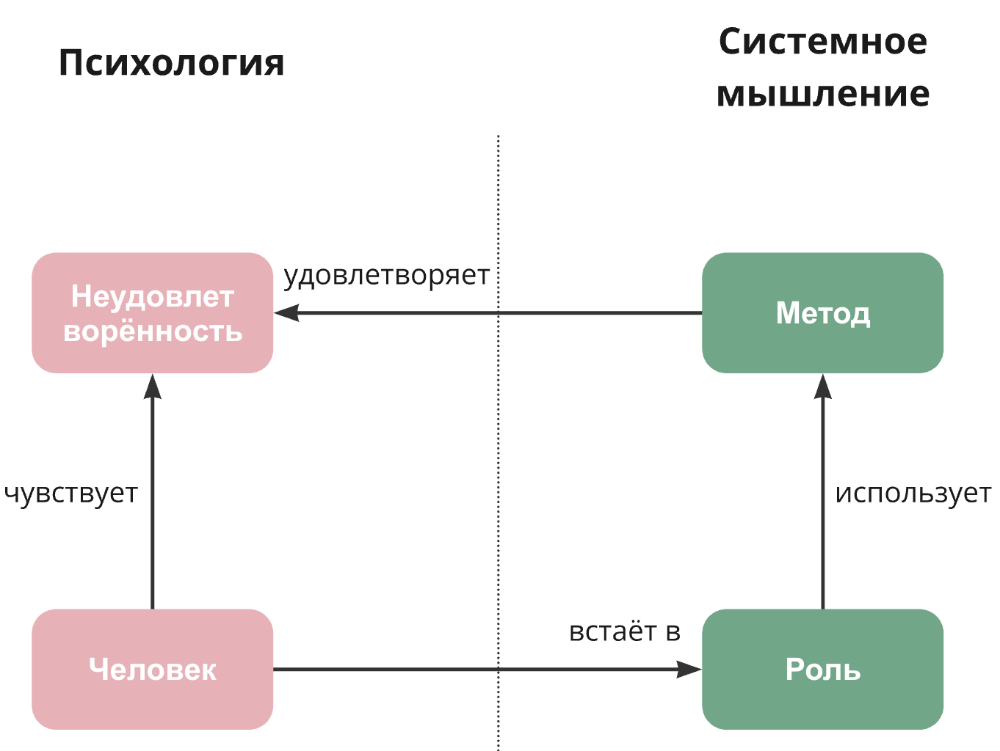

# Эмоции и личные предпочтения

**Мастерство эмоционального соответствия**

Чувства — это индикатор состояния человека. Мастерство *эмоционального соответствия* помогает навести внимание на чувства, описать их, отслеживать их изменение, а также влиять на испытываемые чувства. Благодаря проявлению чувств можно оценить, на сколько хорошо мы играем ту или иную роль, закрывая ту или иную неудовлетворённость. Например, когда человек недоволен, что не может позволить себе купить что-то необходимое, то он может навести своё внимание на ощущение недовольства, и через него выявить неудовлетворённость своим доходом. После чего он сможет сознательно выбрать роль финансиста, поискать книги на эту тему и применить практику личных финансов для избавления от неудовлетворенности.

Если неудовлетворенность доходом уменьшается, а вместо радости человек чувствует какое-то негативное чувство — раздражение или беспокойство, нужно разбираться на уровне изменения жизни. Избавиться от неудовлетворенности доходом на уровне моментального или фокусного внимания невозможно.[^1] Чувства должны побуждать к действию направленному на решение неудовлетворённости, то есть на занятие определённых ролей для исполнения. Если игра по роли определённым методом приносит радость, то человек будет более мотивирован роль исполнять и будет быстрее избавляться от неудовлетворенностей. И наоборот, если исполнение роли не вызывает радости, то и исполнение будет хуже, а значит надо разбираться в причинах негативных ощущений и менять роль или минимизировать её присутствие в жизни.

Чувства выступают топливом для действий, они дают толчок к тому, чтобы быстрее вставать в роль, лучше её исполнять. Решение о действии (о выборе роли) должно приниматься рационально на основании логики. Это позволит минимизировать глупые и обидные ошибки. Чувства подкрепленные логикой дают необходимый "запал", мотивацию начать и продолжать действовать на всех уровнях внимания.

Таким образом, чувства важны на протяжении всего цикла работы с неудовлетворенностями: на стадиях выявления и описания неудовлетворенностей, описания разультата в момент, когда неудовлетворённостей нет, поиска ролей, выполнения ролевых методов, оценки результатов и дальнейшего направления инвестирования времени.

В зависимости от наведения внимания на определённый уровень чувства могут быть более или менее интенсивными: острые, яркие в моменте и привычные, часто неартикулируемые продолжительные.[^2]

**Тревога**

Рассмотрим некоторые негативные чувства, мешающие игре по роли, одно из которых сегодня — **тревога**. Мир меняется слишком стремительно и драматически: три года назад никто не мог представить ковидные ограничения и постковидные изменения, когда одни индустрии пострадали (например, туризм), а другие резко выросли (например, доставка). Или война, которая ещё острее переживается большим количеством людей. Многим пришлось переехать, кто-то потерял работу. Люди чувствуют тревогу и беспокойство за свое будущее, они потеряли уверенность в том, что завтра у них всё будет хорошо.

Кто-то ещё не готов осознать это, но в предстоящие годы мир будет меняться ещё активнее, уже из-за технологий: в результате активного развития ИИ старые роли вроде "водителя автомобиля" будут массово отмирать и становиться нишевыми, "для любителей" (как виниловые пластинки). Одновременно будет появляться много видов занятости, которые не существовали раньше.

Осознание грядущих изменений не способствуют "естественному" успокоению тревоги. Для того, чтобы "найти себя" огромному количеству людей придется быстро переобучаться, чтобы оставаться конкурентоспособными на рынке труда. Для этого им придется понять, чему и как учиться.

Самопросвещение, как способ повышения информированности о том, что происходит с вашей ролью в мире, помогают снизить тревогу. Это относится и к эпизодически исполняемым ролям, например, (пассажир самолёта)::роль.[^3] Для самопросвещения можно воспользоваться практикой формирования ленты новостей.[^4]

Тревога тесно связана со страхом, который может возникать из-за неумения сориентироваться в новой ситуации. Например, если человек никогда не играл роль оратора и не выступал публично на сцене, то в первый раз ему будет страшно, потому что нужно сыграть непривычную роль. Однако, если он продолжит исполнять эту роль в течение какого-то времени, например, на уровне привычки, то страх уйдет.

Страх также может быть и полезен. Например, он сигнализирует об опасности или проблеме исполнения какой-то роли. Кроме того, страх может помочь мобилизовать ресурсы организма для решения проблемы. Например, если человек боится высоты, то при приближении к краю неограждённого балкона страх заставит отпрянуть, а мозг — сделает это быстро за счёт мобилизации ресурсов. Таким образом человек избежит падения с высоты.

Если вы боитесь что-то делать, стоит навести внимание на страх и выявить его причины. Не всегда страх сигнализирует об опасности в физическом мире; он может быть связан с ментальными картинами мира. Например, если вам страшно начинать новый проект или бизнес, потому что "у меня никогда не получится, хотя я хочу", "как воспримут это окружающие" и тому подобное. Это одна ситуация, и с такими представлениями нужно разбираться отдельно — проверять их на соответствие (адекватность) физическому миру. А если вы решили продать единственное жильё для запуска бизнеса, и страх связан с оценкой риска, ситуация совершенно другая, и страх служит полезным предохранителем от небезопасных действий, которые могут привести к ухудшению качества жизни.

**Депрессия**

Второе по распространённости психическое расстройство после тревожности является **депрессия**. Если это не следствие физических болезней, она является естественной реакцией организма на запредельный стресс или глубоко травмирующую ситуацию, то есть на несоответствие картин мира человека и окружающей его реальности. Депрессия может возникнуть, например, в среднем возрасте, когда происходит сверка неудовлетворенностей и накопленного жизненного мастерства — желания никуда не делись, но есть понимание, что многие возможности безвозвратно упущены.

Кто-то пытается лечить депрессию алкоголем, но если употребление алкоголя рассмотреть как на метод, то можно удостовериться, что это не выход.[^5] Если у человека нет психических отклонений, его поведение должно быть логичным — то есть искать решение нужно "не там, где светло, а там где потерял".

Внешние и внутренние проявления депрессии у каждого разные, и мы не будем углубляться в диагностирование, разбирать клинические случаи. Как и любое поведение вследствие каких-то факторов мы рекомендуем рассматривать инженерно — определить рабочий продукт, который вызывает неудовлетворённость, связать его с методом, который используется для реализации этого продукта, выявить роль, которая использует данный метод. Эта цепочка — "рабочий_продукт-метод-роль" — мощнейший инструмент в решении неудовлетворённостей.

**Гнев и злость**

Гнев или злость мы часто испытываем в моменте и реже на протяжении длительного времени. Эти чувства обычно связаны с провалами в коммуникации, когда собеседники не просто не договорились, а поссорились. Также гнев и злость чувствуют из-за того, что собеседник отказывается играть предпочитаемую вами роль из-за расхождения ожидания и реальности — вы ошиблись в своём планировании ситуации, так как не учли интересы других ролей. Справиться с гневом и злостью можно, если выпустить их на волю контролируемо — подальше от других людей или перенаправить в деятельность. Злость, испытываемую из-за того, что что-то не получается, можно использовать как топливо для изменения ситуации — использования других методов или выбора других ролей.

**Состояние потока**

Радость, как состояние **оптимального переживания** или **потока** описывается разными людьми похоже: пловец, переплывший Ла-Манш, и шахматист, выигравший важный поединок, используют аналогичные слова для рассказа об испытанных ими чувствах. В своей книге Михай Чиксентмихайи выделил 8 компонентов радости, способствующих достижению состояния потока в деятельности.[^6] Приведу не дословную интерпретацию:

- **Задача должна быть посильной**

Любой сложный проект или задача должны быть поделены на части, выполнение которой уже приблизит вас к выполнению всей задачи целиком. Если вам сложно начать читать учебник по часу в день ("слон") или писать (а затем публиковать) посты, начните действовать маленькими шагами. Читайте по полчаса ("кусочек"), но каждый день! Другие полчаса уделите решению домашнего задания. Для постов сначала делайте заметки, а потом их систематизируйте в более полное изложение. Ваш мозг сопротивляется новому, помогите себе. Сложная деятельность не будет такой казаться, если вы разобьёте её на части.

| — Как съесть целого слона? — По кусочку за один раз. |
| --- |

- **Окружающая обстановка не мешает сосредоточиться на работе над задачей**

До начала задачи необходимо создать обстановку, которая будет способствовать минимизации отвлечений, убрать все отвлекающие факторы, чтобы во внимании остались только объекты необходимые для решения задачи — на исполнении метода роли.

Чтобы повысить эффективность решения задачи за компьютером, нужно до начала выполнения задачи настроить рабочую среду, например, закрыть все вкладки браузера кроме тех, нужных для решения задачи. Ведь отвлечься очень просто, и за компьютером внимание рассеивается гораздо быстрее: кажется, ответить кому-то в мессенджере или прочитать новость, ничего не стоит. На самом деле в этот момент мы переключаем контекст, и вернуться в сосредоточенное состояние может быть сложно, не говоря уж о том, что зачастую мы не останавливаемся на одном сообщении или новости.

Важно отслеживать свои отвлечения, ловить себя за руку на желании отвлечься и возвращаться к выполнению задачи. Даже если задача рутинная и бытовая, для достижения концентрации важно испытывать интерес к задаче или постараться вызвать его у себя.

- **Цели достижения результата должны быть сформулированы**

Если непонятно, что и для чего вы делаете, то задача будет делаться медленно и некачественно. Вам не обязательно иметь четкое представление результата и не отклоняться от него ни на миллиметр, но общее представление должно быть. Например, если вы хотите поставить мышление письмом, то представьте, как этот метод поможет вам решить задачи в текущих или будущих проектах, в которых вы собираетесь участвовать, или которые вы только собираетесь запустить. Сформулируйте их в виде целей (рабочих продуктов), определите какими методами вы будете их реализовывать. Нужно ли вам научиться новым методам или будете использовать те, мастерством которых уже владеете? Возвращайтесь к этому рассуждению раз в неделю, и когда вы почувствуете приближение к цели, вы ощутите радость от того, что вам удалось что-то сделать, получить результат (рабочий продукт).

- **Мгновенный отклик о выполнении задачи**

В процессе выполнения задачи человеку необходимо получать обратную связь. Чем быстрее и чаще вы будете получать такой отклик, тем более мотивированы вы будете. Можете заметить по себе, регулярно выполнять какую-то рутинную задачу и не получать хотя бы "спасибо" очень выматывает.

Также скоростью отклика вы можете стимулировать выполнение задач, которые вы поручаете. Кроме роли менеджера для постановки задачи вам нужно не забывать о ролях ментора и лидера — двигаться к цели гораздо проще, когда ваши шаги замечают и корректируют движение.

Некоторым людям важно получать позитивное подкрепление за выполненение задач чаще. Для этого можно мельче декомпозировать задачи. Например, если вы пишите статью на несколько десятков тысяч знаков, промежуточными рабочими продуктами могут быть: структура статьи, основные тезисы статьи, раздел #1, раздел #2 и т.д.

- **"Пусть весь мир подождёт"**

Мы постоянно находимся в каком-то контексте: бытовые дела и проблемы, семейные заботы, беспокойства о чём-то не сделанном. Если во втором пункте речь шла об объектах, которые непосредственно находятся в поле вашего внимания, здесь речь идёт о необходимости отключиться от "всего мира". Мир вокруг никуда не исчезает, просто вы перестаёте о нём думать во время решения конкретной задачи. Она единственное, что вас беспокоит в данный момент, и ей одной уделено ваше внимание.

В творческой сфере подобное состояние называется вдохновением, но аналогичные ощущения мы можем переживать вне зависимости от исполняемой роли.

- **Чувство контроля над ситуацией без страха его потерять**

Мы можем наблюдать это состояние в ситуациях, когда вы наслаждаетесь процессом и нет давления показать высокий результат. Чаще это можно наблюдать во время досуга, а не работы — профессиональный игрок в футбол и любитель будут по-разному переживать игру. Если вы играете с друзьями, вы можете быть расслабленным и получать удовольствие — для вас нет необходимости доказывать свою результативность.

Об ощущении контроля над ситуацией рассказывают те, кто занимается экстремальными видами спорта вроде скалолазания, альпинизма, дайвинга, гонок. В таких ситуациях значительно повышается риск получить травму, но так как перед занятиями люди проходят специальный инструктаж, тщательно изучают возможные факторы негативно влияющие на ситуацию и стараются минимизировать ошибки, в результате ощущают ещё большую радость от победы над сложностью.

Мы подчеркиваем важность изучения и постановки мастерства определённого метода.

- **Состояние потока затмевает беспокойство о собственном благополучии**

Десятки ролей, которые мы играем в жизни имеют свои предпочтения в основном направленные на наше благополучие в разных временных масштабах. Когда мы погружены в задачу, все они становятся фоном и перестают нас беспокоить.

Когда над задачей мы работаем не в одиночку, мы ощущаем единение с другими наравне с погружённостью в задачу. Например, во время совместной настольной игры с друзьями или семьёй, или во время брейншторма с командой на работе. Наша активность не прерывается тревожными размышлениями о повседневных заботах; потоку способствует чувство безопасности, так как решаемая задача нам ясна, наших компетенций хватает для её решения, при этом ощущение любопытства и новизны помогают нам оставаться в потоке.

По завершению такой активности повышается самооценка и можно острее почувствовать уверенность в собственных, так как во время переживания потока мы максимально использовали свои навыки и способности и испытываем чувство выполненного долга и удовлетворение от применённого мастерства.

- **Теряется счёт времени**

Наше ощущение времени всегда субъективно, и наше внимание с отсчёта времени переключается на деятельность, в которую мы погружены. Иногда мы удивляемся, как пролетел рабочий день или даже месяц; это означает, что мы были увлечены своей деятельностью и провели это время с достаточным уровнем внутреннего комфорта.

Для переживания оптимального опыта каждый из этих элементов необходимо изучить отдельно. Мы кратко рассмотрели их, чтобы сопоставить инженерный подход к деятельности (работая по методу роли) с ментальным опытом. Описывая поток мы объединили рациональное использование метода с эмоциональной "подпиткой". Сочетание всех этих элементов требует особых усилий, но именно оно способствует оптимальному переживанию, и в нашей деятельности мы можем рассчитывать и на получение более высоких результатов, и на удовлетворение связанное и с результатом, с процессом.

Важно увеличивать число потоковых переживаний, создавать условия для его появления и отслеживать, как именно вам удаётся достигать этого состояния. Это позволит вам развить ваше жизненное мастерство и чувствовать большую удовлетворённость от жизни.

[^1]: читайте об уровнях внимания в курсе "Системное саморазвитие" https://aisystant.system-school.ru/lk/#/course/intro-online-2021/2021-08-15/903
[^2]: см. курс "Системное саморазвитие" https://aisystant.system-school.ru/lk/#/course/intro-online-2021/2025-03-11T1212/61499
[^3]: https://dzen.ru/media/denokan/boeing-737max-mogli-li-piloty-spravitsia-5d3d19aefc69ab00ae32ad36
[^4]: https://systemsworld.club/t/topic/2180
[^5]: https://systemsworld.club/t/topic/3392
[^6]: https://www.litres.ru/book/potok-psihologiya-optimalnogo-perezhivaniya-4244565
