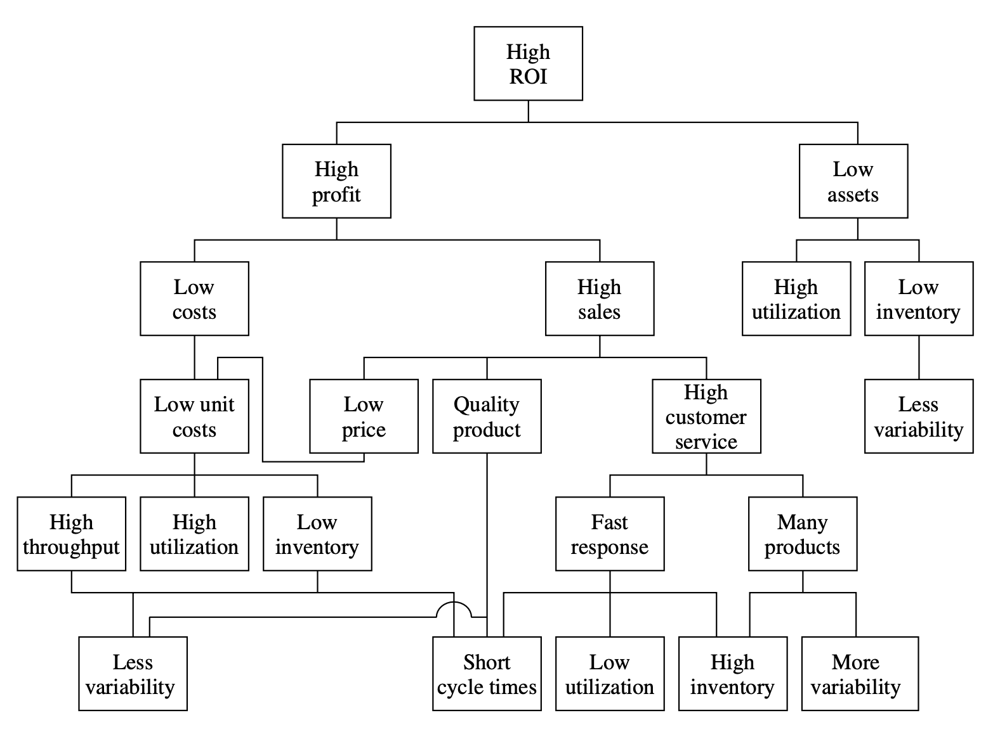

# R4.1:1 - Подготовка к составлению модели: ситуация моделирования

Получив навыки онтологического моделирования, мы можем теперь вернуться к теме моделирования деятельности предприятия, которой мы много занимались в резидентурах R1 и R2, дойдя до моделей путешествия объектов через предприятия. Теперь попробуем уточнить и расширить прикладную онтологию, необходимую для моделирования потоков работ в организации.

Как вы теперь знаете, к составлению модели необходимо подготовиться, в первую очередь эта подготовка состоит в выборе и описании ***метода моделирования***. Напомним чек-лист для описания метода моделирования:

1. Описана ситуация моделирования: ***что*** и ***зачем*** моделировать.
2. Определены ***предметные роли*** для всех ***ситуационных ролей*** (кто выступает *заказчиком* и *адресатом* описания, *автор* описания – это вы). Определены их *интересы*.
3. Выделены основные ***объекты описания***. По ним определен *уровень абстракции* требуемого описания (*индивиды*, *узкие классы*, *широкие классы*).
4. Определен ***вид описания***: будет ли оно использовано только *для чтения* или это *шаблон (форма) для заполнения*.
5. Выбрана ***модальность описания***, определен *формат* (*форматы*) и *язык* описания, выбран инструментарий – *моделер* или несколько моделеров для разных частей описания.
6. Определено, как обычно называются такие описания в *выбранной предметной области*.
7. Описание *озаглавлено*,
8. Определена ***детальность описания***, зафиксировано число *уровней детализации,* определен состав объектов на всех нужных уровнях.
9. Выбрана (или разработана) ***мета-С онтология*** в объёме, необходимом для формирования нужных классификаторов и справочников объектов.
10. Определено, как вы будете ***именовать объекты***.
11. Определено, какие ***признаки*** и ***свойства*** объектов вам необходимо указать в описании.
12. Выбраны виды ***отношений между объектами***, которые должны быть включены в описание.

Начнём с ситуации моделирования для моделирования предприятия. Любая организация существует чтобы реализовать какую-то **цель**. Коммерческие организации существуют, чтобы приносить собственникам *возврат на инвестиции* (*Return on Investment, ROI*) или, в долгосрочном периоде, получать *возврат на активы* (*Return on Assets, ROA*).

ROI = Прибыль / Инвестиции

ROA = Прибыль / Активы

Прибыль = Выручка – Затраты

Чтобы обеспечить возврат на инвестиции, требуются долгосрочная прибыльность и положительный денежный поток. При положительном (и растущем) денежном потоке компания может распределить больше прибыли собственникам, при этом растущая прибыль обычно хорошо оценивается рынком, поэтому растёт и стоимость доли бизнеса, принадлежащей собственнику (и эту долю можно продать по более высокой цене). То есть, предприятие как актив приносит больше денег и становится более ценным.

Менеджеры/управленцы компании должны обеспечить высокий возврат на инвестиции и/или на активы, для этого можно повышать выручки, и/или минимизировать затраты, и/или минимизировать количество используемых компанией активов (замороженный капитал). При этом менеджерам неизбежно придётся столкнуться с необходимостью делать выбор и идти на многочисленные *компромиссы/trade-offs,* как показано на картинке ниже. Например, нет способа *одновременно*:

- Иметь широкую *продуктовую линейку* и низкую *изменчивость/variability* производства: скорость выпуска большого количества разных продуктов будет варьироваться, качество будет варьироваться, время выполнения работ по разным методам – тоже. Количество возможных изменений в широкой продуктовой линейке (из которых часть может оказаться и слегка вредными) растёт, сложность растёт, количество ресурсов, которые требуются, чтобы справиться со сложностью, растёт.
- Обеспечивать высокую *скорость обратной связи* по производственной цепочке (от ответов покупателям и до обратной связи сотрудникам по выполненным заданиям) и высокую *загрузку каждого создателя/рабочей станции или производственной линии*: чтобы всегда быстро реагировать, рабочая станция должна быть недозагружена, тогда задача «*ответить (клиенту, сотруднику, поставщику и т.п.)*» попадёт в начало очереди быстро и быстро будет взята в работу. Если другой работы много, задача дать ответ будет взята в работу позже.

Как видно на той же картинке, конфликтов при принятии менеджерских решений обнаруживается множество. При этом, согласно *теореме об отсутствии бесплатных обедов/no free lunch theorem*[^1], нет единого универсального алгоритма, который сделает за вас выбор и разрешит конфликт наилучшим способом во всех возможных ситуациях. Выбирать методы и решать задачу придётся каждый раз самостоятельно, с учётом обстоятельств, а также решений, принятых ранее. Конфликты неизбежны, они являются движущим фактором эволюции и от них невозможно избавиться; можно лишь выбрать, в каком порядке искать компромиссы, чем жертвовать больше.

С конфликтами сталкивается любой менеджер. Но исполнители разных менеджерских ролей, использующие разные методы для управления предприятием, будут решать их по-разному.

Мы выделяем 4 основных класса менеджерских ролей, используя более общую типологию ролей из системной инженерии[^2]. В таблице ниже проиллюстрировано соответствие ролей в системном менеджменте ролям в системной инженерии (жирным выделены наиболее широкие классы ролей). Это пример того, как культурно-обусловленные названия в мета-модели прикладной предметной области соответствуют объектам более фундаментальной мета-мета-модели.

| **Роли в системном менеджменте** |  | **Роли в системной инженерии** |
| --- | --- | --- |
| **Бизнесмен, Стратег** |  | **Визионер/visionary** |
| **Орг-архитектор** |  | **Архитектор/architect** |
| **Организатор** |  | **Разработчик/developer** |
| Орг-проектировщик | Лидер |   |
| **Операционный менеджер** |  | **Оператор/operator** |
| **Администратор** |  | **Инженер платформы разработки** |

1. **Бизнесмен/инвестор**, который применяет методы воздействия на *прибыльность бизнеса*, а также **стратег**, который выбирает направление деятельности предприятия (эти две *разные* роли - аналоги ***визионера*** в системной инженерии).
2. **Организационный архитектор**, который применяет методы воздействия на *организационную архитектуру* предприятия (аналог ***архитектора*** в системной инженерии).
3. **Организатор,** который непосредственно *создаёт/организует предприятие* в рамках *архитектуры предприятия* (аналоги ***разработчика/developer*** в системной инженерии).
4. **Администратор**, который применяет методы администрирования для обеспечения работы предприятия (аналог ***инженера платформы разработки*** в системной инженерии).

Исполнители каждой из этих ролей видят и разрешают описанные выше конфликты по-разному.

***Бизнесмен**/**инвестор*** определяет, какая именно *организация* ему нужна как собственнику. Для бизнесмена *его* вещь *(«его система»* в терминологии системного мышления[^3]) – это *организация в целом*, и он решает, насколько ему выгодно ею владеть, а также когда выгоднее прекратить права владения и избавиться от организации (продать её). Также он определяет, в организацию какого типа/класса он вложится (купит). Бизнесмен для принятия решения об участии в капитале организации оценивает её бизнес-модель в целом.

Например, будет ли это компания, которая продаёт массовые дешёвые товары ежедневного потребления, например, моющие средства в розницу (см пример российский компании «БиоМикроГели», продающей средства под брендом Wonder Lab[^4])? Или сосредоточится на компаниях, которые продают дорогие товары небольшими партиями (см пример компании Holland&Holland, которая производит несколько десятков очень дорогих охотничих ружей в год[^5]).

Бизнес-модель компании накладывает ограничения на возможные варианты архитектуры и организационной структуры предприятия, а также на варианты его эксплуатации.

Например, компания «БиоМикроГели» должна иметь достаточно низкие затраты на производство одного моющего средства и высокие продажи, соответственно, выпускать как можно больше единиц товара за период времени. В то же время компания Holland&Holland будет тратить на производство и персонализацию ружья под будущего владельца больше денег, для чего нужно будет нанять штучных специалистов и удлинить потоковое время/Flow Time/Cycle Time при производстве.

***Стратег*** является визионером не в отношении самой компании, как бизнесмен, а в отношении *продуктов компании*. То есть, он определяет (а чаще – угадывает), что именно нужно выпускать, чтобы это было нужно рынку, продавалось и приносило прибыль.

Например, на первом этапе развития компании «БиоМикроГели» надо было найти продукт, который можно выгодно продавать на рынке. Для этого они сосредоточились на производстве экологических моющих средств, которые продавали клининговым компаниям Екатеринбурга[^6], и лишь после этого стали работать с розничными сетями[^7]. Нынешняя стратегия – развивать как B2C, так и B2B направления бизнеса, а также очистка вод от разливов нефти[^8]. Компания Holland&Holland после Второй мировой войны испытывала проблемы, однако стратеги компании нашли выход – сосредоточились на продаже ружей на новые рынки (в США, Индию и Европу)[^9]. На сегодняшний день компания продаёт не только ружья, но и одежду для охоты[^10] – это тоже стратегия компании.

Стратег применяет *метод/практику стратегирования* и создает стратегию, определяющую в наиболее общем виде методы работы компании с учетом ограничений бизнес-модели.

***Организаторы*** (в первую очередь ***орг-дизайнер/орг-проектировщик***) проектируют, строят и изменяют организацию: описывают, кто именно (какие роли) будет выполнять нужные для достижения цели методы (то есть решают, какие функциональные объекты нужны), а затем - какие физические объекты (организационные единицы) потенциально могут исполнить нужные роли/выполнить нужные функции. На языке системной инженерии – определяют так называемые *«подходяшки»/аффордансы/affordances*[^11].

Тем самым орг-дизайнер делает функциональную модель предприятия (какие функциональные объекты есть, какие методы применяются, каковы результаты), а потом описывает конструктивную модель (какие физические объекты выполняют описанные методы) и совмещает эти две модели, получая структуру организации. Кроме того, орг-дизайнер участвует в разработке *концепции использования* организации совместно с бизнесменом и стратегом: бизнесмен отвечает за принципиальный выбор бизнес-модели, стратег – за выбор цели (выпускаемой *вещи*) и основного метода её достижения (создания вещи). Орг-дизайнер при этом отвечает за описание набора методов, которые нужно применить *внутри организации*, чтобы выпустить наружу нужную *вещь*.

Это описание из *концепции использования организации* затем переходит в *концепцию организации* и там конкретизируется: уточняются и детализируются методы, выбираются оргзвенья/физические объекты, которые будут исполнять нужные роли.

Орг-дизайнеры компании «БиоМикроГели», например, описывают, что компании нужна собственная научная лаборатория для доработок формул моющих веществ, описывает, какие квалификации нужны для сотрудников научной лаборатории, и так далее. Орг-дизайнеру компании Holland&Holland нужно спроектировать производственную линию для выпуска одежды для охоты после того, как было принято стратегическое решение о выпуске такой одежды. Орг-дизайнеров в организации может быть много, практика/метод оргдизайна часто выполняется распределенно по организации. Методологи компаний «БиоМикроГели» и Holland&Holland будут описывать методы работы, работая в любом отделе организации, например, в маркетинге или на производстве.

В тесной связке с оргпроектировщиком/оргдизайнером работает ***организационный архитектор***. Он, в первую очередь, накладывает ограничения на *модульность организации*: описывает, какие физические модули будут выполнять работы по методам (совместно с орг-дизайнером), думает о том, как сделать эти модули более универсальными/(взаимо)заменяемыми, более надёжными и устойчивыми к неблагоприятным изменениям, какими они должны быть, чтобы они могли быстро и качественно эволюционировать. Вообще же орг-архитектора интересуют разнообразные *архитектурные характеристики* этих модулей, различные *«-ости»* (*надёжность, устойчивость, «эволюционируемость»/evolvability и т.д.*) и поддержка этих архитектурных характеристик, в том числе при помощи экзокортекса.

Если оргдизайнеру интересны функциональные физические объекты, то архитектору – материальные физические объекты и лёгкость замены одних материальных физических объектов на другие при сохранении выполняемой функции/метода.

Орг-архитектор компании «БиоМикроГели» будет думать, например, где разместить научную лабораторию, сколько вообще лабораторных модулей нужны организации, чтобы формулы веществ можно было разрабатывать наиболее быстро (возможно, таких модулей будет несколько, и они будут работать при производствах в разных странах[^12]), будет думать о создании цифрового двойника организации и о том, как при помощи этого двойника найти оптимальную модульную структуру предприятия. Орг-архитектор компании Holland&Holland будет выбирать место для размещения линии по выпуску одежды, как эта линия будет стыковаться с другими линиями, имеющимися у организации, как можно переиспользовать некоторые материальные физические объекты (например, сотрудников с уникальными квалификациями) в разных модулях, чтобы не переплачивать, и так далее. Кроме того, орг-архитекторы обеих компаний будут осуществлять надзор за исполнением своих решений со стороны исполнителей других ролей, например, ролей орг-проектировщика и администратора, операционного менеджера.

***Лидер*** – ещё одна роль из класса ролей *организатора*, занимающаяся изготовлением организации, используя модели, предоставленные орг-проектировщиком и орг-архитектором, а также бизнесменом и стратегом. Основной метод работы лидера – проводить в жизнь изменения (реализовывать проекты орг-развития), договаривая людей между собой так, чтобы они работали новыми для них методами и не сопротивлялись этому. Лидеры помогают исполнителям других менеджерских ролей изменить методы работы, катализируя сотрудничество. Лидерство – это всегда *про людей*: людей нужно подготовить к изменениям, их нужно уговорить не сопротивляться изменениям, уговорить работать новыми методами постоянно, а потом ещё и позаботиться о том, чтобы работа по новым методам стала привычной, и самоподдерживающейся (не в том смысле, что за ней не надо осуществлять надзор, а что люди-исполнители ролей привыкают работать новыми методами и сами начинают замечать и обдумывать ситуации, когда почему-то выполнили работы старыми методами).

Лидерам компании «БиоМикроГели» при расширении в 2018 году стали изготавливать собственную упаковку – то есть, требовалось собрать команду, которая будет этим заниматься, обучить сотрудников, и так далее. Лидеры компании Holland&Holland должны были позаботиться о том, чтобы сотрудники не саботировали создание нового направления работы бизнеса – продажу одежды для охоты.

Иногда лидерской практикой/методом называют только метод *уговаривания* людей на выполнение их ролей. Однако уговаривание – лишь подкласс лидерских методов, среди которых и обучение, и стимулирование, и личный пример. Также лидеру нужно сообщать орг-проектировщику о происходящих «*развалах конфигурации*»: ситуациях, когда реально выполняемые методы изменились, а концепции орг-проектировщика остались старыми. Лидерские практики/методы обычно выполняются не каким-то отдельным оргзвеном, а самыми разными исполнителями/оргзвеньями в организации. Даже если вы не являетесь по должности руководителем, то вы всё равно можете исполнить роль лидера, например, когда меняете методы подготовки ваших коллег ко встречам или методы планирования работ.

Лидер, меняя организацию, работает с теми людьми, которые в компании уже есть. Поставляет ему новых сотрудников ***администратор*** (служба кадров, HR). Деятельность ***администраторов*** этим не ограничивается: они в целом обеспечивают работу предприятия как работающей платформы, на базе которой орг-проектировщики и лидеры собирают «*операционный конвейер*», который будет эксплуатировать ***операционный менеджер***. Класс *методов администраторов* очень широкий, включает в себя такие методы/практики, как поставку сотрудников в организацию, обеспечение пригодных для работы помещений, зданий и сооружений, поставку материалов, обеспечивают соблюдение требований регулятора, ведут официальный документооборот, бухгалтерский и управленческий учёт, и т.д. Благодаря работе администраторов операционные команды, которые находятся в фокусе внимания орг-проектировщиков и операционных менеджеров, могут выполнять свои работы быстро и не отвлекаясь на техническое обеспечение этой работы. Когда работа администрации компании налажена хорошо, администраторов почти не видно и не слышно, но всё каким-то чудесным образом работает. Методы администрирования обычно исполняются в явном виде (в отличие от орг-архитектурных методов), вопрос лишь в качестве исполнения этих методов.

У компаний «БиоМикроГели» и Holland&Holland существуют службы HR, финансистов и бухгалтеров, и так далее.

Важно отметить: администраторы иногда забывают, что они участвуют в создании *вещи*, и что административные службы нужны именно для того, чтобы *вещь* можно было создать быстрее, лучше, с минимальным количеством усилий. А вот оптимизация работы администраторов - не является целью деятельности компании.

Полезно выделять отдельно и в явном виде роль ***методолога***, который моделирует методы предприятия на любом уровне компании. Он описывает методы, которые нужно применить, чтобы выбранная стратегия реализовалась. Чтобы методолог успешно выполнял свою работу, ему надо не только описывать методы и следить за качеством своих описаний, но и отслеживать, как именно применяются описанные им методы, чтобы описания не оторвались от реальной жизни. В отличие от орг-проектировщика, он не совмещает функциональные объекты и физические/конструктивные, а описывает в явном виде именно функции/методы, и затем сотрудничает с орг-проектировщиком, чтобы подобрать нужных исполнителей методов, и с лидером, чтобы обеспечить выполнение методов. Такое выделение роли методолога происходит из-за специализации/углубления разделения труда: появляется всё больше и больше действий, которые нужно выполнять методологу, рационально выделить отдельный функциональный объект (роль), который выполняет эти действия.

Методолог может описывать самые разные методы: например, сотрудник компании «БиоМикроГели», обычно исполняющий роль маркетолога, может выступить в роли методолога и отмоделировать метод изучения нового рынка. Также методологом может выступить целое подразделение или группа топ-менеджеров, совместно обсуждающая метод разработки износостойкой одежды для охоты в компании Holland&Holland.

Наконец, ***операционный менеджер*** *эксплуатирует* созданное предприятие, обеспечивая максимальную скорость выпуска/прохода работ по созданию вещей через организацию. При этом операционный менеджер работает в рамках ограничений, ограничениями, наложенных на его деятельность выборами бизнесмена, стратега, орг-проектировщика, орг-архитектора.

Если производственная линия в виде команды разработки работает медленно потому, что выбраны ненадлежащие методы работы, или методы работы не описаны - операционный менеджер (как роль!) не может это исправить, это требует применения других методов. Исполнитель роли операционного менеджера должен перевести своё внимание на исполнение роли лидера и объяснить сотруднику, например, разработчику, что будет меняться метод его работы, затем либо сам переключиться в роль орг-проектировщика и описать нужный метод совместно с будущим исполнителем этого метода, либо обратиться к другому агенту в роли орг-проектировщика. Затем кому-то в роли лидера нужно будет отслеживать, что теперь разработчик применяет новый описанный метод, а не работает старым. И уже тогда операционный менеджер сможет оценить, как смена метода отразилась на скорости выполнения работ разработчика.

Для качественного выполнения работ у операционного менеджера должна быть модель потоков работ, которая позволяет отследить скорость прохода/выпуска. Такая модель помогает прогнозировать сроки выпуска новой партии продукции или нового релиза, указать на ограничение, которое мешает поднять количество выпускаемых вещей за единицу времени (те указать, где искать причины проблем), а также оценить эффект от возможных оргизменений ещё до их старта. Таким образом, модель потоков работ обычно интересна исполнителям самых разных менеджерских ролей.

[^1]: https://en.wikipedia.org/wiki/No_free_lunch_theorem
[^2]: Подробнее об этом вы узнаете позже в руководствах «Методология», «Системная инженерия», «Системный менеджмент».
[^3]: Помним, что целевая вещь/целевая система для него – это вовсе не предприятие, а тот полезный объект, в создании которого предприятие участвует и которое используется за пределами предприятия.
[^4]: https://vc.ru/marketing/104247-ot-garazhnogo-proizvodstva-do-reitinga-luchshih-brendov-istoriya-uspeha-wonder-lab
[^5]: https://www.hollandandholland.com/
[^6]: https://sberbusiness.live/publications/spasti-planetu-i-zarabotat-istoriia-uchionykh-iz-ekaterinburga-sozdavshikh-proekt-biomikrogeli
[^7]: Работать с розничными сетями компанию подтолкнул кризис на рынке клининговых компаний. Однако не факт, что они смогли бы продавать сетям продукт без его первоначальной обкатки на более узком сегменте клиентов.
[^8]: https://ru.wikipedia.org/wiki/Biomicrogels_Group
[^9]: https://web.archive.org/web/20140318091459/http://www.hollandandholland.com/history.php
[^10]: https://www.hollandandholland.com/shop
[^11]: «Подходяшками» или аффордансами мы будем называть физические объекты, которые могут исполнять нужную/заданную функцию. Создатели систем – проектировщики находят подходяшки в окружающей среде. Создатели систем – конструкторы часто создают подходяшки «с нуля».
[^12]: При этом орг-архитектору тоже придется выбирать и идти на компромиссы: размещение нескольких модулей научной лаборатории может привести к более быстрой доработке формул, но заплатить за это придётся повышенным риском расползания ноу-хау компании, а также более высокой стоимостью обслуживания и поддержания в рабочем состоянии таких модулей.
