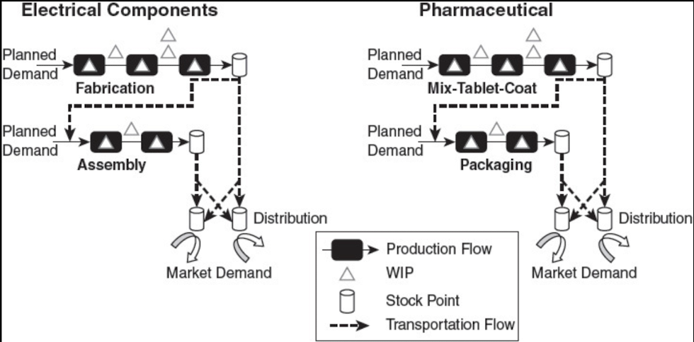
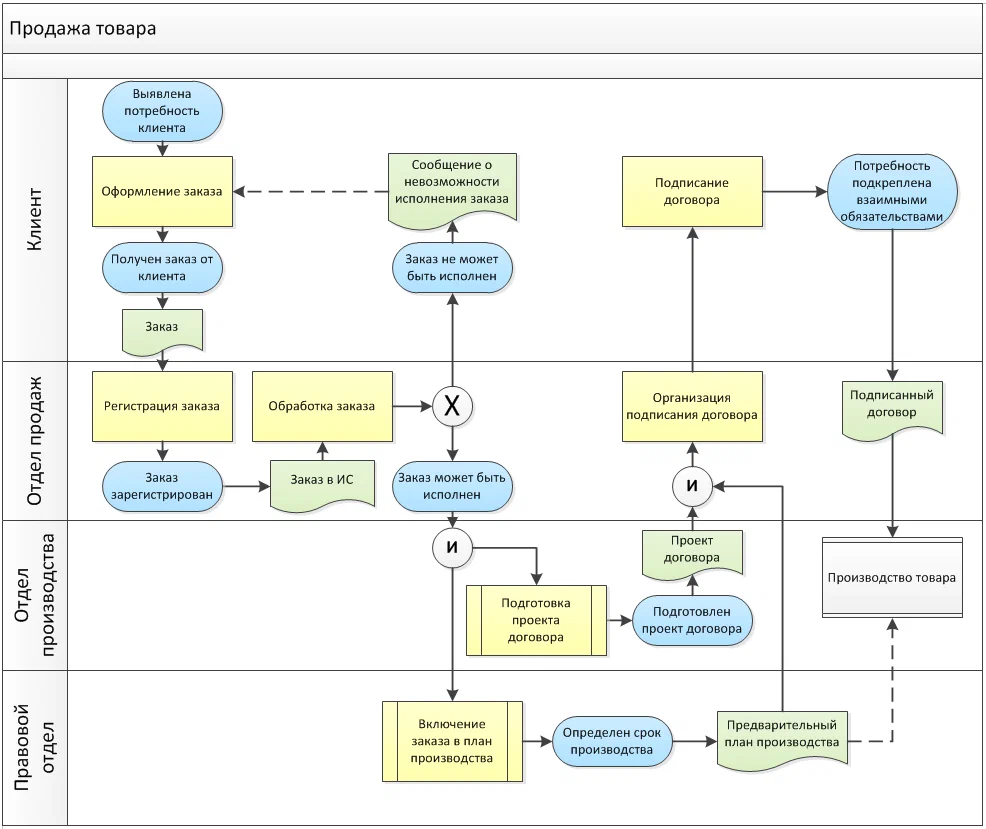
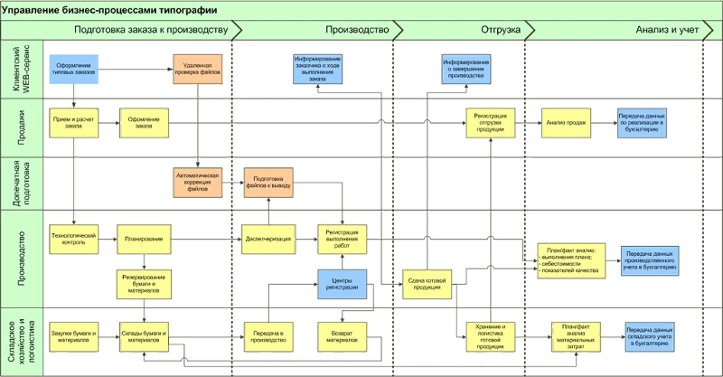

# R4.1:6 - Общий вид принципиальной модели предприятия

Вам наверяка понадобится расшифровать и правильно интерпретировать содержание разных учебников по операционному менеджменту, в которых вам буду предложены слегка различающиеся прикладные онтологии и прикладные методы моделирования потоков (например, учебников ***Factory Physics*** от Wallace Hopp, ***The Book of TameFlow*** от Steve Tendon и т.п.). В этих учебниках и так хватает дребезга (связанного, например, с отсутствием разделения методов и работ), что сильно затрудняет моделирование. Нам нужно вывести во внимание имеющиеся противоречия и устранить их. Для этого полезно будет учитывать онтологические уровни, обсуждавшиеся в подразделе ***«R3.3:5 - Онтологические уровни»*** руководства **R3**.

Самый высокий уровень моделирования предполагает обсуждение языка записи моделей. Уровнем ниже можно разместить те неявные предположения, которые могут повлиять на то, как вы составляете модели. Именно они определяют, какие основные типы мы относим к области операционного менеджмента, а какие – оставляем за пределами этой предметной области. Неявные предположения мы уже обсуждали ранее, кратко повторим их тут:

- *Потоки работ* требуют онтологического разбирательства с понятиями *вещи*, *графа создателей* и *методов создателей*. Без понимания этих концепций создание модели потоков работ будет бессмысленно, потому что неясно, зачем и как создатель вообще выполняет работы.
- *Операционный менеджер* – *оператор предприятия*, который может управлять только тем конвейером, который ему создали и поддерживают *бизнесмен*, *стратег*, *методолог*, *орг-проектировщик*, *орг-архитектор*, *лидер*, *администратор*. К его методам относятся самые простые действия вида *«добавить/убрать ресурс»*. Многие фундаментальные проблемы, замедляющие выпуск, можно исправить исключительно методами других менеджерских ролей.
- Модель потоков работ может лишь помочь *локализовать* такие фундаментальные проблемы, а также не терять выпуск по самым простым причинам, например, из-за перегрузки ваших рабочих станций.

С онтологией путешествий объектов и потоков объектов мы уже разбирались в руководстве **R2** и уточнили соответствующую онтологию в предыдущих разделах руководства R4. Для ***графа создателей вещи*** (он же - ***принципиальная модель предприятия***), вы можете встретить много разных нотаций, в основном это схемы, то есть модели в диаграммной модальности, на языках диаграмм, определяемых разными стандартами. Наша задача в этом руководстве не ознакомит вас с какой-то одной (или несколькими методологиями), а показать вам их сходство, помочь увидеть в них нечто общее (онтологию предметной области, ***мета-С модель***), которая поможет вам разобраться с любой из них в случае надобности.

Граф создателей можно изобразить так (это *«Системная схема проекта»*, модифицированная модель по методологии ESSENCE, которой будет уделено много внимания в резидентурах по системному мышлению):

Это представление показывает разнообразные виды влияния друг на друга компонент графа создателей, в нём ещё нет специализированного раздела именно для потоков работ.

Более пригодным для визуализации потоков является представление графа создателей в виде схемы бизнес-процессов предприятия:

*Принципиальная схема производственного предприятия (производство под заказ)*

*Принципиальная схема типографии*

В учебниках по операционному менеджменту вы найдете еще один вариант графа создателей – модель *Demand-Stock-Production (DSP)* или *Demand-Stock-Transformation*, то есть, *Спрос–Запасы–Производство* или *Спрос–Запасы–Изменения/Превращения*[^1]. Эта модель показывает, как предприятие, получая «на входе» спрос на создаваемую вещь, использует запасы для её создания/производства:

*Схемы Demand-Stock-Production для производства электронных компонентов и лекарств*

На этих схемах отражен реальный рыночный спрос/market demand как «выход» предприятия, а планируемый/прогнозируемый спрос/planned demand – как его вход. Отражены названия методов производства (fabrication, assembly; mix-tablet-coat, packaging) и показаны функциональные физические объекты – производственные конвейеры/линии, где выполняются указанные методы (черные прямоугольники со стрелками – Production Flows). Показаны и складские пункты/Stock Points/расположение «складов», где хранятся как материалы для производства, так и частично готовая продукция, которая затем пойдет дальше по цепочке. Также отдельно отражены места накопления «незавершенки», по схеме можно увидеть, в каких местах на линиях или между линиями скапливается незавершёнка, и в каких относительных количествах (больше/меньше, но не точные количества незавершёнки).

На моделях такого типа уже можно обсуждать **выпуск** как количество продуктов/вещей, покидающих границу предприятия в единицу времени – купленных лекарств и т.п. С точки зрения операционного менеджмента выпускаемая «*вещь*» точно известна, и операционные менеджеры, которые эксплуатируют предприятие как конвейер, заботятся о количестве этих *вещей*, покинувших границу предприятия. Кстати, для МИМ как создателя - примером будет количество инженеров-менеджеров, выходящих из резидентур, и владеющих *мастерством::вещью*, ведь обучающие организации изготавливают именно *мастерство* как часть агента

Кроме выпуска, принципиальная модель предприятия позволяет обсудить ***изменение выпуска***. Действия операционных менеджеров направлены на то, чтобы ускорить выпуск, чтобы предприятие быстрее выпускало вещи и превращало их в деньги. Повторим, что сам операционный менеджер способен сделать это только в рамках возможностей существующего конвейера, принципиальные изменения конвейера требуют участия агентов в других ролях. Но топ-менеджеров (по должности) вы заинтересуете своим проектом или инициативой, именно если покажете, как ***ускоряется выпуск***. Или, если сравниваются несколько проектов или инициатив, будет сопоставляться уже ***рывок выпуска***, то есть *скорость ускорения* (если проект А позволяет увеличить выпуск вдвое за месяц, а проект Б – за полгода, то будет выбран проект А, как обеспечивающий *больший рывок*).

[^1]: Factory Physics – Wallace Hopp, Mark Spearman
