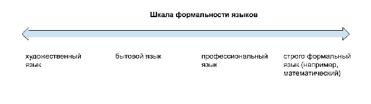

# R1.4:3 - Шкала формальности языков

Мы все владеем родным языком, это всегда, разумеется, *естественный язык*. Некоторые более или менее хорошо выучили один или даже больше *иностранных естественных языков*, на уровне бытового общения, профессионального общения, или даже на уровне чтения художественной литературы и общения на абстрактные темы. Собственно, именно на примере иностранного языка мы часто начинаем осознавать, что в естественном языке можно выделить *язык профессиональный*, немного отличающийся от литературного или бытового.

Действительно, чем ещё можно объяснить, что вы вроде бы знаете английский для обсуждения программирования, но вам недостаёт знания языка для обсуждения театрального искусства? Не значит ли это, что внутри английского есть отдельные языковые составляющие? Но в общем-то наличие профессиональных языков внутри родного тоже легко заметить, особенно если вы начинаете общаться с представителями другой предметной области. И оказывается, что инженер как будто бы общается на разных языках со своим менеджером, или с бухгалтером. Например, есть *язык разработчика, бухгалтера, менеджера/управленца, маркетолога, врача.*

Итак, профессиональные языки – языки общения для разных предметных областей, и они связаны с тем, какие роли исполняют агенты, какие методы в этих областях используют. Легче всего понять, что для разных предметных областей отличаются *словари* - наборы понятий, и, разумеется, отличаются *семантика* (связь слов с объектами этой предметной области) и *прагматика* (связь слов и действий). *Синтаксис* профессиональных языков отличается внутри одного естественного языка не так сильно, но тоже можно заметить отличия.

Представим себе **Шкалу формальности языка**, на которой языки расположены от менее формальных к более формальным, и пройдёмся по этой шкале.

В первую очередь посмотрим на художественный язык, с которым вы в детстве знакомились на уроках русского языка и литературы. Некоторые понятий, которыми мы пользуемся сейчас, например, понятия омонимов и синонимов, вы изучали именно тогда, на примерах из литературы, написанной художественным языком. Такой язык красочен, образен, он воздействует на эмоции. Описания, написанные или переданные таким языком часто надо толковать не прямо, а косвенно. Кстати, художественный язык - не обязательно письменный, визуальные языки можно разместить на той же шкале. Например, если вы увидите картинку женской фигуры с повязкой на глазах и весами в руках, вы на автомате расшифруете её как отсылку к справедливости или справедливому суду .

В художественных текстах зачастую не один смысл, а несколько, и до них надо добраться, попытаться вычислить, что имел в виду автор, что видели в этом его современники, что можно увидеть в нём сейчас.. Причём разные читатели могут найти для себя в тексте разный смысл!

Заметим, что *формальный-неформальный* тут не означает формальности в смысле употребления в *культурном обществе* или в *пивной*! Формальность для нас сейчас - это свобода составления и интерпретации высказываний. Поэтому “*неформальные”* в смысле принадлежности к более упрощённым культурам языки (*блатной жаргон,* например, да и *бытовой язык*) являются на нашей шкале более формальным по сравнению с языком романа XIX века, который гораздо более богат метафорами и изобилует способами построения фраз для выражения одной и той же мысли.

Итак, *бытовой язык -* чуть менее иносказательный и красочный, его легче истолковать, чем *художественный*. Поэтому он находится на шкале лишь чуть правее *художественного* (хотя *блатной жаргон*, возможно, как раз втискивается между ними). В бытовом сплошь и рядом будет недостаточно строгости, в нём очень плохо с *контролем типов*, поэтому на шкале он всё ещё далёк от формальных языков.

*Профессиональные языки/профессиональные жаргоны* по шкале формальности ещё более сдвинуты вправо, хотя и они не являются достаточно строгими. ***Словарь/набор понятий/онтология*** профессионального языка обычно не определена слишком строго, однако он уже выделен, и в нем меньше синонимов или омонимов. Профессиональный язык не столь красочен и богат разными вариантами выражения для одной мысли, ему это не нужно. При использовании профессионального языка важна в первую очередь точность передачи значения, поэтому у него более плотное концептуальное пространство (скоро мы уточним, что это такое).

Но практически никакой профессиональный язык не формализован до предела и в нём есть место для разных *диалектов*. Например, в рамках одной предметной области, *операционного менеджмента*, существует несколько разных значений слова ***«проект»***. Одни сообщества операционных/проектных менеджеров будут пользоваться понятием *«проекта»*, предложенного институтом проектного управления *Project Management Institute (PMI)* с методологией *Project Management Body of Knowledge (PMBOK)*, другие будут использовать методологию *PRINCE2*, но, по крайней мере и для других проектом считается совокупность действий, приводящих к конечному заранее определенному и не меняющемуся после завершения результату, с четкими сроками начала и конца. Однако в настоящее время понятие проекта размылось, стало менее плотным, и теперь проектом в рамках методологий из категорий *Lean* и *Agile* могут назвать и набор спринтов, по итогам которого программисты выдали минимальный продукт, который затем пошли дорабатывать, чего при классическом понимании *проекта* не допускается. после закрытия проекта выпущенная в нем вещь не дорабатывается и не поддерживается). Поэтому, когда вы имеете дело с профессиональным языком, придётся все равно договариваться о конкретном диалекте и его словаре. Да ещё и учитывать, что бывают ***корпоративные диалекты профессиональных языков***!

Языки гуманитарных наук относятся примерно к той же категории формальности, что и профессиональные жаргоны. А вот языки естественных наук - уже ближе к формальным языкам. Языки естественных наук в значительной части состоят из языка математики, но всё же не на 100%, в них всегда есть место для описания феноменов реального мира, невыразимых формулами.

А вот далее идут уже строгие формальные языки, вроде языков программирования или языка математики.. При использовании формального языка у вас нет возможности для двойных толкований. Словарь, синтаксис и семантика языка программирования определены его стандартными спецификациями, понятия математического языка и принципы их комбинирования вводятся определениями, аксиомами, правилами логического вывода. Тут нет возможностей для двойных толкований, знаки «плюс» и «равно» и цифры одинаково толкуются всеми, кто пользуется одними и теми же определениями, поэтому высказывание **2+2=4** может быть доказано. В этом смысле формальные языки противоположны художественному языку.

Итак, чаще всего большинство из нас в повседневной деятельности употребляет не художественный (кроме писателей и поэтов) и не строго формальный язык (кроме матаматиков). Чаще всего мы используем языки бытовой и профессиональные языки, находящиеся ближе к середине шкалы. Кстати, отметим, что *профессиональным языком программистов* нельзя считать те строго *формальные языки программирования*, на которых они пишут программы. Профессиональный язык программистов считать - это тот профессиональный жаргон, на котором обсуждаются требования, спецификации, задачи. Все прекрасно знают, что по степени формальности он не намного правее, чем профессиональные языки других профессий.

Владению художественным языком нас учат явно на уроках русского языка и литературы, владению одним из строго формальных языков – математическим – на уроках математики. Программирование мы изучаем по учебникам и руководствам. Бытовым мы учимся пользоваться просто в общении, чтобы общаться с окружающими в быту, и этого вполне хватает. А вот пользоваться профессиональным языкам нас не учат явно, как языкам.

В университете вы осваиваете сами специфичные для предметной области дисциплины, например, *материаловедение*, но именно *язык материаловедения* вы осваиваете неявно. Никто даже не упоминает, что вы учите язык предметной области вместе с ней самой, узнаёте специфичные факты реальности одновременно со способами их описания. То же самое происходит на работе: вы учитесь общаться по ролям, но обычно никто так не формулирует и не подчёркивает, что вы исполняете разные роли, имеете в этих ролях разные картины мира и описываете мир с определённых точек зрения/viewpoints, для которых характерны свои языки.

Поэтому многие не могут даже явно осознать на каком языке они общаются: на языке научном, профессиональном, или на бытовом.

Подытожим основные свойства языков:

- **Художественный/метафорический**: пригоден для мотивирования, передаёт содержание и ощущения одновременно, выражает сложные мысли, но не пригоден для составления точных описаний, на основании которых можно планировать действия.
- **Бытовой**: пригоден для большинства бытовых ситуаций, где не требуется слишком большая точность описаний, позволяет координировать простые планы. Непригоден для сложных ситуаций и планирования комплексных действий.
- **Профессиональный**: заточен под ситуации конкретной предметной области и обычно для этих ситуаций достаточен. Необходимо очень осторожно использовать при коммуникации с представителями других предметных областей или при работе с несколькими предметными областями одновременно! Сюда относятся языки гуманитарных наук (менее формальные) и языки точных наук (более формальные).
- **Формальный:** позволяет точно выразить то содержание, для которого предназначен. Не пригоден для применения напрямую ни в какой иной предметной области - требует адаптации и совмещения с её профессиональным языком. Труден в изучении. Сюда относятся языки программирования и языки математических дисциплин (их на самом деле тоже много).

Даже внутри одного профессионального языка можно найти более и менее формальные диалекты. Ближайшие из них к бытовому - будут скорее поняты людьми из других предметных областей. Текст с разделами и списками - это уже некоторая формализация. А вот специально ***разработанные для предметной области шаблоны таблиц или базы данных*** - очень высокая формализация профессионального языка, почти максимальная (ещё правее находятся *контролируемые языки*, но это пока что мы обсуждать не будем). Однако заголовки столбцов в таблицах - остаются написанными на профессиональном жаргоне предметной области. То есть такие таблицы всё равно не попадают в область строго формальных языков.

В начале какого-то обсуждения вы можете сознательно выбрать менее формальный язык по этой шкале, чтобы быстрее добиться общего видения с собеседниками. А потом, для принятия решений и фиксации договорённостей о сроках и ответственности - стоит вместе с собеседниами сдвигаться в сторону большей ясности и формальности, структурировать тексты, заполнять таблицы. Полезно проговаривать уровень формализации беседы явно: «*сейчас мы обсуждаем идею свободно*» или «*сейчас мы фиксируем точные формулировки*» (Шаблоны FPF A.1.1, E.10.D1).
