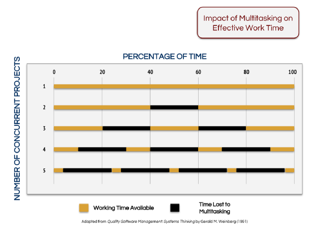

# R1.5:7 - Ещё о переключениях и отвлечении

Как уже говорили ранее, одно из свойств внимания – ***переключаемость***, то есть способность переводить внимание с одних объектов на другие, менять фокус рассмотрения. Благодаря наличию переключаемости агенты могут менять роли. Например, человек может закончить исполнять роль *инженера* на работе, и перейти к роли *менеджера*, или закончить работать и войти в роль *обучающегося* или *родителя*.

Без переключений обойтись невозможно, и мы скоро к ним вернёмся. Однако сперва обсудим другую крайность - попытки обеспечить ***многозадачность***. Многозадачность - это попытка не переключаться между задачами по рационально построенному графику, а попытка сделать несколько задач одновременно, пытаясь переключаться очень быстро (на практике - хаотически). К сожалению, для людей делать такое эффективно и без ущерба для общего выхода результатов работ - практически невозможно. Многозадачность хорошо работает в компьютерных системах, если вычислительных мощностей хватает на решение нескольких задач в реальном времени, то операционные системы могут оптимально направлять на них ресурсы. Но для людей можно с уверенностью утверждать, что ресурсы мозга отнюдь не избыточны, управление распределением этих ресурсов далеко до оптимального, и улучшать управление ресурсами мы практически не умеем, никакое обучение не помогает изменить архитектуру вычислителя у нас в голове. Вы прекрасно знаете по своему опыту, и наверняка замечаете у других, что когда ваше внимание распределено между 5 задачами одновременно, стремительно растет вероятность сделать ошибку, и очень много времени занимает не решение задач, а переключение между ними. При этом чем больше задач - тем больше времени просто пропадает.

В книге ***The Book of TameFlow*** Стив Тендон, разработчик постголдраттовской теории ограничений, которую можно применять и к знаниевым проектам, приводит следующие данные о стоимости переключений в ходе реализации проектов уже для коллективной работы:

 Если у команды есть только один проект, то 100% времени имеется для реализации этого проекта. Добавление дополнительного проекта отнимает 20% от доступного рабочего времени. При 5 проектах бОльшую часть времени команда не работает, а переключается!

Многозадачность на практике означает, что агент открывает новые задачи, пытаясь оптимизировать «вход» – входящий поток работ, и практически не уделяя внимание «выходу» (выпуску результатов работы). В итоге копится список задач в колонке «В процессе», берутся все новые задачи, старые теряются, потом срочно делаются перед дедлайном.

Многозадачность означает потерю фокуса и хаос в деятельности агента – личности или команды. Устранение хаоса и переход к запланированному последовательному выполнению проектов и задач позволяет концентрировать усилия (время) и прочие ресурсы на наиболее важном в каждый момент времени. Убирая многозадачность (и многопроектность), получаем:

- Ускорение в выполнении работ,
- Увеличение производительности труда *без дополнительных затрат* (буквально работаем меньше, но над самым важным, по принципу Парето),
- Уменьшение числа переключений, снимается лишняя когнитивная нагрузка.

Меньше переключений между задачами приводит к большей производительность труда без лишних затрат. Тем самым повышается скорость выпуска результатов, если найдены и расшиты ограничения - увеличивается выпуск предприятия. Товары и услуги быстрее меняются на деньги, компания начинает зарабатывать больше (или, если не начинает, то пристально изучает рынок: на том ли рынке она работает и можно ли на нём заработать больше в принципе).

Поэтому ***переключения между задачами должны быть запланированы***, и это планирование должно выполняться ***с учётом приоритетов проектов или задач***, с выделением как можно больших ***непрерывных отрезков времени для работы в фокусе*** над одним ***самым приоритетным проектом***.

Сознательное переключение мы в любом случае должны отличать от ***отвлечения***, вызванного внешними и внутренними раздражителями. Например, когда человек сознательно меняет роль с организатора встречи по работе на закупщика, он переключается. Когда во время выполнения работы в фокусе к нему приходят сотрудники и просят немедленно решить не срочную (и часто не важную) проблему, он не переключается, а отвлекается от задачи – автоматически и не по своей воле.

Чтобы получить ускорение, делая меньше, нужно прямо **избавляться от отвлечений**: внутренних и внешних. Для начала желательно разобраться с **внешними отвлечениями**: включить режим «Фокусирование» на компьютере (есть практически в каждой операционной системе) и на телефоне, при необходимости установить приложения, прерывающие использование соцсетей. Затем надо гарантировать себе время на сфокусированную работу: либо выполнять ее там, где вас не могут дернуть (например, в переговорке на работе, отдельном кабинете дома), либо приучать коллег и домашних к тому, что вас нельзя дергать в определенные периоды. Можно установить некоторый ритуал для этого: например, закрытая дверь или красный стикер / флажок на столе означают, что вас сейчас нельзя беспокоить.

Когда разобрались с внешними, можно перейти к **внутренним отвлечениям**. Они часто происходят из-за усталости или из-за недостатка ресурсов на выполнение сложной работы по иным причинам. В любом случае, если вы пытаетесь приложить больше усилий, чем вы можете приложить сейчас в текущем состоянии, вы начинаете отвлекаться. Поэтому если вы замечаете, что много отвлекаетесь – определите для начала, не происходит ли это из-за недостатка ресурсов. Если ответ «да», обычно выгоднее пойти отдохнуть или устроить небольшой перерыв, чем бесконечно тупить над задачей.

Приходящие в голову новые мысли также становятся причиной отвлечений. В таком случае можно быстро записать в список дел пришедшую вам в голову идею – а потом выделить время на то, чтобы обработать эту информацию. Обычно это помогает. Кроме того, помогает и практика Помодоро, которая будет обсуждаться в следующих разделах.

Прикладных практик удержания внимания много. С некоторыми из них вы уже познакомились, когда перестраивали ваше расписание и налаживали работу в фокусе. Некоторые вы применяли и до начала стажировки: например, применяли практику Помодоро или удерживали коллективное внимание при помощи экзокортекса. Перечислим ещё некоторые практики, подробнее о них мы будем говорить и дальше в этом руководстве, и в руководстве R2:

- Работать с ***экзокортексом***. Если вы не задействуете экзокортекс (личный или рабочий), то шансов на удержание внимание и эффективные плановые переключения в работах у вас нет, поэтому первый шаг – понять, какой экзокортекс поддерживает вашу работу.
- Выбирать ***методы работы*** и поддерживать их экзокортексом. Нельзя начинать с установки *“самого рейтингового приложения”*. Надо понимать, что любой софт заточен под определенный метод или методы. Выбирая софт, вы на самом деле *фиксируете метод*, в лучшем случае настройки софта позволяют вам немного *адаптировать метод*. Поэтому надо начинать с оценки методов, которые вам могут предложить учебники, консультанты, или действительно поставщики софта. Только убедившись в том, что вам подходит метод - устанавливайте софт.
- Выбирать или даже ***конструировать методы***, которые будут работать для вас/вашей команды/вашего подразделения/вашей организации. А потом ещё точнее адаптировать методы работы под свою специфику.
- ***Выделять время*** на работу по приоритетными задачами и честно удерживать внимание на них всё запланированное время.
- ***Увеличивать продолжительность работы*** над тем, что выделено как важное.
- ***Удерживать себя и команду на проекте*** в длительной перспективе, то есть если проект требует много времени для реализации. Это особенно важно, если переключения неизбежны, если приходится оставлять работы по нему и снова к ним возвращаться. То есть если проект, в силу своих особенностей или особенностей других проектов, не может быть выполнен путём сосредоточения сил на нём на протяжении единого отрезка времени. Такое часто бывает, когда проект требуется пересматривать, обновлять планы по мере поступления информации из внешних источников, на скорость которых вы не можете повлиять (от смежников, от согласующих органов, да и от заказчиков). В этих ситуациях очень важно не устать от проекта, не забыть про проект, не *слить* его.
- Организовать ***регулярные напоминания*** о работах по проекту, доставку которых всем членам команды может обеспечить экзокортекс.
- ***Формировать среду*** для выполнения проекта - буквально убирать с рабочего места ненужные бумаги, закрывать лишние вкладки браузера, делать недоступной в корпоратвином экзокортексе информацию неприоритетных проектов и их данные. Подумайте над тем, чтобы создать для себя и для команды подходящую социальную среду: взаимодействовать с сообществом, которое поддерживает ваши новые методы, и/или создать такую среду самому на работе, коллективно удерживать внимание легче.

Наконец добавим, что если вам лично реально трудно удерживать внимание в течение нескольких минут, вы постоянно отвлекаетесь, и *«разгребанием дел»* это не решается, стоит обратиться к врачу-неврологу или специалисту по расстройствам внимания, чтобы исключить физиологические проблемы со здоровьем.
