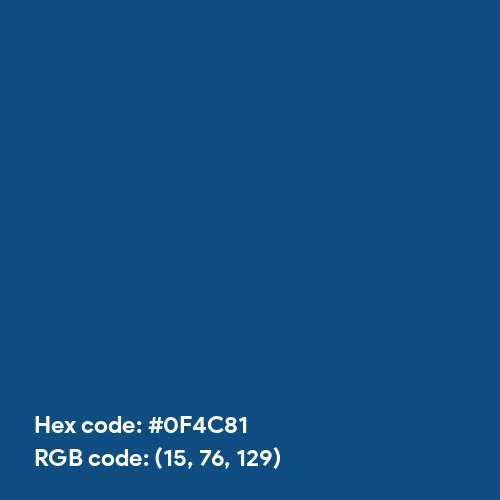

# R2.3:2 - Как мы распознаём дребезг

Распознание дребезга даёт нам повышение скорости и точности мышления, и непосредственно влияет на скорость и точность коммуникации. Механизм дребезга работает, конечно, на более общем механизме распознавания агентом объектов. Поэтому сперва обсудим общий механизм распознавания любого объекта, а не только объекта типа «*дребезг»*. Потом мы отметим особенности распознавания именно дребезга.

Как мы распознаем объект, зависит в первую очередь от того, как мы его ощутим и воспримем при помощи органов чувств. И здесь кроется первая сложность: воспринять непосредственно, без экзокортекса, мы можем лишь небольшую часть реально существующей вселенной. Наши органы чувств несовершенны, мы можем вообще *не воспринять* те объекты, которые могут нам понадобиться. Воспринимаемая вселенная отличается даже для разных живых существ. Мы не можем чувствовать запахи так же, как чувствуют их животные. Птицы, в частности, малиновки, способны чувствовать магнитное поле Земли и ориентироваться по нему. Все эти возможности восприятия у человека отсутствуют.

Если мы не можем воспринять нужные объекты и получить информацию о них непосредственно, нам приходится воссоздавать/реконструировать объекты, которые мы вообще не можем увидеть (например, атом), или те объекты, которые ранее существовали, но исчезли в момент исследования (например, лед в трубках теплообменника двигателя Боинга, который привел к инциденту с жёсткой посадкой самолёта в Хитроу в 2008 году[^1]). Дребезг в таких случаях не возникает, потому что объекта для агента в принципе нет, он никак не выделяется вниманием. Приходится сначала искать объекты по следам/меткам, оставляемым ими в физическом мире, осознавать их наличие, а потом уже какие-то противоречия в этих реконструкциях могут показаться нам противоречивыми.

Чаще мы столкнёмся с другой ситуацией: когда объект выделить вниманием мы можем, но распознать и включить в свою модель мира так, чтобы это привело нас к желаемому результату - не получается. Восприятие информации об объекте зависит главным образом от наших органов чувств. А вот *толкование/интерпретация*, то есть, понимание *идеи*, стоящей за объектом, нахождение для него слова/термина/знака, которым мы его назовём - зависят от нашего предыдущего опыта и «*общественного договора*» в рамках нашего семантического сообщества[^2]. Например, мы называем цвет «*красным*», потому что *так договорились*. Мы опознаем красную машину и красное платье как объекты, принадлежащие классу «*объекты красного цвета*» -потому, что нас в детстве научили идее/концепции/понятию/значению/смыслу «*красного цвета*» и его обозначениям в словах/терминах естественного языка словом «*красный*» или ‘*red’*, или цифро-буквенному обозначению, например, HEX #EF3340 или RGB (239, 51, 64), Pantone 032 C или CMYK (0%, 90%, 76%, 0%)[^3].

Но если нам в детстве расскажут, что *красный* - это цвет как на картинке ниже, и будут учить этому достаточно долго, то мы будем воспринимать этот цвет как «*красный*». А когда мы выйдем за пределы того семантического сообщества, в котором нас этому научили, окажется, что большинство называет этот цвет по-другому, а со словом «*красный»* связывает совсем другое ощущение. И у нас будут проблемы.

Именно такая ситуация часто возникает с объектом *«метод»* в ходе общения менеджеров или объектом *«работа»* в ходе общения инженеров. Менеджеры, глядя на поведение сотрудников, различают в нём только объект «*работа*» и поддерживают разговор на языке и в терминах своего семантического сообщества, игнорируя разговор о «*методе*». Инженеры, напротив, часто не видят *работы*: обсуждая поведение, они смотрят на «*методы*» и обсуждают их. В итоге, когда менеджер и инженер общаются, они могут говорить о разных объектах. При этом дребезг либо минимальный (есть смутное ощущение, что что-то не то), либо не возникает вовсе: в рамках своих привычных способов описания/viewpoints ни инженер, ни менеджер не ошибаются, у них есть основания считать себя правыми. Только цель «*успешно завершить проект в срок и без превышения бюджета*» при этом не достигается.

Мы можем не знать, как распознать объект для достижения цели, потому что не владеем мастерством в соответствующей роли и способами описания мира/рассмотрения/viewpoints в соответствующей роли. Не знаем, что есть объект «*метод*» и роль «*методолога*», исполнитель которой интересуется всеми методами предприятия (а инженер будет интересоваться своими инженерными методами выполнения своих работ), есть объект «*онтология*» и роль «*онтолога*», который интересуется онтологией предприятия и часто исполняет прикладную роль инженера данных/data engineer, выстраивающего модель данных на предприятии.

Может быть мы и знаем, как распознавать объекты, но не выбираем ту роль и способ описания/viewpoint, которым этот объект нужен, а предпочитаем вместо него другую. Например, «*личные финансы*» и «*возможность купить себе машину*» для владельца бизнеса могут оказаться важнее, чем «*развитие бизнеса*». И он примет решение вывести деньги из бизнеса как будущий автовладелец, а не как бизнесмен, заинтересованный в росте бизнеса. Для такого собственника все будет в порядке, но у окружающих может возникнуть ощущение дребезга, если до этого собственник распространялся о том, насколько ему важен рост бизнеса и как он о нём заботится, жертвуя всем. Для быстрого распознавания такой ситуации надо выполнять базовую операцию собранности: *заземляться* и искать отличия между действительностью и реальностью. Не верить слепо записанному в документах или сказанному устно, но проверять это.

Получается, что распознавание дребезга основано на ощущении разницы между:

- Объектами, которые должны были быть упомянуты, по нашему представлению, и объектами, которые были реально упомянуты.
- Идеями/концептами/значениями, которые должны были стоять за упомянутыми объектами по нашим представлениям, и идеями/концептами/значениями, к которым отсылал собеседник.
- Употреблением неожиданных, непонятных слов/знаков/терминов.

[^1]: https://ru.wikipedia.org/wiki/Авария_Boeing_777_в_Лондоне
[^2]: https://www.youtube.com/watch?v=HDbEH3YZkyg
[^3]: https://www.color-name.com/red-pantone.color
