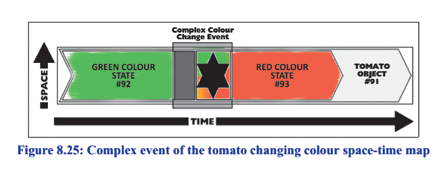
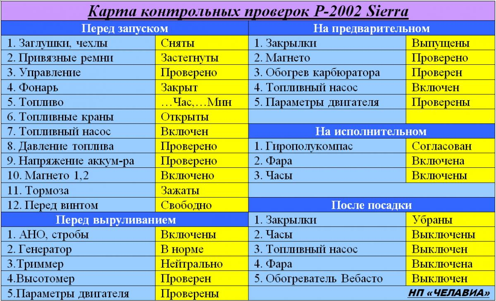

# R2.6:2 -Чеклисты и смена состояний объектов

Выполняя работу по методу (демонстрируя некоторое поведение), агент меняет состояния объектов -п предметов метода.

Например, столяр изготавливает ступень лестницы[^1]. Для этого он выбирает доску нужной породы дерева, затем распиливает её на бруски, строгает, фрезерует и склеивает их, обрабатывает, затем повторно строгает и фрезерует, сверлит отверстия для соединения ступеней с подступенками и площадкой и отдает на шлифовку. Целый ряд объектов появляется, проходит через изменения состояний, иногда исчезает: доска сначала «*выбрана*», затем вместо «*доски*» появляется «*брусок*», который сначала оказывается «*обструганным*», «*фрезерованным*», потом набор брусков становится «*склеенным*» - и тут уже можем говорить о появлении вместо набора/группы брусков «*ступени*». Ступень далее превращается в «*обработанную*», «*обструганную*», «*фрезерованную*», «*с отверстиями для сборки*».

Когда мы говорим о работе по какому-то методу, нас будет интересовать - как получается результат, то есть какие есть «*объекты внимания метода*»/«*предметы метода*» и как они должны менять свои *состояния*.

Мы будем постепенно двигаться по шкале формальности используемых нами языков (вспомните материалы предыдущего руководства, раздел ***R1.4:3 - Шкала формальности языков***) в сторону более строгих формальных онтологических моделей. Мы уже научились выделять такие индивидуальные физические объекты / вещи, как *функциональные физические объекты*, что помогает нам более формально рассуждать о *ролях*. Сейчас мы ещё немного расширим наши представления о том, что можно моделировать как материальные объекты/вещи. В рамках резидентуры ***R3. Рабочее моделирование в инженерии и менеджменте*** вы узнаете об онтологическом моделировании гораздо больше.

Далее будем рассматривать индивид/физический объект как существующий и меняющийся не только в пространстве, но и ***в динамике, во времени*** (мы уже называли такое рассмотрение *4D, четырёхмерным экстенсиональным подходом*). В предыдущем разделе мы обсуждали, что в нём тогда можно выделять ***полные*** ***темпоральные части***: Вася с 10:00 до 18:00 25 июня 2026 года -это одна такая часть, а Вася с 12:00 до 14:00 2 июня 2026 года -другая такая часть. При помощи часов мы можем определить сколько угодно таких темпоральных частей, указав, когда темпоральная часть объекта возникла и когда она прекратила существовать. Посмотрим, как можно это использовать для строгого моделирования.

Диаграмма ниже -это так называемая *пространственно-временная карта (space-time map)* из книги ***Chris Partridge «Business Objects: Re-Engineering for Re-Use»***:

В этом условном примере помидор с уникальным номером *91* (в реальной работе программиста, инженера или бухгалтера это обычная практика -присвоение индивидуальным объектам «*уникальных идентификаторов*» или *ID* находится сначала в состоянии «*зелёный*» с 20 июля по 5 августа 20ХХ года (это отдельный объект с уникальным номером *92*), затем с 6 августа и до 10 переходит в состояние «*красный*» (и этот объект получает номер уникальный номер 93), а затем оказывается съеден (прекращает существование). Мы можем представить это описание в виде набора классификаций для разных объектов (то есть набора утверждений об отнесении объекта к какой-то категории):

- «Помидор#91 с 20 июля по 5 августа»#92 относится к категории «зелёный»
- «Помидор #91с 6 августа по 10 августа»#93, относится к категории «красный»

Конечно, в обычном разговоре мы будем использовать обычные прилагательные (*«зелёный помидор стал красным»*) или причастия *(«помидор съеден»*). Но преимущество формального языка моделирования состоит в том, что высказывания становятся однозначными (нет места для дискуссий о том, что бы могло означат высказывание «*помидор созрел»*), записываются единообразно, могут быть сообщены в любом порядке, в них не используются связки типа «*сначала*» и «*потом*». Поэтому *формализация* является необходимым шагом при переходя от *разговорных описаний* предметной области на естественном языке к строгим *формальным моделям*, необходимым для создания описывающих вашу предметную область компьютерных баз данных, например.

Мы не будем заниматься формальными моделями, необходимыми для проектирования баз данных. Но мы перейдём от полной свободы естественного языка к формализованным моделям, необходимым для создания **чеклистов** -самых полезных описаний для **методов.** (Разумеется, *чеклисты* не заменяют *инструкции* и *регламенты*, задающие методы, но именно чеклисты стоит использовать ежедневно для напоминания, как надо применять метод, и для проверки выполнения работ по методу.)

Посмотрите на типичный чеклист, используемый а авиации перед взлётом и после посадки самолёта:

В нём перечислены объекты: *«заглушки», «чехлы», «фонари»*, и состояние, в которое должен быть приведен каждый конкретный объект, с которым пилоту придётся иметь дело. Если мы говорим о конкретном чеклисте, который должен быть использован на борту конкретного самолёта в конкретный день, то мы понимаем, что он превращается в достаточно строго формализованное (по сравнению с описанием на естественном языке) и компактное описание ситуации, поддающееся однозначной интерпретации (например, *«Магнето №2 самолёта P-2002 Sierra с бортовым номером SU322400, находится в состоянии «Включено» после 20:32 17 сентября 20ХХ года»*).

Есть и другие полезные приёмы записи смены состояний объектов, кроме 4D подхода с его темпоральными частями. Тем, кто работает с текстами (особенно -с компьютерными программами) привычен подход ***версионирования***. Этот метод состоит в указании на версии рабочих продуктов -как объектов, так и их описаний.

Когда вы пишете отчет, то вы можете указывать на версию отчета. Изменение содержания приводит к тому, что версия меняется. Разумеется, это эквивалентно тому, что изменяются темпоральные части описания, оба подхода означают, что описание *меняет* *состояния*. *«Отчет по бюджету за III квартал 2026 г.»* можно представить как объединение темпоральных частей - документа с названием *«Отчет по бюджету за III квартал 2026 г.версии 1.0»*, существовавшего с 20:37 вчерашнего дня (дата и время создания) до 12:00 сегодня и документа с названием *«Отчет по бюджету за III квартал 2026 г.версии 1.1»*, существующего с 12:00 сегодняшнего дня, и пока он не закончит существование.

Точно так же можно представить изменение состояний любых результатов работ, будь то индивид/система («*изделие с инвентарным номером 3234*») или эпистема (описание *«Отчет по бюджету»*).

Выделение важных состояний объектов необходимо для того, чтобы моделировать методы выполнения работ, готовить их описания (инструкции для сотрудников и чеклисты). Выделение состояний и поиск их в реальном мире позволяет прямо в ходе работы контролировать, что работа по методу идет верно. Например, всегда можно проверить, что ступень лестницы после склеивания «*обработана*», а не «*потерялась*». Можно также проверить, что работа по обработке ступени была выполнена за обычное для такой операции время.

Метод изготовления ступени можно сперва описать с указанием на категории объектов *(«доски», «бруски»*) и состояния, в которые они должны приходить. Метод можно описать так:

| Изготовление лестничной ступени |
| --- |
| Доска для ступени - выбрана Бруски (6 шт.) - напилены Бруски (6 шт.) - обстроганы Бруски (6 шт.) - фрезеровка проведена Ступень - склеена Ступень - обработана Ступень - обстроганы Ступень - фрезеровка проведена Отверстия в ступени - просверлены |

Обратите внимание -такое описание (не чеклист!) может находиться над рабочим местом столяра, оно помогает ему работать с типовыми изделиями, в нём указываются общие названия категорий *(«доски», «бруски»*). Мы будем их называть в дальнейшем «*классами*» и говорить о том, что такое описание моделирует *метод* и описывает его предметную область «*в классах*». Однако настоящий ***чеклист для работы*** по методу должен быть оформлен так, чтобы распечатываться для каждого индивидуального объекта:

| Чеклист изготовления лестничной ступени N ______ парадной лестницы объекта по адресу _____________ | Отметка об исполнении |
| --- | --- |
| Доска для ступени - выбрана Бруски (6 шт.) - напилены Бруски (6 шт.) - обстроганы Бруски (6 шт.) - фрезеровка проведена Ступень - склеена Ступень - обработана Ступень - обстроганы Ступень - фрезеровка проведена Отверстия в ступени - просверлены |   |

После вписывания информации об объекте чеклист будет уже описывать *работу* с *индивидом*, с конкретной ступенью для конкретной лестницы в конкретном доме (по тому же самому методу, разумеется).

Итак, объекты, выделенные вниманием для выполнения метода (их ещё называют *предметы метода*) меняются, и эти изменения мы описываем через их состояния.

Иногда объекты могут меняться в разных ситуациях схожим образом. Как различать состояния в таких случаях? Например, отчет был в состояниях: *готов к проверке, отправлен на проверку, возвращён на доработку*. Сейчас в нём исправили ошибки, и он вновь находится в состоянии (ещё говорят «в статусе») *«готов к проверке»*. Как отличить текущее состояние *«готовности к проверке»* от прошлого? Очень просто: по времени. В первый раз отчёт пришел в состояние «*готов к проверке*» вчера, а во второй -уже сегодня. Иными словами, в одном состоянии находятся на самом деле *разные темпоральные части* отчёта. Статус тот же самый, но сам объект изменился, для различения необходимо строго придерживаться определённых правил именования объектов, например -использовать версионирование.

Также состояния могут совмещаться, ***накладываться*** друг на друга. Например, вы начали выполнять задачу, но не закончили её и пошли на встречу.

С точки зрения TameFlow, раз задача *взята в работу*, но не *завершена*, продолжает течь *потоковое время/Flow Time*, понимаемое как «*общее время на выполнение работы*». Но, поскольку прямо сейчас вы на встрече, задача непосредственно не выполняется, она находится в «*режиме ожидания*». Для отражения этого в TameFlow предлагается учитывать это время как *время ожидания/Wait Time* и отличать его от непосредственно *времени выполнения/касания задачи/Touch Time*. *Потоковое время/Flow Time* считается как сумма *времени ожидания/Wait Time* плюс *время касания/Touch Time*.

Во время совещания счётчик *общего времени* выполнения работ продолжает тикать, но одновременно с ним увеличивается *время ожидания/Wait Time*. Задача, выполнение которой отложено, одновременно находится в статусе *«незавершенки»/Work In Progress/WIP* и в статусе *«ожидает выполнения»*. Мы можем указать даты и времена, когда работа по задаче начала выполняться, когда она была прервана, и можем после возвращения к работе назвать дату и время её завершения.

Накладывание состояний друг на друга нам будет важно, например, при *делегировании* выполнения задач. Вы можете делегировать выполнение задач сотруднику, написав ему поручение и выдав инструкции. Но делегирование не будет завершено, пока сотрудник не окажется способен выполнять задачу с нужным качеством без дополнительных управленческих издержек. Поэтому недостаточно снабдить сотрудника инструкциями и передать задачи, нужно еще неоднократно проконтролировать выполнение, и убедиться, что сотрудник может выполнять задачу регулярно. Тогда задача действительно перейдёт в статус «*делегирование завершено*». До этого завершенными можно считать только отдельные этапы делегирования, но само оно ещё «*в процессе*».

[^1]: https://journal.tinkoff.ru/woodworker/
