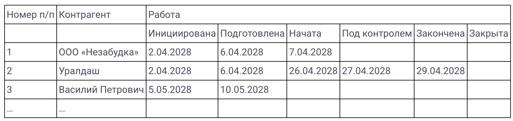

# R2.6:3 - Чеклисты как способ удержания внимания

Итак, смены состояний объектов часто описываются в виде *чеклистов* (или *чек-листов*, допускаются оба варианты написания). Работа по чек-листам позволяет удерживать внимание на нужных операциях, не забывать выполнять обязательные действия и, соответственно, не переделывать сделанную работу. Избегая переделок, мы ускоряем работу по методу, и не несём потерь.

Атул Гаванде в книге ***«Чек-лист. Как избежать глупых ошибок, ведущих к фатальным последствиям»***[^1] приводит такой пример: использование медиками чек-листа ввода катетера в палате интенсивной терапии в одной из больниц позволило сократить хирургическое инфицирование с 11% почти до нуля. При этом чек-лист был очень простым и состоял всего из пяти довольно очевидных пунктов (1 - вымыть руки с мылом; 2 - промыть кожу пациента хлоргексидином; 3 - стерильными салфетками закрыть тело пациента; 4 - надеть маску, шапочку, стерильный халат и перчатки; 5 - наложить стерильную повязку, как только канюля введена), но его использование позволило добиться таких впечатляющих результатов. Произошло это потому, что внимание врача, вынужденного совершать сотни мелких и крупных операций/работ в день, очень часто отвлекалось: без чеклиста хотя бы 1 пункт врач пропускал в 1/3 случаев!

Наши резиденты используют чек-листы в самых разных ситуациях: и чтобы собраться в путешествие (впервые ничего не забыли!), и чтобы организовать работу команд[^2]. Кроме экономии времени на переделках, использование чек-листов позволяет тщательнее проводить контроль выполненных работ. Куда проще проверить качество рабочего продукта, если у вас есть чек-лист, описывающий, каким должен быть продукт.

Списки контрольных вопросов в чеклистах используются для удержания внимания: личного и особенно коллективного. Работа по чек-листам может рассматриваться и как вариант автоматизации операций (просто не 100% автоматизации, а частичной). Исполнителю не надо каждый раз думать, вспоминать, что делать дальше, он может в любой момент проверить, как протекает работа, появляются ли нужные состояния объектов вовремя, или что-то идёт не так.

Для этого вопросы в чеклисте должны быть прямо связаны с важными объектами внимания/предметами метода, нужными для его выполнения. Например, во врачебном чеклисте ввода катетера проверяется состояния готовности врача (руки вымыты с мылом, надета спецодежда) и готовности пациента (кожа промыта, тело закрыто, стерильная повязка присутствует), для чего вводится целый набор дополнительных объектов внимания (руки, спецодежда, кожа пациента, тело пациента, повязка). В авиационном чеклисте (карта контрольных проверок P-2002 Sierra выше) выделяются важные состояния самолёта как названия подпунктов: состояние *«перед запуском», «перед выруливанием», «на предварительном», «на исполнительном», «после посадки»*. При этом в каждом состоянии у конкретного самолёта P-2002 Sierra с уникальным номером 322400 проверяются состояния прочих объектов внимания: *«заглушки, чехлы сняты»* и т.д.

Чеклисты обычно пишутся для конкретного кейса/сценария применения метода. Например, кейса создания отчёта по бюджету, кейса посадки самолёта, сценария ввода катетера, сбора в путешествие и т.п. В целом метод составления чеклиста можно описать так:

- Выбирается кейс/сценарий/ситуация.
- Выбирается роль, для которой будет писаться чеклист.
- Выбирается онтология - набор ключевых объектов внимания, с которыми будем иметь дело, включающий в себя:
  - ключевые крупные объекты внимания;
  - ряд объектов следующего уровня.
- Определяется, в каких состояниях будут объекты внимания
- Описываются шаги/действия, меняющие состояние объектов внимания.
- Определяются соответствующие контрольные вопросы, которые позволяют оценить, выполнены ли нужные действия с нужными объектами и пришли ли объекты в нужные состояния.

Например, чеклист для принятия решения о продолжении или прекращении рекламной кампании имеет ключевым объектом внимания *текущую рекламную кампанию*, но, чтобы этот объект пришёл в нужное состояние (*продолжена, прекращена*), придётся поработать с объектами *«информация о кампании», «информация о продажах»*, выполнить в отношении их некоторые действия (*сбор, оценка)*, чтобы можно было принять решение о *продолжении/изменении/остановке*.

Формы записи чеклиста бывают разными. Мы уже описывали, как происходит переход от описания метода к чек-листу. Можно представить чеклист как список операций, которые нужно выполнить по методу, с местами для отметок о выполнении операций. Например, врачебный чеклист ввода катетера может выглядеть так:

1. Вымыть руки с мылом Выполнено: Да/Нет
2. Промыть кожу пациента хлоргексидином Выполнено: Да/Нет
3. Стерильными салфетками закрыть все тело пациента Выполнено: Да/Нет
4. Надеть маску, шапочку, стерильный халат и перчатки Выполнено: Да/Нет
5. Наложить стерильную повязку, как только канюля введена Выполнено: Да/Нет

Если сам метод первоначально записывают в форме чеклиста («сделать А, Б, В»), то, как в случае ввода катетера, чеклист фактически представляет собой смесь регламента и чеклиста: в нём одновременно описаны операции, которые должны быть выполнены, и состояния объектов (хотя эти состояния не выделены отдельно).

Этот чеклист можно было бы переписать следующим образом:

1. Руки вымыты Выполнено: Да/Нет
2. Кожа пациента промыта Выполнено: Да/Нет
3. Тело пациента закрыто Выполнено: Да/Нет
4. Маска, шапочка, стерильный халат и перчатки надеты Выполнено: Да/Нет
5. Стерильная повязка наложена Выполнено: Да/Нет

И отдельно написать регламент/инструкцию:

1. Вымыть руки с мылом
2. Промыть кожу пациента хлоргексидином
3. Стерильными салфетками закрыть все тело пациента
4. Надеть маску, шапочку, стерильный халат и перчатки
5. Наложить стерильную повязку, как только канюля введена

Тогда у врача будет, например, заламинированная карточка с описанием регламента/инструкции (или файл на компьютере), а у медсестры, которая помогает врачу, будет находиться чеклист, в котором она будет подчеркивать, выполнен ли каждый пункт (*руки вымыты - да, кожа пациента промыта - да*). Медсестра будет контролировать работу врача, напоминая ему о пропущенных пунктах, чтобы катетер был введён правильно (именно так больницам удавалось сократить число катетерных инфекций почти до нуля).

Но оба варианта имеют право на жизнь. Начинают часто с первого, потому что это проще и быстрее. В дальнейшем, чтобы быстрее проверять, выполнены ли нужные работы по методу (т.е. есть ли результат - объекты в нужных состояниях), начинают разделять описание метода и чеклист с состояниями объектов.

После этого чеклисты могут оформляться как универсальные таблицы. Выглядеть это будет, например, так:

Обратите внимание, что отметок/галочек/птичек тут нет, вместо этого предлагается отслеживать выполнение по датам - в каком состоянии находятся работы для конкретного контрагента. Если дата в какой-то колонке для контрагента не заполнена, то в этот статус работа еще не перешла. Например, работы для «*Уралдаша*» уже закончены, но ещё не закрыты.

Обратите внимание, здесь уже вообще нет ни явных вопросов, ни хоть каких-то развёрнутых описаний состояний! Тут уже точно требуется отдельное описание-инструкция по использованию чеклиста (или *легенда таблицы*), в котором будет расшифровано, что же означает каждое состояние. Например, когда мы можем считать, что работы «*закрыты*» - когда получили акт выполненных работ? Оплату? Передали результат контрагенту (в данном случае конкретно «*Уралдашу*»)?

В крупных компаниях сам метод часто записывают в форме регламента/инструкции/корпоративного стандарта, а чеклист оформляют как приложение к нему. Или же готовят чек-лист, уже ссылаясь в нём на какой-то регламент/инструкцию/стандарт, утверждённый отдельно.

Чеклист всегда размещается там, где его будет заполнять исполнителю, то есть тому, кто будет выполнять работы по методу. Это важно: не там, где удобно его делать разработчику, а там, где удобно его заполнять пользователю. Руководитель размещает чеклисты для сотрудников так, чтобы они были доступны непосредственно в операционном экзокортексе сотрудников. Например, чеклист подготовки контента должен быть доступен из экзокортексе планирования и выпуска контента - из Content Management System. Исполнитель должен иметь возможность воспользоваться чеклистом в любой момент работы по методу, в минимальное количество кликов, а не когда-то потом, когда он найдёт время зайти в специальную систему планирования и контроля.

Такую же возможность должен иметь и проверяющий, поэтому проверяющему нужно иметь доступ в операционный экзокортекс.

Вы могли видеть реализацию этого принципа, например, в общественных туалетах: на дверях с обратной стороны часто висит табличка с графиком уборки (13:00, 14:00 и так далее). Уборщица убирает и сразу расписывается в табличке. Проверяющий может зайти и посмотреть на реальное состояние туалета - и на наличие отметок о выполнении работ. Эти подписи не ставятся в специальной книге где-то в служебном помещении! Обратите внимание, что метод уборки в этих табличках не прописан.

Когда чеклист разработан, его надо обсудить с командой (если это командный чеклист) и положить в операционный экзокортекс. После этого нужно будет обучить команду использовать чеклист. В ходе обучения чеклист поменяется, это нормально. Чеклист должен быть удобен для использования исполнителю: если пользоваться им будет тяжело, если написан он будет непонятным языком, то его забросят и заполнять будут лишь формально, для галочки. Не стоит жалеть усилий для получения качественного чеклиста. Потренируйтесь вместе с командой выполнять работу по чеклисту, ответьте на все вопросы, поменяйте описание, если нужно. Обучение может потребоваться провести неоднократно: внимание с первого раза редко удерживается. Провести тестирование лучше не менее 5, а то и 7-9 раз: именно такое (минимальное!) количество напоминаний позволяет пробиться сквозь информационный шум и удержать внимание (сотрудников и личное) на выполнении работы по методу с использованием чеклиста. Напоминаний обычно нужно больше, чем вы думаете[^3].

Далее нужно будет контролировать заполнение чеклистов. Для этого руководителю придётся внести работы по контролю в свое расписание, установить соответствующие напоминания, если нужно - автовыгрузки на почту к определённому времени. И быть готовым спрашивать с сотрудников, если чеклистами не пользуются. Хороший сигнал, если вас при этом (за глаза) будут называть «*сержантом*» или «*занудой*»: люди иногда противятся стандартизации их операций и/или считают её неважной. Предложите команде проэкспериментировать, позволит ли работа при помощи чеклистов уменьшить количество ошибок и переделок, и совместно оцените результаты. Польза от применения чеклистов реально часто оказывается даже больше, чем изначально ожидалось.

Потренируйтесь в создании чеклистов для своих рабочих ситуаций самостоятельно. А в следующем задании вы выполните похожую практику лично для себя.

[^1]: https://www.litres.ru/book/atul-gavande/chek-list-kak-izbezhat-glupyh-oshibok-veduschih-k-fatalnym-po-8285992/
[^2]: https://systemsworld.club/t/cheklisty-shagayut-po-planete/17190
[^3]: https://tenchat.ru/media/933361-napominaniy-nuzhno-bolshe-chem-vy-dumayete
