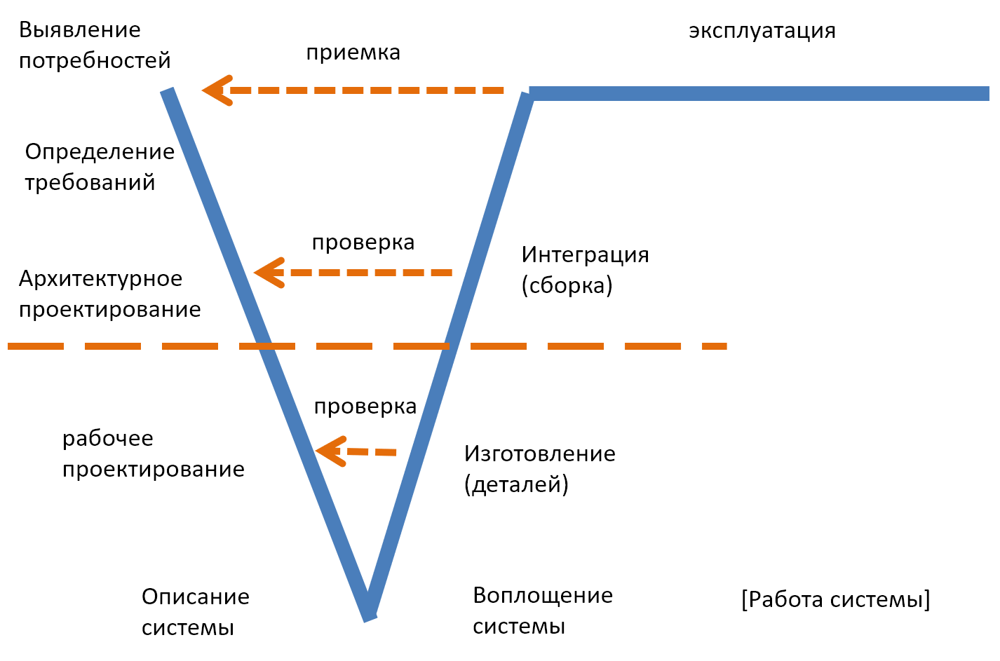

# R2.6:4 - Измерение изменений

Для управления работами в рамках операционного менеджмента важно замерять скорость их выполнения. Выбрав метод и поняв, как меняются состояния объектов внимания/предметов метода, надо начать измерения того, с какой скоростью исполнители с их инструментами в физическом мире могут довести дело до конца. Если мы соберем данные о скорости выполнения операций, то сможем использовать их для прогнозов сроков выполнения будущих работ. Такие расчёты будут надёжнее, чем догадки, выполненные *«методом научного тыка»*.

Мы уже начинали разговор о метриках в подразделе R2.3:6. Давайте расширим и уточним введённые там механизмы.

Что нужно, чтобы измерить изменения? Для начала определиться, что именно должно быть результатом выполнения метода, какие объекты должны быть в каких конечных состояниях. Например, «*обед приготовлен*» (или «*подан на стол*», или «*съеден*»?), «*отчёт составлен*», «*встреча проведена*».

Далее надо отмоделировать, какие ключевые промежуточные состояния объекты внимания/предметы метода будут проходить в процессе применения метода. Например, *«выбрано блюдо для готовки», «наличие ингредиентов проверено», «выбран метод составления отчёта», «метод понятен исполнителю*. Тут важно научиться при моделировании состояний объектов/предметов метода размышлять в так называемом ***«методологическом времени»***. Это не время на часах в том смысле, что тут нет никаких точных временнЫх меток. Вы не прописываете, когда, к какому времени, обед должен быть «*приготовлен*», отчёт «*подготовлен и загружен*», и даже не размышляете о продолжительности этих переходов в часах или минутах. Вы только описываете состояния, которые *не могут не принять* объекты в ходе выполнения метода, и последовательность этих состояний

Вы получите что-то наподобие V-диаграммы системной инженерии, только не для одной системы, а для нескольких ключевых объектов метода, и, скорее всего, с разными состояниями для разных объектов.

Это и есть описание метода в *«методологическом времени»*. Тут отсутствует любое указание на физическое время выполнения (то есть то, что интересует нас в работах), но присутствует указание на объекты внимания и последовательность их предполагаемых состояний (то есть то, что интересует нас в методах). Указание на последовательность обычно довольно строгое: например, пока описания объекта или его части нет, его изготовление едва ли начнётся, без чертежей едва ли изготовят детали двигателя автомобиля и вряд ли потом такой двигатель соберут. Но бывают и состояния, которые можно достигать параллельно, или неоднократно (итерациями), то есть в методологическом времени могут быть отражены самые разные зависимости состояний друг от друга.

А уж в реальном физическом времени, в котором будут позже выполняются работы, состояния объектов точно не только будут двигаться вперёд, но и будут откатываться назад. Например, инженеры, собирающие двигатель, могут обнаружить, что детали не подходят, или что в конструкции двигателя есть недостатки, которые приведут к проблемам в эксплуатации. В таком случае двигатель из состояния «*собран*» вернётся в состояние «*изготавливается*» или «*проектируется*». И такие возвраты в реальном физическом времени в реальных проектах будут происходить постоянно. Поэтому в разные состояния объекты (их темпоральные части, конечно) могут приходить не по одному разу, прежде чем будет получен конечный результат.

Стандартная V-диаграмма этого не отражает, из-за чего ею легко обмануться: посчитать, что это описание отражает то, что будет реально происходить с вашими объектами. Нет, оно пригодно только для обсуждения в методологическом времени, а вот для мониторинга работ придётся регулярно делать реальные замеры, без оглядки на то, что *«должно быть».*

Реальные измерения должны показывать, какие предметы метода/объекты внимания метода находятся в каких состояниях в какой момент времени, какие состояния им ещё предстоит пройти (т.е. каков методологический «путь» от текущего места в производственной цепочке до «выхода»), и с какой скоростью должны быть выполнены работы, которые приведут объекты в нужные состояния. Кроме того, на основе замеров должны выполняться расчёта по схеме «что, если» - что может помешать выполнить работы в срок.

Например, ключевым результатом работы вашего подразделения HR должен быть успешно работающий сотрудник, который занимает определённую должность и применяет определённые методы (или играет определённые роли). Для этого примера надо определить, когда мы начинаем рассматривать такого сотрудника: с момента принятия на должность (пришёл на работу в компанию) или с момента попадания в пул потенциальных кандидатов для найма. Затем спроектировать «методологический путь»: расписать цепочку состояний, через которые (вообще) проходит сотрудник. Далее (на основе данных о реальных кандидатах) отметить, через какие состояния проходили кандидаты сколько раз, какова была траектория их движения (например, одни сотрудники могли не раз пройти «*интервью*», те «*быть проинтервьюированными*», зато ни разу не выполнять «*тестовое задание*», или наоборот), какова общая «*скорость до результата*» (то есть, от начального/входного состояния или точки отсчёта до конечного состояния), какова была скорость выполнения ключевых операций/работ по методу, которые наиболее важны для доведения дела до конца («*критические работы*» или работы «*критического пути*»), что помогло или помешало выполнить операции быстрее, как менялись принятые решения на протяжении всего пути.

Такое рассуждение придётся повторять на разных системных уровнях организации для всех предметов методов. (Системными уровнями мы пока будем называть масштабы крупности физических объектов. Далее в руководстве по системному мышлению понятие системного уровня будет уточнено.)

Для компании в целом надо применять такое же рассуждение. Общий его алгоритм таков:

1. Определить **конечный результат**. Для компании в целом конечный результат - это вещь, покидающая границу предприятия (мы уже называли это «***целевой системой***»). С точки зрения операционного менеджмента интересует количество таких вещей в штуках/партиях/иных единицах измерения в единицу времени, то есть **выпуск.** Для столярной мастерской, в ней изготавливают лестницы, границу предприятия покидают лестницы - сколько-то штук ежедневно/еженедельно/ежеквартально. Если вы производите молоко, придётся выбрать какой-то измеримый результат для замеров, например, количество произведённых литров, или бутылок молока. У ИТ-компаний это могут быть релизы, версии продукта
2. Определить, **каковы ключевые состояния вещи**, через которые она проходит, прежде чем покинуть границу предприятия. Тут можно думать так: надо, чтобы воплотились физические объекты (лестница ID 405 для клиента А, лестница ID 406 для клиента Б, которые 4 мартобря 20ХХ года отправятся клиентам). Для этого должно появиться «*описание лестницы*» (и описания её частей), причём, скорее всего, не одно (описание для клиента, для столяра, для юриста и т.д.), подобран материал, бруски напилены, обструганы, отфрезерованы и т.д., лестница собрана - вплоть до конечного состояния, которое вы определите сами (кто-то посчитает, что конечное состояние - это *«лестница, отправленная клиенту»,* а клиент уже сам собирает, кто-то решит, что для них конечное состояние - *«лестница, установленная у клиента»*, а кто-то и вовсе скажет, что конечное состояние - *«лестница, выдержавшая полгода эксплуатации»*).
3. После определения ключевых состояний нужно будет замерить **скорость выпуска/скорость до результата**: с какой (средней) скоростью объект/ключевой предмет метода проходит путь от начального состояния (его тоже придётся выбрать самостоятельно, как и конечное состояние!) до конечного. Выпуск в штуках учитывает только количество покинувших предприятие вещей (штук лестниц в данном случае) - и нам не важно, сколько вещь изготавливается. А вот скорость выпуска оценивает, как быстро вещь проходит путь по конвейеру.
4. После вы можете приблизить *«камеры внимания»*, навести их на конкретные кусочки пути, где возникает больше всего проблем (часто там расположены бутылочные горлышки, воздействие на которые даст максимальный эффект с точки зрения операционного менеджмента/управления работами). Выделить конкретные работы по методу (например, на схеме или в таблице), которые выполнить сложнее всего, например, в силу сложности метода (*моделирование* обычно сложнее, чем *использование модели,* составить качественный чеклист сложнее, чем его *заполнить*) или в силу ограниченности ресурсов для выполнения работ (недостаточно квалификации исполнителей, мало материалов, мало денег и т.д.).
5. После чего выделить как самые проблемные, так и самые медленные операции на участках пути. Наиболее медленная операция из всех будет **ограничением**. Чтобы ускориться в выполнении работ, нужно воздействовать на ограничение в первую очередь.
6. Для воздействия на скорость работы ограничения мы можем применять разные технические или управленческие воздействия/оргизменения. Мы можем вычислить ожидаемый эффект от воздействия - а именно, изменение в скорости работы ограничения или **темп/ускорение**.
7. Для сравнения разных воздействий между собой нужно будет вычислить, какое из них даёт наибольшую прибавку в скорости до результата. То есть, сравнить ускорения между собой. Для этого мы можем сравнить ускорения «в лоб» или рассчитать **рывок**, то есть, *изменение в ускорении*. Если одна инициатива даёт ускорение в 1.5 раза, а вторая - в 3 раза, то рывок от второй инициативы в 2 раза больше.

Итого мы можем считать, что у нас есть формула, описывающая движения вещи по конвейеру предприятия, которая, однако, сложнее привычных физических формул. В классической механике мы считаем, что есть одна неизвестная (координата, скорость или время) и мы можем найти эту величину. Если точка движемся по прямой с одинаковой скоростью (прямолинейное равномерное движение), то, чтобы найти путь (координату), нужно умножить скорость (известна) на время движения (известно). Если движение криволинейное и с разной скоростью, то для нахождения пути придётся интегрировать, а для нахождения скорости - дифференцировать. А вот в квантовой механике уже считается, что нельзя измерить одновременно координаты частицы и её импульс/количество движения.

Для физики предприятия ситуация примерно такая же запутанная, и по-своему ещё хуже: мы заранее вообще ничего не знаем.

Мы не знаем точный *путь* объекта от начального состояния до конечного. Мы можем только описать *«методологический путь»* и затем замерять *«физический путь»* в реальности. Кроме того, сам путь по мере движения будет меняться: и у выполняющего работу агента, и у методолога/наблюдателя будут меняться представления о том, каков должен быть путь, какие методы и работы нужны, чтобы его пройти. Даже объект по мере движения может поменяться: например, предприятие поменяло цель, надо перетряхнуть все текущие проекты, возможно, отказаться от старых, чтобы прекратить двигаться по старому пути. Зато добавляется переменная *«прирост информации»*, меняющаяся по мере движения. И мы не знаем заранее, какую информацию и где получим - мы вынуждены постоянно тестировать гипотезы/предположения.

Большое значение придаётся анализу следующего показателя *«физики предприятия»* -*скорости* движения объекта. Его мы хотя бы можем предположить/спрогнозировать в нынешних условиях на основе статистики и наших предположений о том, что изменится в будущем. Как спрогнозировать, можно вычитать в книжках ***The Book of TameFlow/Tame Your Work Flow*** (разные названия одной книги) от Steve Tendon или ***Actionable Agile Metrics*** и ***When Will It Be Done*** от Daniel S. Vacanti. Но и эти прогнозы будут проваливаться в некоторых случаях.

Нашей целью в конце концов является оценка ***времени движения***, но это, пожалуй, самая сложная величина для прогнозирования. Разобраться с ней можно только тогда, когда мы разберемся со всем остальным.

Это непросто, однако методы, описанные выше, позволяют начать разбираться с этой сложностью на предприятии. Будем пробовать их применить - в большом (для предприятия в целом) или в малом (для его кусочка), чтобы прийти к моделированию потоков работ.
