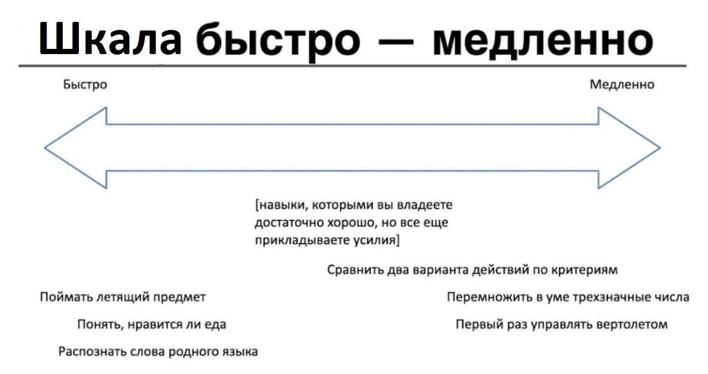

# R2.6:5 - Шкалы

При выборе методов и управлении работами придётся регулярно сталкиваться с выбором: повысить ли точность выполнения задачи - или приоритизировать скорость. Мы уже обсуждали такой выбор, когда говорили о типах мышления и обсуждали дребезг. Почему так происходит и как сделать правильный выбор в такой ситуации?

Как вы помните, мозг/биологический вычислитель как физический объект можно представить в виде двух сигнальных систем по Павлову: первой сигнальной системы, которая обеспечивает быстрое ассоциативное мышление, и второй сигнальной системы, которая обеспечивает медленное понятийное мышление. При помощи быстрого мышления удобнее решать отдельные классы задач: например, те, для выполнения которых не нужно концентрироваться, или которые уже вошли в автоматизм/привычку. При помощи медленного мышления хорошо решаются другие классы задач, например, задачи по стратегированию, задачи на умножение многозначных чисел, или текстовые задачи, или сложные инженерные задачи. Здесь быстрое мышление пасует, не даёт рационального ответа и вместо него подкидывает чушь (очевидные и неправильные решения). Медленное мышление, напротив, именно в таких ситуациях даёт максимально качественные решения.

В зависимости от задачи, мы двигаемся по шкале скорости мышления вправо или влево:

Мы можем посмотреть на тот же процесс как на движение по шкале точности мышления. Когда у вас нет качественного автоматизма (например, когда вы не довели до автоматизма умение моделировать собеседника в коммуникации), одновременно с движением по шкале точности мышления вы движетесь по шкале скорости: обмениваете «*скорость*» на «*точность*». Это происходит следующим образом.

Для начала нужно выбрать степень точности (качества) рабочего продукта. Если качество должны быть очень высокими, а метод выполнения ещё не доведён до автоматизма и/или не выделено достаточное количество ресурсов на выполнение работ, скорость выполнения упадёт. Мы обмениваем замедление в выполнении работы на прибавку в качестве. Это выгодно делать, когда речь идёт о принятии сложных решений с долгими и значимыми последствиями, например, о выборе стратегии компании, или когда речь идёт о задачах, ошибки в решении которых дорого обойдутся позже, на этапе эксплуатации сложных инженерных систем. Если мы имеем дело с такими задачами, мы двигаемся вправо по шкале «*быстро - медленно*» и вправо же по шкале «*неточно - точно*», пока не выберем устраивающие нас точки: где точность уже достаточна, а скорость ещё не критически низкая.

Иногда в приоритете может оказаться скорость получения рабочего продукта. Обычно это очень важно, когда вы запускаете новое направление бизнеса, новую компанию или что-то делаете в первый раз. Частая ошибка в таких ситуациях - слишком сильно двигаться по шкалам скорости и точности вправо: вы не можете себе позволить потратить слишком много сил и времени на первую попытку. Вам нужно рассчитать свои силы на несколько попыток, например, хотя бы на 4-5: обычно хороший продукт получается примерно с 4 раза, поэтому вы заранее соглашаетесь на то, что первые попытки будут неточными/некачественными. Вы соглашаетесь считать более приоритетной характеристику «*скорость получения рабочего продукта*» и принимать решение по поводу методов и работ так, чтобы рабочие продукты получались побыстрее, а затем непрерывно улучшались.

«***Быстро - медленно***» и «***неточно - точно***» - не единственные виды шкал, которые вам понадобятся. Шкал много, и поиск нужных шкал для принятия решений по поиску оптимума -важная часть работы по моделированию.

Но общая схема принятия любых решений будет именно такой: сначала выбираем *шкалу* и *направление движения* на ней, и тут выбор будет бинарным: мы не можем одновременно бежать и вправо, и влево. Затем нужно будет выбрать, где именно на шкале мы остановимся, тут мы можем выбирать из множества значений. Остановившись по этой шкале, мы будем уже осознавать, какой выбор это нам диктует по другим шкалам. Если выбора больше нет (наше положение на других шкалах зафиксировано) -мы может оценивать решение в целом. Критерии для этого мы ещё будем обсуждать. Если же выбор есть, мы можем немного сдвинуться по следующей шкале в сторону предпочтительного для нас направления.

Например, пусть ваша компания проектирует мосты, по которым потом возводят мост мостостроители. Вам надо выбрать, будет ли она делать типовые проекты мостов, или попробуете выйти на рынок уникальных мостов. То есть вам надо сперва найти, где на шкале *«**типовые - уникальные**»* вы будете работать. Это стратегический рыночный выбор, он определяется скорее предпринимательской догадкой о будущем данного сегмента (основанной на знании рынка на данный момент, конечно). Допустим, вы склонились к проектированию более уникальных мостов, а не типовых. Вы даже можете поточнее выбрать степень уникальности на шкале «*типовой - уникальный*». Например, вы можете сосредоточиться на проектировании совсем уникальных горных виадуков, а можете сфокусироваться архитектурно уникальных, но инженерно -типовых мостах для городской среды, уникальность «*чуть выше средней*». И то, и другое может быть выгодно, какой выбор вы сделаете, зависит от доступных вам ресурсов и вашего решения.

Но с этим выбором вы автоматически выбрали более медленную скорость выполнения операций, чем та, что возможна для проектирования типовых мостов. Это уже **компромисс/размен/trade-off**: вы платите за уникальность продукта (и возможность заработать больше с одного экземпляра) более медленной скоростью выполнения операций, а также повышенными требованиями к квалификации проектировщиков и, вероятно, повышенным вниманием к качеству продукта. Если вы выберете проектировать типовые мосты, то вам будет доступна более высокая скорость операций, вам нужны будут чуть менее квалифицированные инженеры - но в обмен на это вам придётся куда быстрее «прогонять» проекты через конвейер организации, только так вы можете заработать достаточно. То есть вы уже ограничили своё положение ещё на одной шкале: «***дорого-дешево***».

Далее у вас есть шкала выбора методов проектирования «***автоматизированно-вручную***». Автоматизированное проектирование лучше работает для типовых проектов, а вот уникальные -требуют внимания живых инженеров. Но ваше положение на этой новой шкале -тоже не так уж детерминировано. Вы можете вложиться в новые технологии, позволяющие с помощью генеративного AI делать уникальные проекты не хуже.

Далее количество шкал и поиск оптимальных решений по ним может расти, работа по методам *многокритериальной оптимизации* и поиск *Парето-оптимальных решений* ещё встретятся вам в наших резидентурах.

Как выбирать методы в конкретной ситуации? В большинстве случаев вы сделаете выбор при помощи быстрого мышления ещё до того, как успеете вспомнить про шкалы. И если у вас не возникает после такого выбора проблем, например, если вы спокойно договоритесь с другими агентами в других ролях, то можно о них и не вспоминать. Но если вы не можете договориться, то нужно будет определить, какие объекты вы и ваши собеседники вообще выделяете, и по каким шкалам сравниваете их изменения. Вот тогда вам и пригодится умение выводить рассмотрение разных шкал в фокус медленного мышления.
