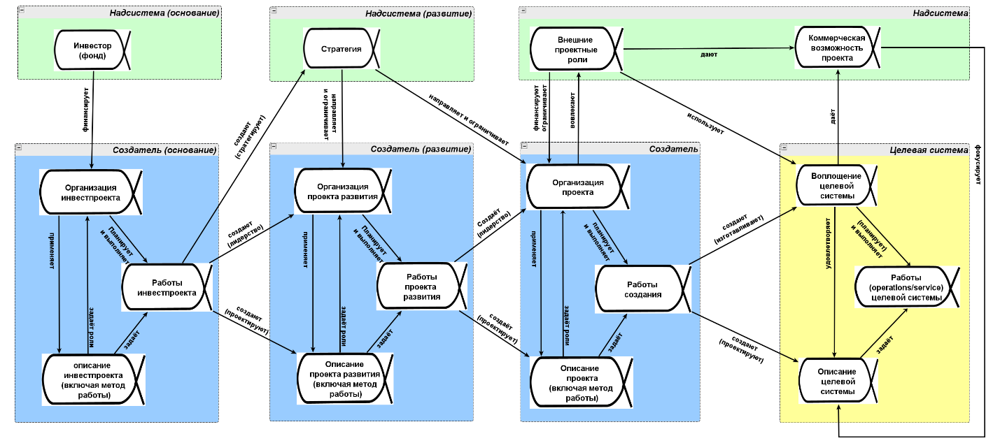

# R2.6:6 - Система и граф создателей системы

Мы обсуждали моделирование смены состояний объектов для того, чтобы делать качественные чеклисты. Сейчас мы применим этот подход для более общего описания ***путешествия/journeys объектов***. Часто о таких путешествиях говорят маркетологи: возможно, вы слышали термин *«клиентское путешествие»/customer journey*, которым описывают то, как потенциальный покупатель превращается в реального, создавая это описание в виде карты/customer journey map. Нас будет интересовать более широкое представление о путешествии любой *системы* по *предприятию-как-конвейеру* или его участкам (включая путешествие *клиентеллы* с точки зрения маркетинга, разумеется). Именно такой тип путешествия интересен операционным менеджерам.

Разные виды систем вы уже попытались определить ранее, когда играли в игру «*Назови систему*»[^1] в резидентуре ***R1 Распожаризация***. Напомним: в качестве *системы* мы, для начала, рассматриваем систему, покинувшая границу *нашего предприятия* и эксплуатирующуюся/использующуюся за его пределами. Далее мы можем иногда заметить, что эта *«наша система»* (которая покинула границу *нашего предприятия*) реально нужна для создания другой системы, то есть *наше предприятие* является одним из создателей в *графе создателей* и *«наша система»* в дальнейшем используется для создания *«целевой системы»*.

Например, есть нефтедобытчик, для которого система - это партия/лот нефти, которую можно передать по долгосрочному контракту или продать по краткосрочному контракту на бирже. А вы можете оказывать нефтедобытчику услуги по *разведке нефтяных месторождений* *(«сервис поиска мест для бурения нефтяных скважин»)*, тогда «*вашей вещью*» будет географическая локация – точка, в которой *скважина* (которую пробурит сервисная компания – *бурильщик,* и скважина – это *его система*) должна попасть в месторождение нефти (это не любая точка, пустая скважина означает, что работы по сервису/методу поиска мест для бурения были проведены плохо). Но *конечной/целевой системой* и для вас, и для бурильщика – тоже будет партия/лот в сколько-то баррелей нефти. Если нефть не нужна, то и пробуренная скважина тоже не нужна. Соответственно, и сервис/метод поиска мест для бурения нефтяных скважин тоже тогда не нужен.

Именно поиск *целевой системы* (то есть системы, приносящей некую пользу людям) важен, хотя в её определении у нас есть некоторый произвол. Например, можно поспорить - что целевой системой является партия/лот дизельного топлива, а вовсе не нефти, поэтом для обоснования нашего выбора нужна будет дополнительная аргументация. Она состоит в том, что из партии нефти можно сделать не только много разных видов топлива, но и множество видов синтетических материалов на нефтеперерабатывающих заводах, например, искусственный/синтетический каучук. Из этого каучука в дальнейшем могут сделать эластомеры, которые придают эластичность жвачке, купленной вами в магазине. Таким образом граф создания можно продолжать достаточно далеко (от нефтеразведчиков до продавцов жевательных резинок, например), однако обычно имеет смысл остановиться на такой системе, которая уже ценна сама по себе (например, является предметом торга на бирже, как партия/лот нефти) и использование которой далее становится очень многообразным. Поэтому остановиться именно на партии нефти как целевой системе на этом этапе – самое разумное.

Таким образом, при поиске целевой системы мы должны различать два широких класса ситуаций:

- **Предприятие изготавливает целевую систему само (является единственным её создателем).** В этом случае назвать целевую систему относительно легко. Нефтедобытчики добывают нефть и формируют партию/лот нефти на продажу, подрядчик строит дом, парикмахерская создаёт прическу, компания-создатель конвейеров продаёт ленточные конвейеры для шахт.
- **Предприятие не изготавливает целевую систему непосредственно, а находится где-то в** ***графе создателей системы***. Тем самым создателей целевой системы оказывается несколько, и каждому из них выделить целевую систему вниманием и назвать сложно, каждый *зависает* на ***своей системе*** (или это даже не система, а эпистема/описание). В таких случаях необходимо разворачивать производственные цепочки (или даже сложные графы), и по цепочке добираться от *своей системы (своего объекта)* до *конечной/целевой системы*.

Посмотрим ещё раз на примеры *графов создателей (*гораздо подробнее они будут обсуждаться в руководстве ***R6. Системное моделирование***). Если вы один из создателей в графе, ваша роль может различаться.

Вы можете физически изготавливать ***часть системы (деталь системы)***, например, двигатель автомобиля, который совместно с другими деталями собирается на отдельном предприятии и продаётся покупателю в составе системы «автомобиль». Это достаточно простой случай. Похожий вариант – с синтетическим каучуком, это не деталь для системы, но это ***сырьё*** для следующего этапа её изготовления. Сырье тоже входит в состав выпускаемой системы как часть!

Совсем другой вариант – когда ваша компания изготавливает вообще не *систему*, а её ***описание***, например, *инженерно-конструкторскую документацию для прототипа авиадвигателя*. В этом случае границу предприятия покидает физически не «*наша система*», а ***описание системы***. «*Нашей системой*» далее по цепочке будет прототип авиадвигателя, изготовленный за пределами нашего предприятия по нашим чертежам, а *конечной/целевой системой* - *серийно выпускающиеся* по нашим чертежам авиадвигатели (прототип нужен для того, чтобы потом перейти к серии, и количество неуспешных прототипов мы хотим минимизировать) или даже самолёт. Авиадвигатель изготавливается другими предприятиями, мы только описываем их. Поэтому, если вас просят назвать вашу систему (то есть имеют в виду индивид/физический объект), а вы внезапно говорите *«инженерно-конструкторская документация»*, то у собеседника возникает дребезг - вы не удержали внимание на типе, перепутали объект с его описанием, *систему* с *эпистемой*.

Для того чтобы найти систему, полезно выполнить уже знакомое нам *заземление*. Сперва назвать систему вообще (класс систем, например, *«лот нефти», «мост»*), а затем предъявить конкретный индивидуальный физический объект, принадлежащий к классу изготавливаемых систем («*лот нефти, проданный по поставочному контракту №124*», «*мост через реку Обь в таком-то месте, введённый в эксплуатацию с такого-то числа*»). Заземление позволит проверить, не допустили ли вы ошибку при определении системы (не спутали ли систему и её описание, систему и её свойства/характеристики, систему и её поведение).

Если вы работаете в проекте по разработке софта (например, ERP-систем для предприятий) то вам надо особенно внимательно следить за тем, чтобы ни вы, ни ваши коллеги не путали исходный код софта, сам работающий на предприятии софт, содержащий цифровой двойник предприятия, и те объекты на предприятии, описания которых поддерживает ваш софт – материалы, комплектующие, запасы, товары, и т.п.

Не делайте ошибку, не считайте, что ваш исходный код ценен сам по себе, и даже что наполненная база данных ERP ценна сама по себе. Нет, они цены тем, что описывают реальные объекты на предприятии и поддерживают реальные работы по выбранным методам. Разработчики должны понимать, какие физические объекты будут во внимании тех, кто использует этот софт, какими методами они пользуются, какие методы сейчас SoTA (*State-of-the-art, современные/последние*), а какие уже устаревают и не должны поддерживаться вашим софтом.

Рассмотрев подробнее *описания* *систем*, вернёмся снова к разным вариантам отношений в графе создателей. Ещё один вариант – вы создаёте не часть/деталь системы, не сырьё и не её описание, а ***инструмент*** для её создания (простейшего неавтономного *создателя)*, например, *станок* или *прибор* для производящего систему завода. Тут тоже надо рассуждать осторожно. (Если это универсальный токарный станок, который может работать на машиностроительных заводах самой разной направленности, то рассматривать в качестве своих целевых систем всё многообразие возможных механических изделий – нет никакого смысла. А вот обточенную с заданными параметрами точности заготовку, ради которой и покупают ваш станок – надо иметь в виду.)

Пример попроще – в нашем примере про нефтедобычу. Нефтеразведчики создают для бурильщиков *возможность* - пробурить *скважину* в указанной *локации*, которая упрётся в нефтяное месторождение, и добывать оттуда нефть. *Бурильщики* используют эту оргвозможность: бурят *скважину*, которая предоставляет возможность *нефтедобытчику* добывать нефть и продавать её партиями/лотами на рынке, где ею могут торговать или отправлять. Локация и скважина – это не части партии нефти, но они и недостаточно универсальны, кроме как для добычи нефти, их использовать незачем. Поэтому место разведчиков и бурильщиков в графе создания партии нефти осмыслить несложно.

Наконец, ваше предприятие может выпускать и не вещь, и не части вещи, и не описания вещи или её частей, и не простые инструменты, а изготавливать ***другого агента-создателя***, обладающего не только автономностью, но и (в каком-то смысле) предпочтениями и волей. К этой категории относятся «*консалтинговые проекты*», в рамках которых «*что-то меняется в методах организации-клиенте*» на основе предложенных консультантом моделей. В рамках таких проектов меняется часть методов предприятия или предприятие в целом (*«обновляется до новой версии»*), вот эту часть предприятия в новом состоянии можно назвать *«нашей вещью»*. Вы *изготавливает* эту новую версию части предприятия чтобы создать новую оргвозможность, как создают её нефтеразведчики для бурильщиков. А уже изменённый создатель изготавливает вещь/целевую систему. Разумеется, роль такого консультанта может выполнять внутренняя служба развития предприятия, отвечающая за поиск и внедрение новых методов. А её, в свою очередь, может изготавливать (как организацию) *директор по развитию*. Вообще цепочки создания и изменения *агентов-создателей* могут быть не менее сложными, чем цепочки получения сырья и деталей для систем. Это иллюстрирует диаграмма, называемая *системной схемой проекта*, которая будет занимать важное место в резидентурах **R6. Системное моделирование** и далее.

Пока что c ней наверняка не всё понятно, но не застревайте на этом. С этой схемой вы еще не раз встретитесь и разберетесь, что означает каждый её элемент. На данный момент нам важна принципиальная идея: одни создатели могут создавать/основывать или менять/развивать других создателей, таким образом они оказываются включёнными в граф создателей целевой системы. Но все проекты организационного развития и технологического развития нужны только для того, чтобы появилась система в конце цепочки этой. Не нужна нефть - не нужна скважина - не нужен сервис поиска мест для бурения - не нужен проект по изменению методов поиска нефти в регионах.

Если вы работаете с софтверными проектами, то очень велик шанс, что вы не работаете над целевой системой напрямую, а находитесь где-то в графе создателей. Например, разрабатываете платформу Aisystant для МИМ, чтобы инженеры-менеджеры могли пользоваться руководствами, проходя резидентуры. Платформа нужна не сама по себе: она нужна для того, чтобы инженер-менеджер мог формировать у себя нужное мастерство, например, мастерство рациональной работы, которое затем используется на предприятиях в проектах оргразвития для ускорения выпуска систем. Разработчики Aisystant должны учитывать это, помнить, что они не просто «*делают софт*», а участвуют в изготовлении мастерства инженеров-менеджеров, пусть и не напрямую.

Систем, в создании которых участвует организация, может быть много, в таких случаях говорят о «*широкой продуктовой линейке*». В резидентуре мы предлагаем для начала выбрать одну систему и потренироваться рассуждать о ней. Если вы сразу попытаетесь рассмотреть сложную ситуацию с предприятием, выпускающим много систем, то вы просто не справитесь со сложностью. Сначала учимся моделировать на более простых примерах, затем усложняем модели. Так вы придёте к результату быстрее и не отвалитесь по пути.

Теперь вы примерно поняли, какая у вас система и где ваша организация в графе создателей[^2]. Далее нужно понять, какие объекты путешествуют через ваше предприятие. Если ваше предприятие - единственный создатель системы, то через предприятие путешествует система, которая затем покидает границу предприятия и попадает к покупателю, который её эксплуатирует, и мы будем описывать её путешествие через конвейер и измерять путь, время и скорость прохождения пути. Если ваше предприятие - один из создателей в графе создателей, то назвать объект, путешествующий через предприятие и выпускающийся на выходе, чуть сложнее. *Хорошо бы* называть объектом, выпускающимся вашим предприятием, *будущую* целевую систему, которая начнёт существовать в какой-то момент в будущем. Например, если вы делаете 3Д модели мостов, лучше всего считать выпуск/проход/Throughput в штуках *будущих мостов*, которые будут построены по вашей 3Д модели. Ведь если вы регулярно делаете модели, которые потом не используются - то вам перестанут платить.

Но мы понимаем, что менеджеры, с которыми вы будете разговаривать, могут считать выпуск иначе. Рассуждения о том, что происходит с вещью после начала её эксплуатации, часто вообще оказываются вне внимания даже топ-менеджеров, и уговорить их перенаправить камеры внимания в нужное место не так просто. Поэтому, чтобы договориться (ведь у нас не просто «*моделирование*», а «*прагматичное, целеориентированное моделирование*»), мы аккуратно говорим, что вы *можете* считать выпуск не в «*системах*» (будущих или уже существующих), но в штуках (или иных единицах измерения) *других объектов*. При таком подходе объекты, которые *для операционного менеджера* покидают границу предприятия/выпускаются с предприятия, могут быть любого типа: хоть часть системы, хоть её описание, хоть вообще инструмент, который другой создатель будет использовать для создания системы. Но при определении *выпускаемого объекта* вы должны понимать и показывать причинно-следственную цепочку, связывающую её с целевой системой, т.е. как этот *ваш выпускаемый объект* за пределами вашего предприятия используется для создания целевой системы и её дальнейшей эксплуатации. Например, нефтеразведчики могут считать выпуск не в лотах/партиях нефти, но в штуках разведанных скважин. Также они *могут* сказать, что выпуск будут считать в штуках сейсморазведочных профилей[^3] (описаний возможных локаций для бурения) - но *только если* при таком разговоре во внимании команды удерживается как минимум скважина, которую будут бурить в месте, которое в сейсморазведочном профиле указано как наиболее перспективное. Если во внимании команды этого нет, то они радостно проигнорируют все ваши слова про *«целевую систему»* и будут полировать описания, ничуть не заботясь об их связи с физическими объектами (*Мы выпускаем сейморазведочные профили так, что перспективные для разработки скважины находятся в 50% случаев (а у конкурентов - в 75%)? Ну и что, находятся же, и даже довольно часто! Почему эти клиенты жалуются?!* )

Если вы сталкиваетесь с таким восприятием команды, то проще запретить говорить о выпуске описаний и искать пусть не «***целевую систему***» (например, *партию/лот нефти, реально поставленную покупателю)*, но хотя бы ***материальную вещь*** «***нашу систему***» («*пробуренную скважину*»).

Таким образом, при определении объекта, который путешествует через предприятие и выпускается наружу, надо убедиться, что этот объект:

- Связан с целевой системой каким-то отношением, и вы можете указать, каким именно (отношением часть-целое, отношением описания, отношением создания, цепочкой этих отношений в каком-то количестве и порядке), и вы не забываете об этих отношениях в работе.
- Покидает границу предприятия и эксплуатируется/используется за его пределами,
- Отсутствие выпускаемого объекта или проблемы с ним приводят к проблемам в создании и дальнейшей эксплуатации целевой системы.
- Интересен операционному менеджеру, измеряющему выпуск предприятия. Чтобы вы смогли убедить менеджера в необходимости провести организационные или технологические изменения на предприятии, надо уметь показывать связь между увеличением скорости выпуска или уменьшением затрат на выпуск единицы или партии объектов. Тогда менеджер вас услышит и будет готов договариваться.

[^1]: https://ailev.livejournal.com/1750301.html
[^2]: В ходе первых резидентур вы получите лишь первое представление о том, что такое вещь и граф создателей. Мы не ожидаем, что вы сразу найдете целевую систему и сможете выделить всех её создателей. Но мы точно ожидаем, что вы начнете думать, что такое целевая система, в создании которой вы участвуете, что ваше предприятие выпускает, чтобы она появилась – и при этом вы не будете допускать онтологических ошибок: не будете пытаться назвать вещью описание вещи, поведение вещи, свойства/характеристики/атрибуты вещи.
[^3]: https://habr.com/ru/companies/leader-id/articles/496284/
