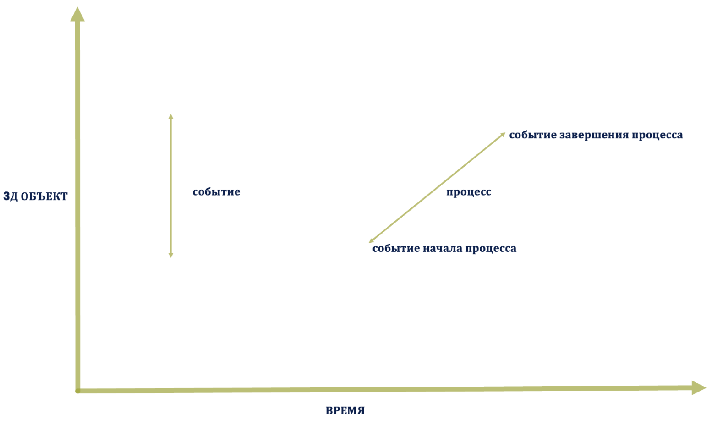

# R2.6:7 - Онтология путешествия объектов

Чтобы далее описывать путешествие объектов, нам надо ввести минимальную онтологию.

В первую очередь нам важны следующие объекты этой онтологии:

- **Объект путешествия** - базовый объект внимания. Это тот объект, который предприятие, или подразделение, или команда (в зависимости от выбранного уровня рассмотрения) будет получать ***на выходе***. Вам надо уметь выделять его вниманием и определять, является ли он системой или эпистемой/описанием.
- **Состояния объекта/states** – через какие состояния пройдёт выбранный объект, прежде чем его можно будет считать "выпущенным". Имейте в виду, что ***на входе*** может быть множество разных объектов, состояния которых будут важны даже до того, как объект появится хоть в каком-то виде. Эти состояния вы также должны назвать с отсылкой к объекту путешествия (например, *«комплектующие для сборки измерительного узла завезены»* или «*сборочные чертежи измерительного узла утверждены»*.
- **События/events,** отмечающие смены состояний объектов. Описания событий должны позволять определить, как мы понимаем, что состояние достигнуто, включая понимание того, что объект перешёл в состояние "*выпущено*".

«**Событиями**» мы называем моменты во времени, которые отделяют одни состояния объектов от других. (В следующей резидентуре R3 вы научитесь думать о них/моделировать их как трёхмерные срезы, являющиеся частями четырёхмерного (4D) объекта)

Например, в мероприятии "*концерт*" мы можем выделить события «*начало концерта*» и «*завершения концерта*». Можно считать, что событие *начала концерта* состоит в выходе музыкантов на сцену. После начала концерта мы можем говорить о том, что объект «*концерт*» перешёл в состояние «*происходит*», то есть начал воплощаться в жизни (и, соответственно, мы, как зрители будем демонстрировать зрительское поведение: слушать, хлопать и т.д.). *Событием завершения* – можно считать включение света в зале, или вставание музыкантов, или уход музыкантов со сцены. После завершения - объект «*концерт*» находится в состоянии «*завершён*», то есть закончил воплощаться в жизни (и мы как зрители должны теперь покинуть концертный зал). Всё, что происходит между началом и завершением концерта, мы будем называть «**процессом**», то есть чем-то, длящимся во времени[^1].

События отмечают смены состояний объектов, происходящие пока объект путешествует через предприятие (или преобразуется на нём). Операционных менеджеров всегда будут очень интересовать события «*начала работы*» и «*завершения работы*». Заметьте, тут у нас *состояния работы*, а не *состояния объекта*! После события начала работы предмет работ/work item должен начать менять своё состояние, а после события *успешного завершения работы* - прийти в *нужное состояние*, и это важное различение.

Шкаф должен перейти в состояние «*сдвинут* *в угол*». Это событие совпадёт с событием «*работа завершена*» при успешном завершении работы. А вот при неуспехе – ***такт работы*** завершен с точки зрения операционного менеджмента: трата ресурсов произошла и завершилась, время потрачено, грузчики ушли. Но всё впустую, *шкаф* так и не сдвинут. И это необходимо отслеживать, тут для моделирования полезно ввести понятие *такт работы/work episode* – если нужное состояние объекта не достигнуто, то понадобится ещё один (минимум) такт, со своим началом и завершением.

*Работа/work* завершена, когда есть нужный объект в нужном состоянии. А *такт работы/work episode* может завершиться и без нужного объекта в нужном состоянии.

Если приходится производить несколько тактов работы для одной работы, то надо что-то менять:

- либо что-то, связанное с *работой* (например, исполнителя);
- либо что-то, связанное с *методом* (менять метод).

Описание путешествия системы делаются так, чтобы учесть: *сначала* произошло событие «*начало существования системы*» (вещь из «*будущей*» стала «*существующей*»), а потом - событие «*начало эксплуатации системы*». Поэтому и успешность завершения процесса составления описания системы оценивается *после* наступления события начала эксплуатации системы, а до этого лучше называть состояния *описания* без использования слов *успех* или даже *завершение*.

Теперь вернёмся к *графу создателей*, ограничившись рассматриваемым нами участком путешествия. Любое событие происходит в каком-то ***узле графа создателей***, в ***функциональной локации***, которую можно связать с конкретным ***физическим местом/локацией***. Это место, в котором в определённое время происходит **взаимодействие/interaction/контакт/touch** исполнителя какой-то определённой роли с объектом путешествия. Такое взаимодействие ещё может называться ***вовлечение/engagement***, если мы говорим о пути *клиента*, или ***обработка/processing/transformation***, если мы говорим о пути *детали*.

Мы обязательно отделяем само *взаимодействие* от места, где оно происходит (*узла графа*), и называем эти объекты разными словами. Но если вы общаетесь с человеком или с ИИ, или даже читаете профессиональную литературу, например, по маркетингу, то вы можете встретить слова *точка контакта/touchpoint* сперва в значении «*контакт/touch*», а через пару страниц его же - в значении *«место контакта»*. Мы же предлагаем разные объекты называть разными именами, и не путать их.

При взаимодействии создатель/агент, которого в данном случае мы можем назвать также «*контактёр*» (тот, кто производит контакт с объектом в фокусе внимания), демонстрирует *поведение*: выполняет ***работу*** по ***методу***. Но и сами объекты, с которыми взаимодействует *контактёр*, тоже могут демонстрировать поведение. Например, если в фокусе объект типа «*клиент*», то клиент вполне *агентен*, и может сам решать, что ему делать, а что нет, например, оборвать взаимодействие и уйти. Он также выполняет работы по методам[^2] - но по своим, и мы не можем запретить ему это делать[^3]. Да и с объектом типа «*деталь*», который сам уйти не может, может случиться какая-то незапланированная неприятность (*деталь упала и погнулась*), из-за которой придётся применить какие-то новые методы, выполнить незапланированные работы по другим методам (*попытаться выпрямить деталь, отправить на переплавку*). То есть, поменяется **путь/path/маршрут** объекта, траектория, реально пройденная объектом по графу создателей.

Путь есть не только у одного объекта, но и у целого **потока** объектов. Поток объектов мы выделяем как набор объектов (обычно одной категории/типа/класса), у которых путь пролегает через те же функциональные локации. Например, мы можем говорить о потоке клиентов через маркетинг, или о потоке работ, материалов и прочих объектов через обрабатывающий цех.

**Путешествие/journey** – это взгляд на объекты внимания как класс, путешествие может включать множество путей разных объектов. В этом смысле *путешествие/journey* – это взгляд на поведение/изменения/activity объекта и смену его состояний *как на метод*. Путешествие включает все, что происходит или может происходить от наступления события «*начало путешествия*» и до наступления события «*конец путешествия*» (включительно). Когда мы хотим подчеркнуть, что мы держим во внимании весь объект, то мы используем термин/слово «*путешествие*». Когда мы описываем смену состояний объекта с точки зрения контактёра на предприятии, который выполняет работы по своим методам, чтобы привести объект в нужное ему состояние, то мы можем использовать слово/термин *обработка/превращение/transformation*. Но этот термин часто встречается в книжках по операционному менеджменту как универсальный, включающий все значения без разграничения.

У нас обязательно будут какие-то ***описания путешествия***. Например, у маркетологов будут *карты клиентского пути/customer journey map/CJM*, у технологов – технологические карты, у операционных менеджеров - модели потоков работ на предприятии. В таком описании вам иногда придётся расписывать ***причины***, по которым объект выбирает тот или иной путь через узлы графа создателей в своём путешествии. Например, может потребоваться описать причины, почему клиент начинает взаимодействовать с компанией (это обычно называют «*описать болевые точки*»/*pain points*).

Конечно же, поскольку в описании путешествия будут упомянуты работы по методам, потребуется далее учесть все те объекты, которые держим в фокусе внимания при разговоре о методе (например, упоминать о пользе применения метода) и о работах (например, о ресурсах и сроках). Вы уже знакомы с этими объектами.

Приведённая выше онтология значительно переработана по сравнению с имеющимися учебниками и стандартами, в основном для гармонизации используемых терминов. Сейчас вы должны уже уметь их интерпретировать и заземлять. С этой онтологией уже можно описывать путешествия объектов *в* *первом приближении*. Вы можете выделить ключевые состояния объекта, ключевые события смены, ключевые точки контакта и создателей, которые работают в них какими-то методами. Вы можете получить первое описание принципиальной модели предприятия, которая в учебниках операционного менеджмента может называться модель Demand-Stock-Production (DSP). Мы еще встретимся с этой моделью.

*Схемы Demand-Stock-Production для производства электронных компонентов и лекарств*

Получившаяся *первая версия* модели будет, наверное, ещё очень несовершенной, но уже рабочей/actionable. С ней можно работать над решением каких-то задач (стратегических, менеджерских, айтишных), параллельно изучая учебники или стандарты для повышения её качества. Так вы сможете быстрее прийти к ускорению выпуска. Вспомните, что на первых этапах эволюции побеждает тот, кто быстрее, на следующих - тот, кто точнее. Тот, кто сможет скомбинировать высокую скорость старта технических или организационных изменений (которую может помочь обеспечить использование LLM) с постепенным улучшением качества/точности изменений (за которую отвечает человек) - тот сможет выиграть в конкуренции.

[^1]: Мы не будем уточнять тут, к чему отсылает процесс – к методу или работе. В данном случае нам важно другое: то, что в отличие от «события», «процесс» имеет временнУю продолжительность, протяженность во времени.
[^2]: В методологии Jobs to Be Done (JTBD) придумали слово jobs в значении «выполнение работ клиентом по каким-то методам». Суть методологии – навести камеры внимания создателей на то, как клиент (а не они!) выполняет свои работы по методам, используя вещь, произведённую создателем.
[^3]: Да и в целом наше воздействие на поведение «внешнего контактера» ограниченное.
