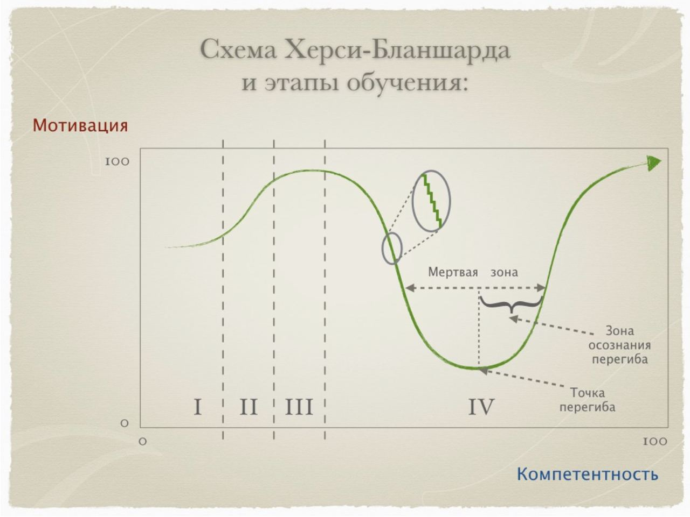
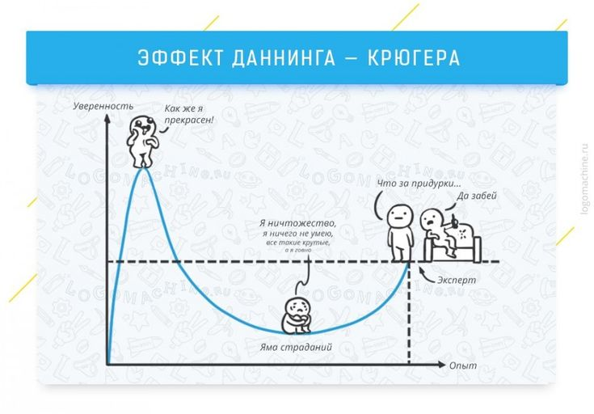

# R2.6:9 - Проблемы и практики удержания внимания

Прикладных практик удержания внимания много, и с некоторыми из них вы уже познакомились в резидентуре ***R1 Распожаризация***, когда перестраивали ваше расписание и налаживали работу в фокусе. А самые основные вы применяли и до начала резидентур по ***Рабочему развитию***, проходя руководства по ***Личному развитию***. Это практика *Помодоро* или общий подход к удержанию внимания при помощи *экзокортекса*. Обсудим подробнее общие принципы выбора, применения и совершенствования таких практик/методов.

1. Важнейшей практикой для удержания внимания является **работа с экзокортексом**. Если вы не задействуете экзокортекс (личный или коллективный), то у вас (или у вашей команды, или у вашей компании) будут большие проблемы. Во-первых, вы не сможете увидеть рабочую нагрузку агента во времени: она скрыта и не видна. Во-вторых, без налаженного учёта досуга в экзокортексе вы не увидите и соотношения работы и досуга, не сможете отследить недостаток отдыха (особенно важно это трудоголикам). В-третьих, вы не сможете увидеть, что реально происходит с интеллектуальной работой (обучением или планированием). Эти виды работ проходят незамеченными на фоне рабочей нагрузки, не выделяются из неё

Без экзокортекса внимание не то что не удерживается - оно даже толком не наводится. В личных проектах вы замедлитесь до скорости улитки, будете годами выполнять то, что можно сделать в свободное время за месяцы или даже недели. В рабочих проектах цена отсутствия экзокортекса может быть ещё выше: когда увольняется один или несколько людей, которые выступали в роли «*корпоративной базы знаний*» - встаёт работа очень крупных организаций. Хорошо если найдётся кто-то, кто понимает, как отмоделировать упущенное - и на это придётся потратить несколько месяцев (реальный кейс: 2 месяца моделирования, и это очень быстро!). А если не найдётся, то компания может нести потери куда дольше - вплоть до нескольких лет. Недопущение такого варианта экономит компании деньги.

Если у вас (или вашей команды) есть проблемы с удержанием внимания, первый шаг – попробовать найти экзокортекс, который поддерживает работу команды. Если он вообще есть – необходимо пометить его в фокус внимания, проанализировать его функционал и начать его совершенствовать. А если вообще «всё в голове» - немедленно его создать.

2. Чтобы удерживать внимание, важно чтобы экзокортекс позволял фокусироваться на **методах работы** и поддерживал именно работу по методам. Некоторые соглашаются с тем, что «*всё дело в экзокортексе*» и начинают искать *лучшее* приложение или гаджет. Но на самом деле важно вовсе не конкретное приложение, а способность агента (личности, команды, подразделения, компании) выполнять с использованием экзокортекса работу по нужным методам.

Вы можете вести бюджетирование крупной организации с сотнями миллионов выручки и коллективом более тысячи человек в Excel табличках - и у вас всё будет получаться, если ваши сотрудники научены этому методу. А если не научены, то они и в новейшей ERP с поддержкой ИИ занести ничего не смогут, или будут делать это крайне медленно.

Если у вас (или вашей команды) есть экзокортекс, но есть и проблемы с удержанием внимания, то следующий шаг - назвать метод(ы), которым работаете вы или ваша команда, оценить степень владения методом (обучены ли вы или ваши сотрудники применять метод). А далее обратить внимание на то, как экзокортекс помогает (или мешает) применять именно ваши методы,

3. Далее может потребоваться **адаптация методов работы**, **выбор и конструирование методов**, которые будут работать для вас/вашей команды/вашего подразделения/вашей организации или даже вашего сообщества. Иногда проблема не в том, что сотрудники вообще не владеют методом, а в том, что метод реально сложен в применении и проще им не пользоваться.

Например, в ИТ-разработке для оценки сложности задач применяется практика оценивания задач в *сторипойнтах*»/*story points* [^1]. Идея оценки сложности вполне здравая, однако в реальности этот метод сложен, и его качественное применение требует длительного обучения, через которое может пройти не каждая команда. В итоге эта практика «*вырождается*» и сторипойнты становятся вместо оценок сложности оценками времени выполнения задач, что прямо противоречит идее этого метода.

Если метод/практика не даёт обещанного результат, то стоит проверить, нужен ли этот результат вообще, какова ожидаемая польза. Если точно нужен, то надо искать способ адаптировать метод под себя. Главное при конструировании или сборке метода под себя - выделить ключевые объекты внимания и принципы проведения операций с ними, меняющих состояния объектов, как мы обсуждали это выше. Модель путешествия объекта должна строго учитываться в качественном методе.

Далее, необходимо при моделированbи метода обязательно учитывать алгоритм онтологического моделирования, подробнее о котором буде в следующе резидентуре, R3.

Какую бы работу вы не делали по вашему методу, метод должен быть совместим с уже известными вам из операционного менеджмента лучшими практиками управления работами, обобщёнными в **мантре элегантности/lean в работе**: задачи должны быть учтены в экзокортексе, выстроены в очередь, приоритезированы, способность выполнить работу/capacity должна быть оценена и все ресурсы должны быть предоставлены вовремя.

Если у вас (или у вашей команды) есть проблемы с удержанием внимания, третий шаг - описать, есть ли польза от применяемых сейчас методов, нужно ли их применение вообще. Если применение более не требуется (например, вы закрываете проект и более не требуется организовывать встречи, общаться с клиентами), то надо убирать работы из расписания. Если польза есть и результаты нужны, то надо оценить, какие проблемы есть с применением метода(ов), и как можно было бы методы поменять так, чтобы они были качественными и при этом давали результат.

4. Постоянное удержание внимания требует **регулярного выделения времени на работу** над теми задачами, на которых нужно удерживать внимание, **«налёта часов», причем очень «сфокусированного»**. Наиболее успешно проходят резидентуры МИМ стажеры, которые выделяют 8-10 часов в неделю на изучение руководств и выполнение заданий, и, кроме того, всегда ищут возможности применить материал в жизни уже вне рамок заданий. Чудес не бывает, надо осознавать, что 80% результата приносит инвестирование времени в регулярную работу, и лишь 20% результата можно обеспечить за счёт врождённых способностей. Поэтому и имеет смысл фокусироваться на том, что даёт 80% результата.

Чтобы удерживать внимание стабильно, рекомендуется увеличивать число подходов к тем задачам, которые выделены как важные (если уж невозможно, как мы уже обсуждали в руководстве ***R1 Распожаризация***, доводить их до результата *в один подход*). Этот принцип ещё можно назвать увеличением ***частоты работы*** над важным, или применением ***многоповторности/deliberate practice***[^2]. Если ваши результаты или результаты вашей команды вам не нравятся, хотя с пользой и методом проблем нет, вы можете банально делать недостаточно «*подходов к снаряду*», значит *частоты работы* над важным не хватает. Часто в этом оказывается причина проблем в маркетинге[^3]: оказывается, вы сделали еще недостаточно попыток, но уже ожидаете сверх-оптимистичных результатов. Поэтому нужно не только найти способ/метод выполнения работ, но и способ втиснуть в ваше расписание достаточное количество попыток. Какое именно - можно оценить на основе данных от других агентов. Например, если вы выделяете меньше 8 часов в неделю на изучение и применение материалов из руководств МИМ, то у вас почти наверняка будут проблемы. Пилотам гражданской авиации нужно 4 000 часов налёта, а чтобы пересесть в кресло командира - ещё больше.

Проанализируйте:

- Сколько времени прошло с момента, когда вы начали выполнять работы (с даты старта)?
- Сколько работ выполнено?
- Сколько рабочих продуктов получено?

Попробуйте найти оценки средней «*скорости до результата*» в вашей предметной области (своей, других членов команды, команды в целом), и отдельно отметить скорость, с которой вы получили самые первые результаты.

Четвертый шаг совершенствования практик управления вниманием – научиться оценивать, когда рационально ожидать результат, и проверить, как влияет на него увеличение частоты выполнения работ.

5. Всегда требуется прикладывать усилия к тому, чтобы рационально ***удержать себя и команду от «слива»***. Для этого надо познакомиться с механизмом, как слив происходит, как люди просто бросают заниматься делом, без планирования и поиска альтернативных путей.

Агенты постоянно вычисляют, принесёт ли им какую-то пользу продолжение работы над старым проектом или нет, причём в большинстве случаев это происходит *интуитивно*: работает мышление S1 на базе первой сигнальной системы. Интуитивных оценок вполне достаточно в краткосрочной перспективе, они неплохо работают, мы оцениваем и обосновываем пользу от выполнения работ, хотя и склонны руководствоваться не тем, что на самом деле важно, а тем, что удобнее (в силу причин, описанных в руководстве ***R1 - Распожаризация***, в разделе ***R1.5- Концентрироваться на важном***). Но проблемы начинаются тогда, когда надо удерживать внимание на более-менее долгосрочных периодах: для личности это могут быть месяцы или годы (масштаб постановки привычки, что занимает месяцы, или масштабы самореализации и образа жизни), для компании - тоже месяцы или годы (если компания небольшая и очень быстро меняется) или даже десятилетия (крупные компании и/или давно существующие компании, часто семейные).

Здесь-то и наблюдается слив. Это происходит потому, что вдолгую обнаруживается ***эффект мёртвой зоны*** в *модели Хенси-Бланшарда*[^4], обнаруживаемый и в обучении/научении новому, и в выполнении сложных длинных проектов. Сначала мотивация агента достаточно высока («*осторожный оптимизм*»), после первых результатов она взмывает вверх, а затем начинается мёртвая зона: первые результаты («*низко висящие плоды*», которые легко сорвать) получены, и чтобы улучшаться дальше - требуется производить рутинную регулярную работу по улучшению. Это характерно для разных агентов - как для людей, так и для организаций. Сначала создаётся минимальный продукт/MVP (часто на сверхусилиях, высокой мотивации) и проверяется сходимость бизнес-модели. Когда бизнес-модель найдена и уже можно строить прибыльный бизнес (говоря иначе – когда пройдена стадия *Product-Market Fit*), наступает время *менять методы работы*. То, что работало раньше - перестаёт работать. Хаотичные усилия по тестированию всех возможных гипотез нужно менять на упорядочивание работы команды и улучшение продукта *для выбранной аудитории* (а не для всех подряд, как раньше). Мотивация тут же сдувается, работа рутинизируется, и часть основателей, которые хорошо запускают новые стартапы, отваливается («*сливаются*»). Вместе с ними может «*отвалиться*» и бизнес.

Можно увидеть, что **«м*ёртвая зона*»** модели Хенси-Бланшарда соответствует **«*яме отчаяния*»/«*яме страданий*»** в модели Даннинга-Крюгера:

Обойти «*мёртвую зону*» невозможно, в том или ином виде она всё равно проявится. Когда агент находится в ней, то ему *кажется* рациональным бросить это дело и пойти делать что-то ещё. Но в том и проблема, что часто это решение лишь *кажется* *рациональным*: оно принимается не потому, что расчёты показывают бесперспективность занятия (на рынке мало возможностей получить хорошую долю, вы вряд ли будете выполнять такую работу в будущем и так далее), а потому что на решения агента влияет его низкая мотивация (её нахождение в «*мёртвой зоне*»). И тут расчёты искажаются таким образом, чтобы обосновать принятое где-то внутри под влиянием эмоций решение. В результате мы бросаем выгодный проект и начинаем новый - только чтобы обнаружить там ту же самую мёртвую зону[^5]. Время потрачено, результатов нет, зато *жить весело*: постоянно переключаемся между новыми проектами и делами.

Что же делать в данном случае?

- *Знать о мёртвой зоне*, поджидающей на пути, и, если вам нужно обучать людей (а руководителям роль учителя приходится исполнять постоянно), то *рассказывать об этом* команде.
- Иметь такие критерии оценки пользы от работы по методу, которые не опираются на эмоции (причём первую версию критериев желательно сделать ещё до того, как вы вовлеклись в длинный проект).
- Удерживать внимание на оценке проводимых работ по критериям.
- Постоянно удерживать внимание на *улучшении результатов* и на том, чему научились. Это поможет поддержать мотивацию.
- Воспринимать желание бросить, если оно чисто эмоциональное, как повод увеличить ***частоту выполнения работ***: относитесь к себе и/или команде как тренер, который готовит команду к важному матчу.

Если у вас (или вашей команды) есть проблемы с удержанием внимания, пятый шаг - оценить, не находитесь ли вы в *мёртвой зоне*, и выполнить предложенные выше действия. Если вы просто будете сливаться чуть реже, чем другие (не в 9 из 10 случаев, а в 7 или 6 из 10), то вы уже действуете куда собраннее, чем абсолютное большинство окружающих.

6. Удержать внимание вообще и справиться с мёртвой зоной в частности помогут **напоминания**, о которых мы говорили в прошлом подразделе R2.6:8. Если у вас (или вашей команды) есть проблемы с удержанием внимания, шестой шаг - оценить, не маловато ли у вас напоминаний о новых работах или работах по новому методу.

Напоминаний обычно нужно больше, чем вы думаете. В этом руководстве, и других, мы стараемся повторять самое важное по 5-6, а то и по 7-9 раз. Некоторые резиденты сначала на это жалуются, а потом понимают, для чего это нужно: когда на пятый раз в голове «*зажигается огонёк*» - появляется осознание, что всё, что тут написано, применимо к ним в полной мере, и что руководство надо читать не как художественную литературу «*про кого-то другого*», а буквально как инструкцию к действию: читаем и делаем буквально как написано. Написано, что должны договариваться о терминах? Договариваемся о них при запуске нового проекта. Бывают такие объекты, как «*очередь задач*» и «*очередь проектов*»? Ок, они должны появиться у нас! Точно так же вам, чтобы обеспечить понимание (а заодно и выполнение работ), нужно спроектировать напоминания: для себя и окружающих. Сколько напоминаний о важном есть у вас сейчас?

7. Удерживать внимание поможет и **формирование среды**. Методы/практики формирования среды особенно помогают удерживать внимание вдолгую: если на выполнение отдельно взятой задачи ещё можно собраться разово или даже пару раз, то на постоянную работу (например, спортивную подготовку (беговую, по плаванию), образовательную программу, и прочие инвестиционные активности - каждый раз собираться с духом заново получается плохо. Нужно, чтобы среда вокруг вас была спроектирована так, чтобы поддерживать выполнение нужных методов.

Например, если вы решаете ходить на спортивные тренировки, меняйте маршрут работа-дом - чтобы проезжать мимо вашего зала, и собирайте форму с вечера, чтобы утром лишь подхватить сумку. Если надо сфокусированно поработать, буквально уберите из поля вашего внимания лишние объекты: ненужные сейчас бумаги, вкладки браузера, программы, телефон - то есть всё то, что может вас отвлечь и помешать выполнению работы по методу.

Подумайте над тем, чтобы создать вокруг себя подходящую социальную среду: влиться в некоторое сообщество, которое поддерживает ваши новые методы, и/или создать такую среду самому на работе: это повышает ваши шансы на удержание внимания. Коллективно его удерживать легче.

Если у вас (или вашей команды) есть проблемы с удержанием внимания, седьмой шаг - оценить, что у вас со средой (в том числе социальной). Можно, например, прикинуть, кого можно включить в «*группу поддержки*» или «*группу влияния*»: кто готов будет действовать так же, как вы, чтобы провести нужные организационые или технологические изменения? Кто примет это легче всего?

8. Удержать внимание поможет и **создание конвейера по реализации проектов/выполнению работ**. Для этого придётся применять и практики стратегирования, чтобы определиться, чем вы вообще будете в ближайшие месяцы-годы заниматься (и постоянно переопределять приоритеты). Простой способ «*для себя*» можно изучить в руководствах **программы личного развития МИМ**, практикум ***S2. Методы саморазвития***. Продвинутый способ для команды и компаний - в руководстве резидентуры ***R10. Системный менеджмент***. Затем надо наладить конвейер по выполнению проектов и задач по задуманному. Параметры конвейера будут зависеть от стратегического выбора.

Допустим, имеется организация, которая проектирует ЗD модели мостов, используемые для строительства мостов. Целевой системой для неё является «*мост в эксплуатации*», соей системой или выпуском предприятия (т.е. вещью, покидающей границу предприятия) - «*3D модель моста*» (в штуках). Мы должны определиться, каким будет конвейер по выпуску 3D моделей мостов, а это зависит от того, проектированием какого класса мостов мы будем заниматься: типовых мостов или уникальных мостов. Если типовых, то наш конвейер должен работать на высокой скорости (достаточно небольших адаптаций шаблонной модели/прототипа под новые ситуации), квалификация инженеров может быть чуть ниже (не требуется исключительных знаний). Если же мы выберем проектировать уникальные мосты, то скорость выпуска будет неизбежно ниже, чем у тех, кто занимается типовыми: это компромисс/размен/trade-off, или плата за выбор: мы обмениваем возможность зарабатывать больше с одной 3D модели на замедление разработки этой модели. Такой организации также потребуются более квалифицированные инженеры-проектировщики и, вероятно, более продвинутые 3D-моделлеры.

То же самое касается и личного *конвейера*. Если у вас нет планов (хотя бы попытаться) получить квалификацию *реформатора* (как мы называем это в МИМ), то есть, умение и опыт менять свою организацию целиком, или менять некое сообщество, то ваш личный конвейер реализации проектов может быть устроен проще, в его создании и при управлении им можно больше полагаться на интуитивный выбор и допускать больше неэффективных решений, которые не будут иметь особых последствий. Но если у вас большие планы и/или амбиции, то нарушение первых принципов, описанных в наших руководствах, будет для вас более дорогостоящим. Вам нужно уже сейчас больше внимания уделять разгребанию дел и обучению, досугу; доделывать всё, что описано в руководстве, даже после завершения резидентур, и постоянно думать о том, что делать дальше.

[^1]: https://habr.com/ru/articles/667818/
[^2]: https://jamesclear.com/deliberate-practice-theory
[^3]: https://youtube.com/shorts/uXGPvU-0Xg0?si=gjQz9ndt5_DWV_Nx
[^4]: https://tenchat.ru/media/609659-masterstvo--yedinstvenniy-aktiv-kotoriy-ne-podverzhen-denezhnoy-inflyatsii
[^5]: https://tenchat.ru/media/647873-obrazovatelniy-turizm-pochemu-my-ne-dostigayem-masterstva
