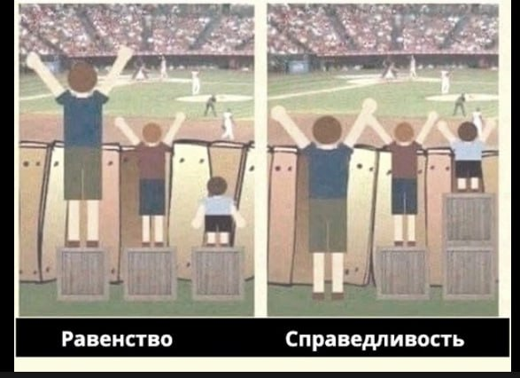

# R3.2:8 - Физический мир и ментальное пространство

Итак, чем ближе концепт (идея) к физической реальности (чем он *заземлённее*), тем проще искать воплощающие его объекты, и тем плотнее его концептуальное пространство.

Мы уже несколько раз обсуждали, что физические объекты (индивиды) — очень простая штука. Это то, что можно «*потрогать, услышать, понюхать, измерить*» (хотя бы теоретически), то есть воспринять органами чувств или приборами. Они имеют протяженность в пространстве и времени, пространственные и временные границы. Обратите тут внимание на «*время*»: эти объекты не просто даны нам, они существуют во времени, и у этого существования есть начало и конец! Мы уже обсуждали в предыдущих резидентурах возможность выделять как физические довольно сложные объекты, иногда неожиданные, контринтуитивные, то есть такие, существование которых скорее противоречит нашей «*бытовой*» интуиции. Скоро мы к этому вернёмся.

Остальные, *нефизические* объекты, выделяемые (формируемые) нашим мышлением, мы называли раньше «*категориями*», а теперь - «*классами*» или «*типами*». Мы также обсудили их тесную связь с *идеями, концептами*. Мы не можем их потрогать и зарегистрировать в физическом мире. Они возникают как наши мысли, существуют в нашей голове, или же описываются нами в экзокортексе как *эпистемы*, выражаются *знаками*. Для единства терминологии будем иногда называть все нефизические объекты «*объектами ментального пространства*». Все они - абстракции над физическими объектами, концептуализации самого разного рода.

Вспомните треугольник Фреге. Важно понимать, что *объекты ментального пространства* - это не *знаки*, не *модели* и не *эпистемы*. Для объектов ментального пространства важен тот же принцип, который мы долго тренировали для систем - **нельзя путать объект и его описание**!

Знаки, выражающие объекты ментального пространства/идеи/концепты (и моделирующие/описывающие их модели/эпистемы) материальны, они существуют в физическом мире. Мышление об объектах ментального пространства (их моделирование) - это вполне материальное вычисление, которое физически происходит в наших мозгах или в наших компьютерах/экзокортексах. Знаки и целые эпистемы могут быть извлечены из головы, записаны, обработаны, далее они могут быть прочитаны и тем самым соответствующие идеи (концепты) могут быть загружены другим агентом (человеком или ИИ). Мы помним, что в эпистемах нас интересует не материальный носитель знака, а его содержание, референция. Материал знака - нам не важен.

В треугольнике Фреге важно различать все три угла, отождествление любых их них - ошибка. Как и путаница между объектом и описанием, путаница между *физическими объектами* и *объектами ментального пространства/категориями/классам* влияет на качество моделей и так же недопустима. Умение отличать их тоже надо тренировать.

Спросите себя, что именно вы имеете в виду, когда думаете про «**нечто**». Попытайтесь представить себе «**нечто**» *в текущем контексте* ваших рассуждений и спросите себя, с какими объектами может взаимодействовать ваш объект. Прямо представьте себе это взаимодействие, заземлите своё мышление. Если ваш объект взаимодействует с другими физическими объектами с помощью своих физических частей, то он физический. Если он взаимодействует как идея, путём воздействия на мышление/моделирование - это объект ментального пространства (не забудьте, что именно идея воздействует на мышление, но любая идея предъявляется как какой-то знак!).

Предположим, вы планируете «*презентацию стратегии*» для руководства. Что вас волнует сейчас?

Если предметом ваших забот является то, прочтётся ли флешка, или совместимость формата презентации с оборудованием, будут ли нормально отображаться анимированные картинки и вставленное в слайды видео - вас волнует презентация как физический объект, файл на конкретной флешке.

Если вас волнует реакция на новые идеи, если вы выбираете правильные способы донести их до начальников даже до того, как вы стали выбирать конкретные картинки и видеофрагменты (знаки) - вы работаете в ментальном пространстве.

Главные навыки, которые должны у вас сформироваться по итогам освоения материалов этого раздела:

- отличать физические объекты от идей, концептов (при этом отличать физические объекты от категорий мы учились и раньше, а абстрактные категории от идей мы договорились не отличать);
- находить или прослеживать связи между физическими объектами и идеями, которые они воплощают;
- анализировать знаки, наименования (особенно плохо подобранные), чтобы определять, на что они указывают - на физический объект или на идею, а также определять механизмы этого указания (референции).

Обсудим ещё раз ряд примеров (некоторые из них у нас уже были).

**1. Конкретный стол и «*стол*» как концепт**

Представьте себе стол, за которым вы сейчас сидите. А теперь представьте себе стол вообще, абстрактное понятие стола.

Стол, за которым вы сидите, можно потрогать; он существует в пространстве и времени; занимает место, имеет протяженность; когда-то начал существовать (был создан) и когда-то закончит (развалится, станет неспособен исполнять функции стола).

«*Стол*» как понятие не существует в физическом мире. Это концептуализация, обобщённый образ, который возникнет у вас в голове, когда вы слышите «*стол*». «*Стол*» как понятие возник (был выделен из фона) для указания на обобщённую категорию предметов, когда нет необходимости или возможности идентифицировать конкретный стол.

**2. Разговор между мной и вами и «*разговор вообще*», как явление**

Разговор между мной и вами существует в физическом мире, в реале (не прямо сейчас, но он мог состояться в прошлом и вполне представим в будущем). Когда он происходит в реальности, в него входят: я, вы и воздух между нами, по которому ходят звуковые волны. У этого разговора есть начало и конец во времени.

«*Разговор вообще*», как явление, существует как концепт в ментальном пространстве, это обобщённый образ, описание широкого набора ситуаций. «*Идея разговора*» ни в какой момент времени нигде не происходит, у этой идеи нет участников. Когда мы говорим о «*разговоре вообще*», мы представляем себе набор самых характерных черт разговора - несколько собеседников, общающихся голосом. Но мы уже не можем сказать, передаются ли в «*разговоре вообще*» звуковые волны только по воздуху, или же в нём задействованы микрофон и динамик телефона, а также компьютеры, провода, антенны и радиоволны, передающие голос между телефонами.

**3. Справедливость**

Вы всегда можете представить себе конкретные физические воплощения идеи справедливости. Это ситуации, в которых она вершится, те ситуации, когда вы скажете - «***Да, это справедливо!***».

Дети подрались из-за игрушки — вы нашли справедливое решение, отдав одному игрушку, а другому что-нибудь еще.

Есть известный мем, иллюстрирующий явления «справедливость» и «равенство» легко понимаемыми ситуациями в физическом мире:

Слово (знак) «*справедливость*» называет в памяти ситуации из этого набора ситуаций справедливого состояния дел, каждая из которых ощутима, слышима и конечна. Понятие «*справедливость*» отсылает к какому-то общему для всех таких ситуаций набору ощущений или переживаний.

Здесь мы отталкивались не от конкретного примера в физической реальности, а от концепта, который существует именно в ментальном пространстве, и пытались представить себе его воплощения в реальном мире. В принципе, нам это удалось, не хуже, чем для «*стола*». Но есть несколько важных отличий.

*Плотность* *концептуального пространства* для «*стола*» выше, чем *плотность* *концептуального пространства* для «*справедливости*». Другими словами, для «*справедливости*» люди могут представить себе гораздо большее количество совсем разных ситуаций, намного больше, чем самый продвинутый дизайнер мебели может представить себе разных столов.

И среди этих ситуаций обязательно найдутся такие, про которые кто-то (в контексте своей культуры, происхождения, образования) будет громко кричать: *«Да это вопиющая несправедливость, позор какой-то!»* Примеры вы легко подберёте сами. И таких протестов будет гораздо больше, чем недовольных вычурными дизайнерскими фантазиями, которые продаются под ярлыком «*стол*».

**4. Математические и физические объекты**

Абстрактные математические объекты (*число, точка, прямая, множество, функция, производная* и т.д. и т.п.) очевидно являются объектами ментального пространства. Однако понимание того, почему это так, *идеи* это или *категории*, как правильно найти их конкретные физические воплощения (*экстенсионал*) - требует реального знания соответствующих разделов математики, а также истории науки. Но для некоторых концептов информация о возможных путях поиска воплощений даётся даже на начальном уровне, когда они впервые вводятся в школе.

Возникновение понятий точек, прямых и других объектов геометрии из практики землемеров объясняют при рассказе о постулатах Евклида, производную функции объясняют через скорость изменения, а интеграл - через площадь. Однако для установления связи с реальным миром такого простого понятия как натуральное число - нужен уже некоторый багаж знаний из теории множеств. Сама же теория множеств - легко изучается на начальном уровне через заземление на яблоки, груши, желуди.

Скажем честно - философские дискуссии о «*реальности*» математики не утихают. К какому типу наук относится математика - идут споры. Конструктивный и аксиоматический подходы, проблемы бесконечности - все эти интереснейшие вопросы мы оставим за пределами нашего руководства.

Физики гордятся тем, что самые абстрактные объекты в ментальном пространстве их науки были созданы исключительно для нужд моделирования реальности, и тем самым физика сохраняет прочные связи с реальностью, реальность даже называется «*физической*». Увы, на эту тему тоже идут философские споры.

Мы будем считать, что *математика и физика* (***фундаментальные трансдисциплины интеллект-стека***, используемого в руководствах МИМ) - оперируют объектами ментального пространства, а их приземление в реальный мир происходит в рамках *онтологии, логики, исследований/познания* - других *фундаментальных трансдисциплин интеллект-стека*.
