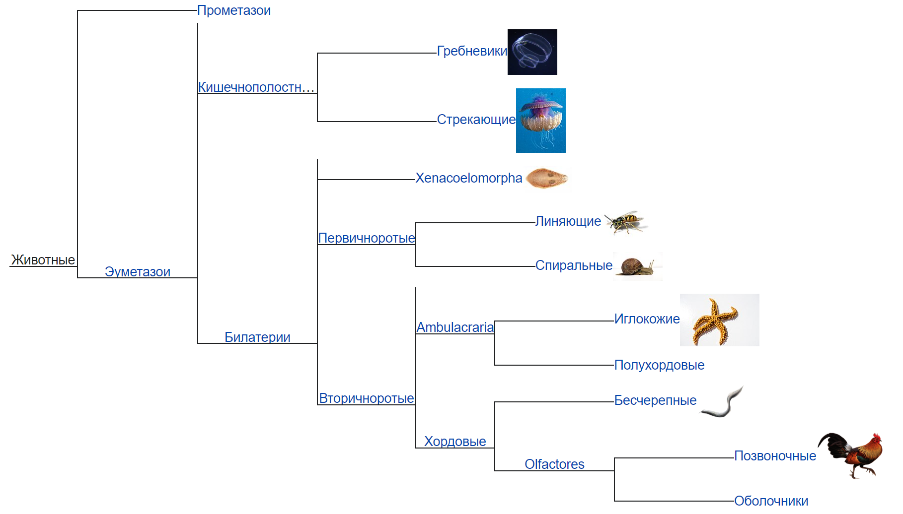
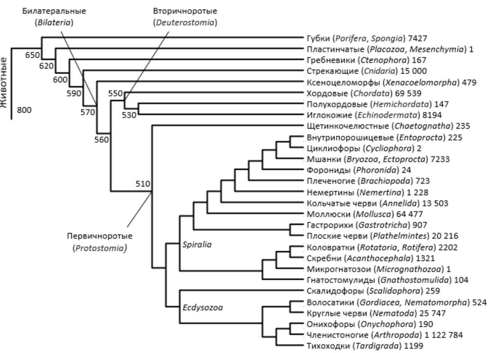
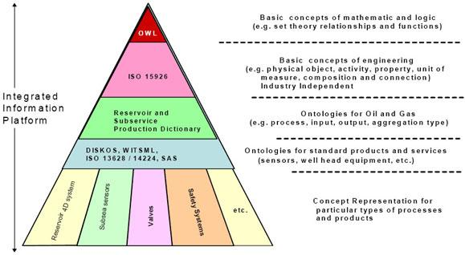

# R3.2:12 - Классификаторы, таксономии

Познавая мир, моделируя его - мы постоянно относим экземпляры к классам, создаём по мере необходимости новые классы, уточняем существующие классы. Мы можем сужать или расширять классы, добавляя или убавляя концепты и их признаки.

В языке это выражается как «*электростанции, в частности атомные электростанции*» или «*продукты, в частности овощи*».

Постоянно используемой *практикой моделирования* (привычным способом отчуждения моделей, записи моделей в экзокортексе, обмена моделями) является создание ***классификаторов*** (***таксономий***). Так мы называем ***деревья*** классов, в которых есть «*корень дерева*» - самый общий, наиболее широкий класс (если это называется «*таксономия*» - то говорят «*таксон*»), под ним - его *подклассы*, более узкие, специальные классы, связанные отношениями *специализации*, далее под ними - ещё более специализированные, узкие классы, и так на много уровней вниз, на столько, на сколько требует предметная область. Все отношения в таком дереве - отношения *специализации*.

Кроме, возможно, последнего уровня (его, впрочем, рисуют редко). На последнем уровне, в самом низу, находятся «*листья дерева*», индивиды, связанные с уровнем над ними отношением *классификации, членства*.

(Да, математики и программисты любят пошутить на тему того, что у них деревья *растут из корня вниз*.)

Проще всего начать с примеров из биологии ([h](https://ru.wikipedia.org/wiki/Биологическая_систематика)[ttps://ru.wikipedia.org/wiki/Биологическая_систематика](https://ru.wikipedia.org/wiki/Биологическая_систематика)), это самое очевидное и очень развитое применение принципа организации результатов познания и моделирования в виде деревьев. Скорее всего, вы даже изучали их в школе.

Классификаторы в какой-то предметной области могут существовать с разной глубиной, с разной степенью детализации. Промежуточные уровни в любом дереве классов можно пропустить, а можно и добавить уровни в середину, пользуясь основным свойством специализации: *все элементы подкласса принадлежат и надклассу*.

Впрочем, разные исследователи могут строить в одной предметной области и принципиально разные деревья классов, несовместимые друг с другом. Во многих теоретических или прикладных дисциплинах это - наиболее концентрированная форма разногласий между научными школами или онтологическими подходами. Принципиально разные деревья для одной предметной области вам могут встретиться и в онтологических теориях, и в биологии, и в инженерии, и в справочниках оборудования на производстве.

Иногда это признак фундаментальных расхождений в предпосылках моделирования (в самих принципах выделения объектов), как это произошло в биологии, когда оказалось, что на основе *секвенирования геномов* получаются совсем другие деревья, чем на основе старых методов *морфологического сходства*. Но иногда расхождения являются проявлением того самого расхождения в *способах описания* для разных ролей, которое мы уже обсуждали. Подробнее об этом вы узнаете далее в руководствах МИМ **R5. Системное мышление** и **R8. Системная инженерия**.

Ещё один пример попытки построить глобальный «*классификатор всего*», на этот для нужд инженерии - это стандарт **ISO 15926-2:2003 Industrial automation systems and integration — Integration of life-cycle data for process plants including oil and gas production facilities**

Как видно на рисунках выше, каждый специалист и каждая отрасль рисует дерево своим способом, в своём софте, кто во что горазд. Но надо понимать, что чисто *графические редакторы*, создающие пиксельные картинки, для онтологической работы принципиально непригодны: в них можно рисовать красивые иллюстрации, но сами *структуры данных* для компьютерной обработки нельзя держать на картинках! Профессионалы используют специальный софт *онтологических редакторов*, позволяющий и записывать данные в форматах специальных языков моделирования, пригодных для дальнейшей обаботки (которая включает и возможность строить по ним иллюстрации).

Например, есть популярный свободный универсальный редактор онтологий **Protégé** [https://protege.stanford.edu/](https://protege.stanford.edu/). Или вы можете взглянуть на специальный редактор **dot15926**, именно для данных, соответствующих стандарту ISO 15926 [https://techinvestlab.ru/dot15926Editor.html](https://techinvestlab.ru/dot15926Editor.html).

Однако простейший способ моделирования онтологических деревьев - это привычная всем таблица. Формировать деревья в виде таблицы можно разными способами. Мы предлагаем вам указывать классы в отдельных строках, при этом для классов каждого уровня использовать отдельную колонку, группируя строки классов под строками надклассов. Если колонок не хватает - всегда можно вставить новые.

| **Уровень 1** | **Уровень 2** | **Уровень 3** | **Уровень 4** | **Экземпляр** |
| --- | --- | --- | --- | --- |
| Живое существо |   |   |   |   |
|   | Животное |   |   |   |
|   |   | Собака |   |   |
|   |   |   | Колли |   |
|   |   |   |   | Лесси |
|   |   |   | Овчарка |   |
|   |   |   |   | Рекс |
|   |   | Корова |   |   |
|   |   |   |   | Зорька |
|   | Растение |   |   |   |
|   |   | Дерево |   |   |
|   |   |   | Дуб |   |
|   |   |   |   | Дуб Андрея Болконского под небом Аустерлица |
|   |   |   | Вяз |   |
|   |   |   |   | Старый вяз в Вековечном лесу |
|   |   | Куст |   |   |

Другим способом является прямое указание в отдельной колонке для каждого класса его надкласса, но это менее наглядно.
