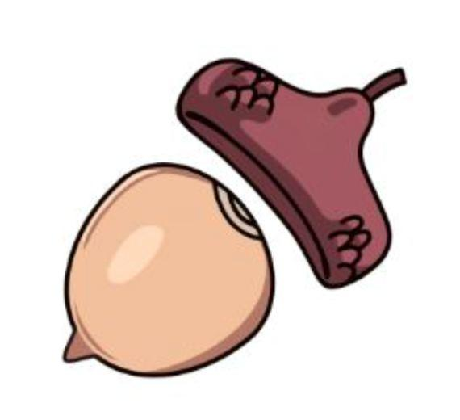
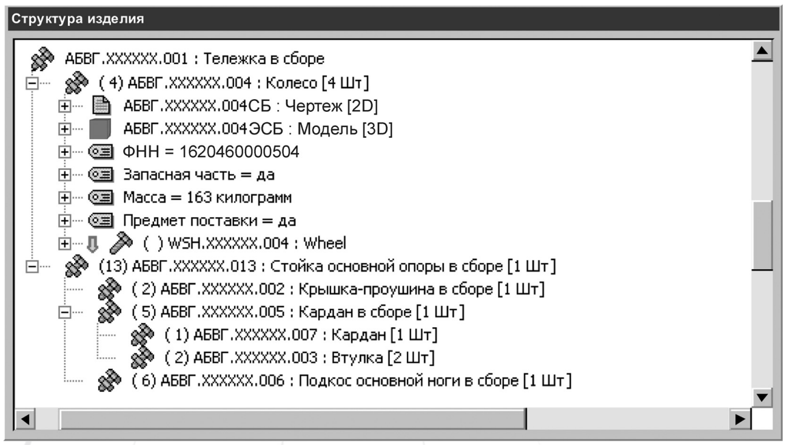
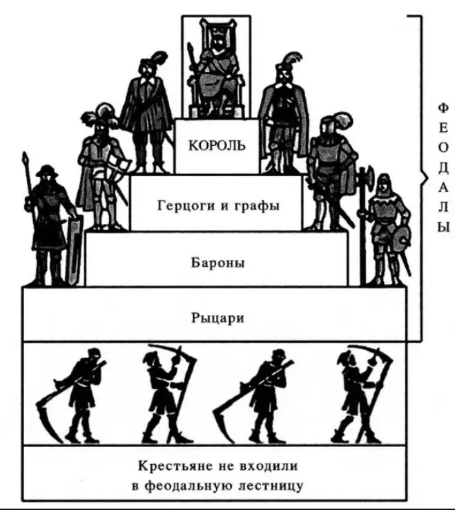
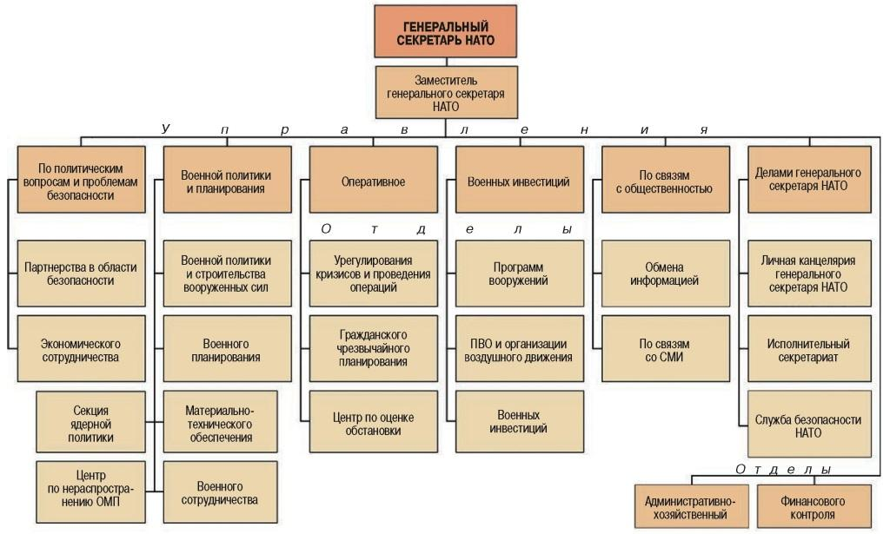
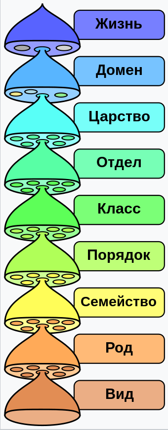
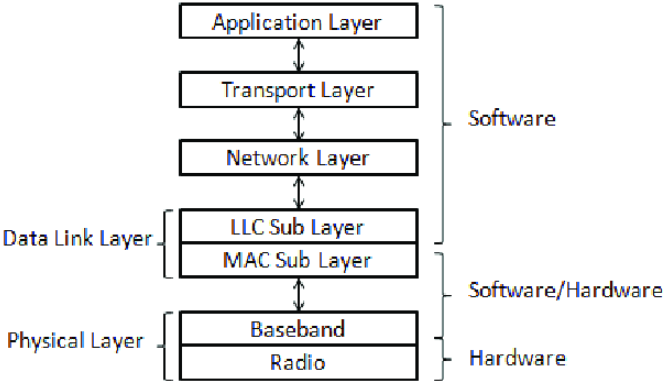
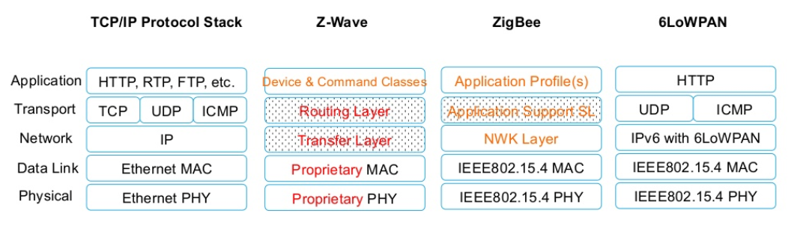

# R3.2:13 - Разбиения, иерархии и другие деревья

Не всякое дерево, которое вы можете встретить в какой-то предметной области, является классификатором (таксономией). На похожей внешне картинке, где какие-то объекты организованы «*сверху вниз*» (или даже «*снизу вверх*») между уровнями могут подразумеваться другие отношения, не *специализация* и не *классификация*. Рассмотрим самые часто встречающиеся виды таких деревьев.

**1. Разбиения**

Важнейшим инструментом для организации инженерных знаний являются «***разбиения***».

В ***деревьях разбиений*** отношение между уровнями - отношение «***часть — целое***». Это простое и очень важное отношение в строгом смысле существует только между физическими объектами, индивидами. Его еще называют отношением «*истинная часть*», чтобы не путать с *частями описаний*, *классами частей* для *классов целого* и другими использованиями слова «*часть*» для обозначения чего попало.

*Ножка стола в моей комнате является частью целого стола.*

*Моя рука является частью меня.*

Именно по такому принципу из систем выделяют подсистемы, подробнее об этом тоже рассказывается в других руководствах МИМ.

На картинке выше конкретный жёлудь состоит из истинных частей - плода и шляпки.

Чтобы определить части для какого-то целого, нужно мысленно буквально разделить его на части. Мыслительный прием для проверки правильности определения этого отношения: *все атомы* объекта «*часть X*» входят в число атомов объекта «*целое Y*». Если да, то все верно, *X — часть Y*.

Отношение «***часть — целое***» может ещё называться «**композиция**», или «**входить в состав**», или «**вложенность**». Дерево, построенное по этому отношению, в языке выражается «*Х состоит из..*.».

Не надо думать, что по отношению часть-целое реально создаются в основном простые двухуровневые разбиения!

Именно композиция определяет деревья задач в проектах (*Project Breakdown Structure*) в софте проектного управления, или структуры сложных изделий в софте автоматизации проектирования CAD/PLM (*Product* *Breakdown Structure*). Т там и там легко может быть 10-20 уровней, а в некоторых случаях - и больше.

Иногда мы знаем что-то общее про композицию *всех индивидов класса* и хотим описать это общее правило композиции как *отношение между классами*, то есть как *типовой шаблон описания индивидов* из этих классов.

Например, мы знаем, что все самолёты состоят из фюзеляжа и крыльев. Для *каждого конкретного самолёта* мы можем записать это как утверждение об индивидах - частях и целых (например, используя серийные номера соответствующих сборок, используемые авиастроительным заводом как уникальные идентификаторы. Но как выразить это в виде *отношения классов «Самолёт», «Фюзеляж», «Крыло»*? Как указать, что у самолёта обычно один фюзеляж (но бывает и два), и два крыла (но бывает и до 6)?

Простого ответа на этот вопрос нет. Разные онтологии по-разному решают вопрос выражения и записи таких соотношений, и эти способы остаются за пределами нашего вводного руководства. Простейший вариант, разумеется - это игнорировать формальную разницу и строить разбиение *типового стола* по той же схеме, что и разбиение индивидуального стола. У *типового стола* при этом будет фиксированное количество ножек (4 или 6), и упомянутую выше проблему (что у *абстрактного стола* на самом деле может быть от одной ножки до любого наперед заданного числа) - вы успешно обойдёте.

Но вы должны уметь отличать модели ***«разбиений*** ***в классах***», если вы их встретите, от моделей «***разбиений индивидов***», и не забывать, у чего бывает *истинная композиция*, а у чего - нет.

Записывать деревья разбиений можно в специальном инженерном софте, или в таблицах, как и деревья классов. Картинки можно потом строить как иллюстрации, но обязательно нужно фиксировать результаты работы в формате, допускающем обработку на компьютере.

Формировать деревья разбиений в виде таблицы можно тоже разными способами. Мы предлагаем вам указывать индивидуальные объекты в отдельных строках, при этом объекты каждого уровня - в отдельной колонке, группируя части под их целым.

| **Уровень 1** | **Уровень 2** | **Уровень 3** | **Уровень 4** | **Уровень 5** |
| --- | --- | --- | --- | --- |
| Стол инв. N 123 |   |   |   |   |
|   | Ножки стола |   |   |   |
|   |   | Ножка N1 |   |   |
|   |   | Ножка N2 |   |   |
|   |   | Ножка N3 |   |   |
|   |   | Ножка N4 |   |   |
|   | Столешница |   |   |   |
|   |   | Панели |   |   |
|   |   |   | Панель N1 |   |
|   |   |   | Панель N2 |   |
|   |   | Механизм раскладывания |   |   |
|   |   |   | Рама |   |
|   |   |   | Пружины |   |

Другим способом является прямое указание в отдельной колонке для каждой части её целого, но это менее наглядно. Посмотрите:

| **Часть** | **Целое** |
| --- | --- |
| Стол N 123 | нет |
| Ножки стола | Стол N 123 |
| Ножка N1 | Ножки стола |
| Ножка N2 | Ножки стола |
| Ножка N3 | Ножки стола |
| Ножка N4 | Ножки стола |
| Столешница | Стол N 123 |
| Панели | Столешница |
| Панель N1 | Панели |
| Панель N2 | Панели |
| Механизм раскладывания | Столешница |
| Рама | Механизм раскладывания |
| Пружины | Механизм раскладывания |

Обратите внимание - мы всегда хотя бы на верхнем уровне должны выбрать такое имя, чтобы было понятно: имеем ли мы в виду *индивидуальный объект*, либо *типовой, стандартный объект*, то есть *класс индивидуальных объектов*. Помним при этом, что *истинное отношение композиции* бывает только для индивидуальных объектов, а смысл композиции для классов - всегда нуждается в дальнейшем пояснении: обязательно ли у целого есть такие части, сколько есть таких частей, и т.п.

**Замечание для системных аналитиков и программистов**

Если вы заняты проектированием *баз данных*, разработкой *моделей данных* (а это то, для чего в первую очередь используется *формальный онтологический подход*), то вы понимаете, что ***по дереву специализации наследуются свойства***, ***по дереву композиции (разбиению) — свойства в основном делятся***, а ***дерево по отношению классификации говорит «вот структура шаблонов для заполнения»***.

**2. Иерархии**

Вы можете встретить термин «*иерархия*» в применении к классификаторам (про них часто говорят «*иерархия классов*»). По происхождению это древнегреческое слово означает «*управление верховного священнослужителя*», и его самое общее значение - это «*организация от высшего к низшему*».

*Иерархия классов* - это действительно организация *от общего к частному*, от абстрактного - к более конкретному, а абстрактное считается *более высокой* категорией. Поэтому использования термина *иерархия* в этих случаях вполне корректно.

Тем не менее очень важно различать, когда увиденная вами картинка с деревом подразумевает какое-то иное отношение между уровнями, **не** композиции, **не** классификации, **не** специализации.

Например, на следующих картинках - деревья по отношению «*подчинения-командования*», и это классическая *иерархия*, а вовсе не в переносном смысле. Впрочем, про них часто говорят «*пирамида*».

**3. Иерархии классов классов**

На следующей картинке вы видите ещё один сложный пример иерархии или дерева - это организованные «от простого к сложному» **классы классов**. Идею этой картинки вам теперь понять легко. А вот формально описать онтологические отношения, положенные в её основу - далеко не просто. Мы лишь скажем, что эта проблема в чём-то похожа на проблему описания отношения «*часть целое*» *для классов*, проиллюстрированную выше.

*Экземпляры класса «Род» являются надклассами экземпляров класса «Вид», и т.д.*

Понятно ли это?

Подумайте (посмотрите в википедии): что мы считаем экземплярами класса «*Род*», что мы считаем экземплярами класса «*Вид*». Входят ли сами экземпляры класса «*Род*» в класс «*Вид*»?

Подробнее мы это обсуждать не будем.

**4. Стеки**

И последний тип иерархической структуры, который вы должны научиться отличать - это **стек** (*stack, стопка*). Тут диаграммы похожи на стопку подносов в столовой или стопку листов бумаги в пачке, они редко выглядят как ветвящиеся деревья, хотя на некоторых уровнях могут присутствовать несколько разных объектов (концептов).

Термин «*стек*» сперва появился в программировании, как название конкретной структуры данных, на чём мы останавливаться не будем.

А далее этот термин стал использоваться для обозначения иерархий по отношению «*опираться*», «*основано на*», «*использует*».

В основном это «*технологические стеки*», иерархии поддерживающих друг друга технологий. Можно говорить, что это *основания (фундаменты)* и *надстройки* над ними.

Мы в МИМ описали свой подход к образованию по фундаментальным дисциплинам с помощью **интеллект-стека** - набора методов мышления, которые есть у сильного интеллекта, умеющего решать новые проблемы.

Сегодня мы включаем в интеллект-стек следующие опирающиеся друг на друга дисциплины (перечисление «сверху вниз», от вершины к основаниям): **системная инженерия, методология, риторика, этика, эстетика, познание/исследования, рациональность, логика, алгоритмика, онтология, теория понятий, физика, математика, семантика, собранность, понятизация.**

Эти дисциплины составляют основу резидентур и руководств МИМ. Как вы видите, в наших руководствах мы уже обсуждали многое из этого набора: **методологию, риторику, познание/исследования, онтологию, теорию понятий, семантику, собранность, понятизацию.**

Вообще же путать разные виды «*древовидных*» структур (особенно *разбиения* с *классификациями*) - одна из самых распространённых ошибок при обучении системному мышлению. Поэтому мы рекомендуем вам потренироваться сейчас, подумать над приведёнными примерами, поискать упоминаемые вокруг вас «*деревья*» и явно сформулировать - а по какому отношению они построены?

Сейчас мы можем наконец обсудить, и зафиксировать на будущее, одно важное различие. Есть два очень похожих слова: «**систематичное**» и «**системное**». Но означают они принципиально разное!

В самом широком смысле «***систематичное мышление***» (ещё говорят «***систематическое мышление***») - это умение видеть в мире *деревья классификаторов*, *обобщать* или *специализировать*, *определять тип* объекта. Это мышление с применением онтологий, им мы и будем в основном заниматься в текущей резидентуры.

Антоним к «*систематичному мышлению» - «хаотическое мышление».*

Умение увидеть и применить «*систему типов*», «*систему Станиславского*» или «*систему законов*» - это примеры использования *систематического мышления*.

«***Системное мышление***» - это умение видеть *разбиения* объектов на взаимодействующие части, умение видеть *целое*, видеть, *частью какого целого* на следующем уровне оно является. Системное мышление необходимо для того, чтобы обнаружить (или создать) у системы новые свойства, которых нет у её частей. Их называют ***эмерджентными*** свойствами. Как именно это делать - предмет одноименного руководства и резидентуры МИМ **R5. Системное мышление**.

Антонимов к «*системному мышлению» - целых два. Это «холистическое мышление» -* попытка видеть во всём *«единое целое»,* отказ от анализа частей вообще, призывы обеспечить «*целостное восприятие*». Ещё один антоним - «*редукционистское мышление*» - отказ считать, что у системы появляются новые свойства, попытка свести/редуцировать систему к её частям.

Способность разработать и построить «*компьютерную систему*» или способность спроектировать, создать и ввести в эксплуатацию «*систему космического запуска*» - это примеры использования именно *системного мышления*.
