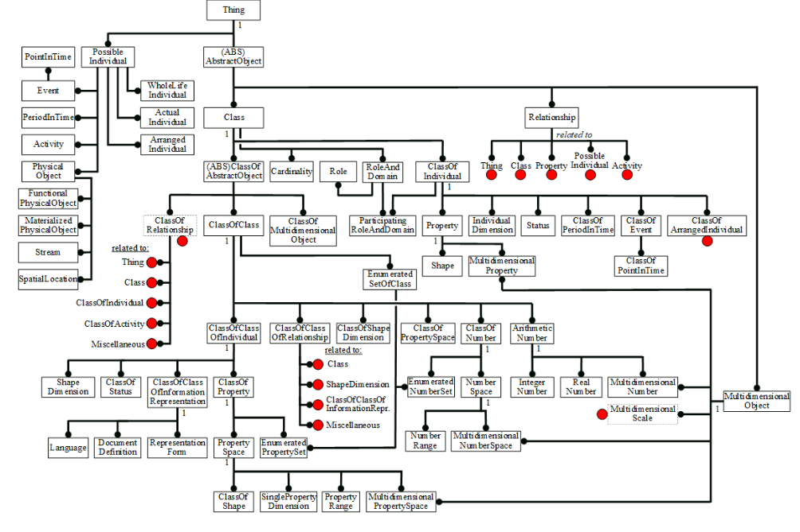

# R3.2:15 - Примеры систем типов

Если вы решите всерьез заняться моделированием, то вам лучше всегда ориентироваться на существующие высокоуровневые онтологии. Нет нужды каждый раз выдумывать *с нуля* базовые типы. Есть несколько популярных онтологий (*онтологических фреймворков*, систем *верхнеуровневых типов*), которые можно брать за основу, если вам нужно спроектировать онтологию своей предметной области. С полезным списком вы можете ознакомиться тут: [https://en.wikipedia.org/wiki/Upper_ontology](https://en.wikipedia.org/wiki/Upper_ontology)

Кратко скажем о нескольких из них.

**1. Язык OWL (Web Ontology Language)** [https://en.wikipedia.org/wiki/Web_Ontology_Language](https://en.wikipedia.org/wiki/Web_Ontology_Language)

OWL - это язык для формального описания онтологий. OWL является частью стека технологий Semantic Web, и вместе с RDF Schema (Resource Description Framework Schema) содержит несколько фиксированных типов (классов), используемых для описания всех прочих онтологий, то есть в рамках этого языка задаётся верхнеуровневая онтология для онтологов.

В онтологиях, выполненных в соответствии со стандартами Semantic Web, объекты описываются с использованием нескольких основных концептов, среди которых есть:

**rdfs:Resource** - тип для всего вообще, имеющегося в модели

**owl:Thing** - тип любого индивида, то есть класс всех индивидов

**owl:Class** - тип “класс”, используемый для описания всех классов, то есть класс всех классов

**owl:Ontology** - тип “Онтология”

**rdf:type** - отношение классификации (как видим, оно тут называется буквально “*типизация*”)

**rdfs:subClassOf** - отношение специализации

**rdfs:label** - отношение “*является основным человекочитаемым именем*” для объекта

и другие.

Обратите внимание на конструкции ***rdf:*** и ***owl:***, стоящие в начале идентификаторов объектов. Это указания на *пространство имён* (*namespace*) - способ указать контекст, стандарт или предметную область в котором надо интерпретировать имя.

Например, уже неоднократно обсуждавшуюся нами проблему определения референции слова “проект” можно решить путём указания не типа (после имени), а предметной области (перед именем):

*project_management:проект*

*engineering:проект*

**2. Стандарт ISO 15926-2:2003 Industrial automation systems and integration — Integration of life-cycle data for process plants including oil and gas production facilities**

Эту онтологию разработали для очень прикладного применения: для описания промышленных систем в областях нефтедобычи, нефтепеработки, химических производств. Чтобы в конечном итоге описывать трубы, насосы, их параметры, текущие через них потоки - на верхнем уровне зафиксировали аж 201 тип, организованные в сложную древовидную структуру (но уже не совсем дерево) глубиной до 9 уровней.

На самом верху - **Thing** - просто “Объект”, “Сущность”, под ней “**Возможный индивид**” и “**Абстрактный объект**”, и т.д.

**3. BORO Business Objects Reference Ontology**

Эта онтология очень нравится нам своей универсальностью и фундаментальной обоснованностью, опорой на пространственно-временную природу реальности. В ней есть легко усваиваемые правила выявления и типизации объектов. В том числе к достоинствам этой онтологии относится наличие реальных применений.

Это разработка практически одного человека - Криса Партириджа, его книга “**Business Objects: Re-Engineering for Re-Use”** - один из лучших теоретических и методических материалов по теме онтологического моделирования. Поэтому мы подробнее остановимся на основных предпосылках этой онтологии и типах, на которых она основана. А далее будем использовать именно эту онтологию и соответствующие ей методики моделирования, хоть и не всегда строго формально. Мы предпочитаем оперировать с объектами именно на основе *4D экстенсионалистских подходов*, что объясняется их универсальностью и простотой.

В основе BORO лежит система из всего трёх **типов** верхнего уровня:

**Физический объект**

**Класс**

**Кортеж**

**Классы**, в свою очередь, бывают:

**Классы физических объектов**

**Классы классов**

**Классы кортежей**

Обсудим их подробнее.
