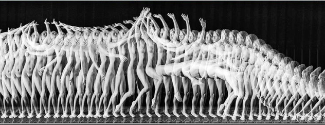

# R3.2:16 - Выделение 4D индивидов

Мы уже неоднократно обсуждали выделение индивидов (индивидуальных физических объектов) в реальном мире, и основанный на таком выделении экстенсионалистский подход (который можно назвать простым словом «*заземление»*). Кратко повторим: индивидом является всё то, с чем можно взаимодействовать в окружающем мире, что воспринимается органами чувств человека (возможно, с использованием специальных приборов), что занимает какой-то объём пространства. Если объект можно обнаружить путём физического взаимодействия с ним - это индивид. Самое простое физическое взаимодействие - это потрогать, или постучать по объекту, ещё объект можно увидеть. Если вы объект унюхали или услышали - то вы тоже обнаружили физический объект, но это будет газ в атмосфере, или звуковая волна. А вот *источник* запах или звука - это какой-то другой физический объект, скорее всего существующий, но пока что у вас есть о нём только косвенная информация!

Некоторые индивиды могут быть зафиксированы только путём взаимодействия с более или менее сложным измерительным прибором (микроскопом, фотоловушкой или счётчиком Гейгера). При этом человек взаимодействует с прибором (видит свет в окуляре, слышит щелчок), а уже прибор - взаимодействует с индивидом (собирает свет в объективе, получает заряд от частиц). Если что-то воздействует на измерительный прибор - это, несомненно, некий индивид. Однако, как и в случае с запахом или звуком, надо ещё верно определить, какой именно индивид обнаруживает себя именно так.

Договоримся так же, что *«воображаемый»* индивид в каком-то возможном/вероятном варианте *прошлого* или *будущего* нашего *реального мира* - это тоже индивид. Да и *воображаемый* индивид в каком-то *воображаемом* *мире* (совсем не связанном с прошлым, настоящим или будущем нашего реального мира) - это всё равно индивид.

Если вам придёт в голову создавать онтологию *мира* *фэнтези* - вы должны предположить, что *драконы* или *вампиры* существуют как индивидуальные физические объекты, с которыми можно взаимодействовать, в том числе магически, и строить онтологию именно на этих предпосылках. А уж варианты выделения объектов и отношений в мире фэнтези вполне описаны.

Не забывайте при этом, что *контекст* онтологии (в том числе - к какому именно миру она относится) всегда должен быть записан и сообщен пользователю. Истинность некоторых высказываний может быть определена только в *контексте*: фразы “*Вампиров не существует*” и “*Граф Дракула - вампир*” истинны одновременно, но в *разных контекстах*. Некоторые онтологи называют онтологию, использующую только определённый контекст, *микротеорией* (это совсем не то же самое, что *онтика*, небольшая самостоятельная система концептов/понятий для какого-то фрагмента картины мира!). В рамках разных микротеорий совсем разные объекты (индивиды, классы, отношения) названия могут иметь одинаковые названия.

Теперь поговорим подробнее о **4D** (**четырёхмерном**) подходе в *экстенсионализме*. *4D* означает, что границы объекта (*экстент*) определяются не только в *пространстве* (три координаты), но и во *времени* (четвёртая координата). То есть у индивидуального объекта мы должны выделить (увидеть) момент начала его существования и момент окончания его существования. Это его *темпоральные* (или *временнЫе*, ударение на Ы) границы. Между этими моментами его *физические границы* в пространстве могут (и будут) *изменяться*. Сразу отметим важный момент - некоторые предметы будут просто *перемещаться* в пространстве, а некоторые - претерпевать гораздо более существенные *трансформации*.

Если у нас есть основания полагать, что объект во времени сохраняет свою *идентичность* (не разрушается, изменяется в каких-то оговорённых рамках) - то в подходе 4D экстенсионализма мы считаем его *единым четырёхмерным объектом*.

Рамки сохранения идентичности (основания считать, что объект сохраняет свою идентичность) - могут быть разными. Либо прагматическими - нам так удобнее моделировать мир. Либо философскими. У философов велись дискуссии - можно ли считать, что каждое утро просыпается *тот же самый человек*, что заснул накануне? Нам, с прагматической точки зрения, удобно считать, что тот же!

Ваза::индивид - возникает как 4D объект во времени и в пространстве в тот момент, когда комок глины получает форму на гончарном круге. Далее она внутри границ своего существования во времени будет перемещаться в пространстве, и прекратит свое существование во времени и в пространстве только в тот момент, когда её физический экстент превратится в груду черепков.

Насекомое::индивид появляется из яйца проходит метаморфозу от гусеницы через куколку к бабочке, но если нас для каких-то целей интересует индивидуальный генетически уникальный организм - мы будем считать, что это одно насекомое::индивид.

Вася::индивид рождается, растёт, стареет и умирает, меняясь психологически и умственно, но мы считаем (по крайней мере в рамках самых распространенных философских теорий), что он сохраняет свою индивидуальность, что это один и тот же человек от рождения до смерти.

Теперь мы можем понять, почему в 4D экстенсионализме нет никакой проблемы моделировать/описывать по единым правилам объекты, существовавшие в прошлом, или те, которые будут существовать в будущем. (Помним, что будущее у нас проектируемое, предсказанное или вероятное, то есть возможное, но пока что воображаемое, и это мы уже обсудили). Все 4D объекты существуют вообще вне *вашего времени* наблюдателя-онтолога, и вне времени существования вашей модели: каждый 4D объект существует в своих темпоральных границах, проживает свой отрезок времени, а когда именно мы решили сделать модель - совершенно не важно.

Нет никакой разницы, описываем мы в этом году желудь на дубе, или же мы занимается этим в будущем - мы должны лишь чётко указать: “*жёлудь на дубе в октябре 2022 года*”::индивид или “*жёлудь на дубе в октябре 2023 года*”::индивид .

Следуя традициям некоторых авторов научной фантастики, говорят, что мы представляем себе объекты во времени и пространстве как “*четырёхмерных червей*”.

Если же мы хотим сказать именно о привычном *трёхмерном объекте* в определённый момент времени - это называется “*срезом*” или “*сечением*” объекта во времени, или “*событием*” (*event*).

“*машина Мерседес номер РР45678, попавшая в аварию в 22:03 25.12.2023 на перекрестке улиц Пушкина и Гоголя*” - это указание на четырёхмерый объект (индивид), существующий в определённый момент времени, имеющий определённые пространственные и временные координаты.

*«Событие»* в привычном нам смысле является именно таким срезом в момент времени. В обычном понимании событие, разумеется, включает несколько объектов,.

Событие *“авария в 22:03 25.12.2023 на перекрестке улиц Пушкина и Гоголя”* включает в себя как пространственные части объекты *“машина Мерседес номер РР45678 на 22:03 25.12.2023”* и *“машина Волга номер ФБ43332 на 22:03 25.12.2023”.*

Важнейшее преимущество 4D подхода - это возможность видеть всё в мире единообразно: как *материальные* объекты, при этом сохраняя привычные и необходимые для моделирования/мышления механизмы, но реализуя их новыми методами. Например, 4D подход позволяет строго различать объект и процесс, в котором этот объект участвует.

Бег и бегун - и то, и другое слово означает нечто в реальном мире. Это разные понятия, но связанные друг с другом.

Казалось бы, очевидное различение, но выясняется, что для многих менеджеров при изучении управления бизнес-процессами это различение происходит вовсе не автоматически, и путаница в сложных случаях, охватывающих компании с сотнями работников, может иметь серьёзные последствия.

Мы уже обсуждали, начиная с резидентуры **R1. Распожаризация**, что именно индивидуальные объекты мы считаем ***системами***, в то время как их *поведение* или происходящие с ними *процессы* - считать системами не следует. Строгое следование 4D подходу, которое позволяет считать индивидами практически любые явления в 4D- может внести путаницу в выделение систем. Поэтому напомним, что у систем есть ещё ряд важных признаков: вхождение в надсистему в какой-то роли, наличие подсистем (компонент, деталей), и самое главное - **выполнение полезной функции в надсистеме** **в роли некоторого агента-создателя**, сохраняющего свою **идентичность**. Для тренировки этого различения мы рассмотрим в следующей части - как именно связаны процессы и участвующие в них объекты.

Далее мы узнаем, как размышлять в рамках этого подхода о свойствах объектов, об изменении этих свойств, и даже о смене одних объектов на другие с сохранением их функции.
