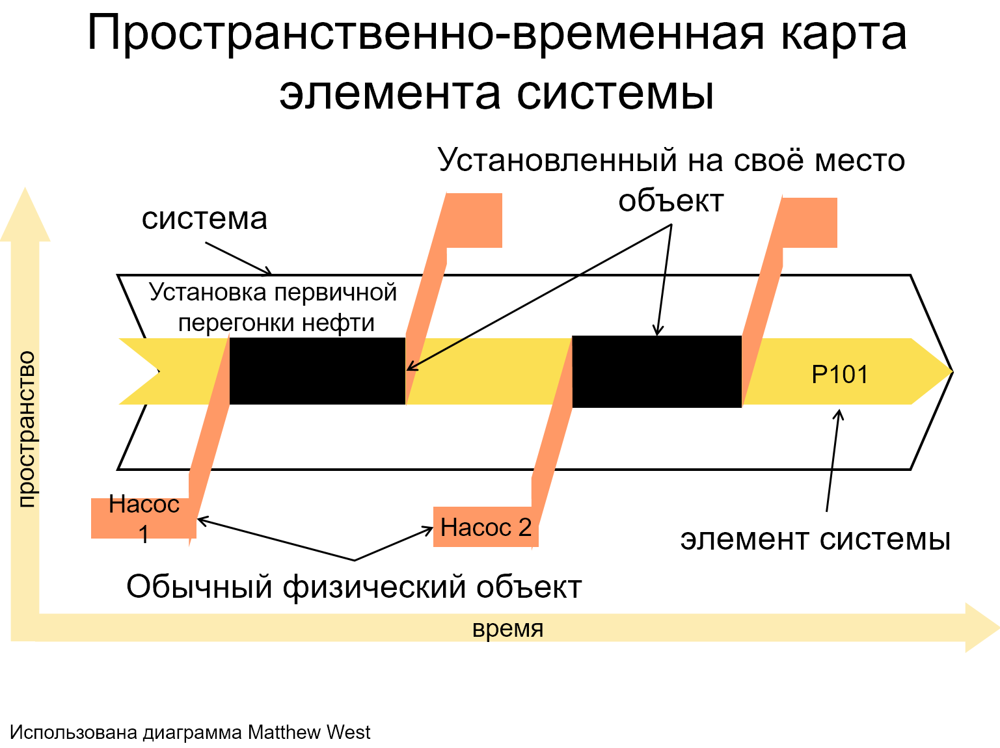

# R3.2:23 - Замена элемента системы

Мы уже отмечали, что, используя приёмы 4D экстенсионализма, становится проще единообразно моделировать *изменения материальных физических объектов* (*перекраску*, *взросление* и т.п.). Покажем, как введение в нашу онтологию ***функциональных физических объектов*** ***(ФФО)*** помогает по единой схеме решать другую задачу - как моделировать *замену объекта*, как определять обозначения (и искать для них референцию) при описании объектов, меняющихся *целиком*.

Разберём пример *инженерной системы* - именно для инженерных применений использование ФФО детально разработано, например, в стандарте ISO 15926.

При проектировании технической установки проектировщик сперва включает в состав системы (в *модель системы*, в схемы и чертежи) именно *функциональный физический объект*, который будет отвечать за давление в трубопроводе. Необходимость появления этого элемента следует из физической сути процесса, который будет протекать в установке (поток по трубопроводу должен перемещаться). На схемах этот функциональный элемент получает *индивидуальный идентификатор (тэг)* P101.

Этот элемент модели соответствует какому-то будущему индивиду - материальному устройству, которое возникнет и будет существовать потом, когда установка будет построена. При дальнейшем проектировании параметры этого будущего индивида (мощность, энергопотребление, габариты) - привязываются к данному тэгу, эти характеристики описываются на данном этапе именно как характеристики объекта *P101::ФФО*. Удобство такого выделения объекта в том, что инженер может проектировать установку, не заботясь пока что о выборе конкретного оборудования, производителя, цене, наличии или перспективах поставки. Инженер определяет только нужные характеристики оборудования. Но эти характеристики не могут «*висеть в воздухе*» - поэтому в модели и появляется функциональный объект *P101*.

Далее, при изготовлении реальной установки для исполнения функций Р101 будет закуплен конкретный насос, с характеристиками, удовлетворяющими характеристикам P101, но уже от конкретного производителя, имеющий какой-то *серийный номер*. Этот объект можно назвать *«Насос 1»*. (Может быть и так, что, в связи с трудностями закупки нужного оборудования, для исполнения функции P101 будет установлено два физических насоса, но мы это пока обсуждать не будем.)

На диаграмме ниже видно, как этот *«Насос 1»::МФО* перемещается в пространстве после выпуска на заводе (все три пространственные оси обозначены тут одной вертикальной осью), и в какой-то момент встаёт на место, предназначенное для *P101::ФФО*. После этого *P101* приобретает *пространственное воплощение* и начинает выполнять свою функцию - перегонять поток по трубе. С этого момента у *«Насос 1»* и *P101* возникает общая полная темпоральная часть, на диаграмме закрашенная чёрным. Весь *«Насос 1»* в это время является частью *P101*, и весь *P101* в это время состоит из *«Насос 1»*.

В какой-то момент, например, после поломки, *«Насос 1»::МФО* будет снят со своего места и перемещён в пространстве, и в этот момент он перестанет быть полной темпоральной частью *P101::ФФО*. На некоторое время *P101* перестанет существовать в пространстве - насос демонтирован, функция в этом месте трубопровода не исполняется. Но потом следующий материальный физический объект, *«Насос 2»* (возможно, от другого производителя, но обязательно с подходящими характеристиками), будет установлен на это место, и *P101::ФФО* снова приобретёт материальное воплощение.

