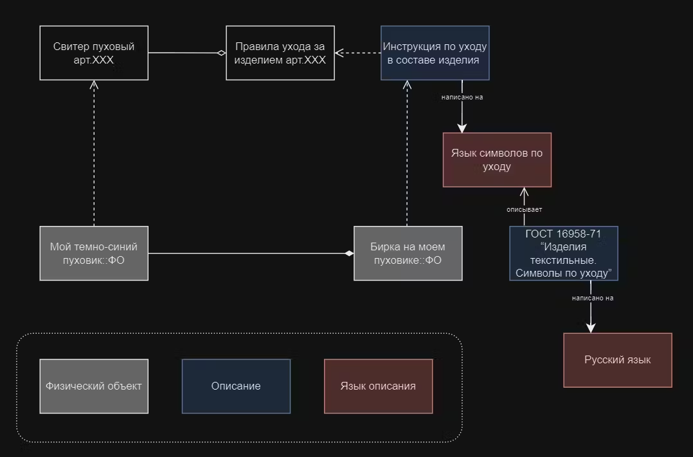

# R3.3:4 - Мета-языки и уровни моделирования

Итак, поднимаясь на следующий *уровень описания*, описывая описание объекта, мы оказываемся на *мета-уровне*, работаем с мета-описанием.

А можно ли встретить *описание описания описания* объекта? Да, конечно можно. Это будет *мета-мета уровень*, *мета-мета-описание* исходного объекта, тремя уровнями выше него. Поговорим подробнее о возможных уровнях в этой иерархии.

*Мета-язык* — это язык, который вводится для описания другого языка. Зачем он нужен? Как мы обсуждали ещё в резидентуре **R1**, язык определяется словарем, синтаксисом, семантикой и прагматикой. Все эти определения - находятся на *мета-уровне* *по отношению к языку*, то есть они должны быть записаны на каком-то *мета-языке*. Выше мы ввели ещё одну формулировку для того же самого утверждения, используемую в основном в области создания баз данных: *язык описания определяется своей моделью данных.*

Внутри языка, в его конструкциях - невозможно даже логически строго сформулировать семантические понятия «*истина*» и «*ложь*» (это формализовал А. Тарский в с*емантической теории истины* [h](https://ru.wikipedia.org/wiki/Семантическая_теория_истины)[ttps://ru.wikipedia.org/wiki/Семантическая_теория_истины](https://ru.wikipedia.org/wiki/Семантическая_теория_истины)), поэтому сам наш естественный язык, тот, на котором мы разговариваем, должен быть в целях строгого логического анализа семантики рассмотрен как минимум два языка: *язык описания объектов* и *мета-язык*. На мета-языке формулируются важные высказывания про язык описания объектов, например высказывания об истинности высказываний. Различить их можно только формально, посмотрев, *о чём именно* делается какое-то высказывание.

Вроде бы это должно означать, что может быть обнаружена какой угодно длины цепочка из мета-языков, каждый из которых описывает предыдущий. В этой цепочке сохраняется отношение «*мета-язык — язык объектного уровня*». О любой паре соседних языков в этой цепочке можно говорить, что они находятся в таком отношении друг к другу. Посмотрим, а нужны ли такие длинные цепочки?

Вернёмся к примеру с картой:

У нас есть *карта*::О, это описание *территории*::ФО.

Есть *легенда карты*::О - она описывает карту, задаёт язык, на котором составлена данная карта, даёт указания, как читать описание, задаёт модель данных для карты.

Легенда описывается картографическим стандартом::О. Мы можем считать картографический стандарт *описанием языка легенды* (то есть *мета-мета*-описанием), но можем считать этот стандарт и расширенным *описанием языка карты*, то есть тоже *мета*-описанием, как и легенда.

На этом примере видно, что, что *разделение на мета-уровни* - достаточно условная конструкция. Конечно, мы всегда можем сравнить два уровня, и сказать, что один из них - это *мета-уровень по отношению к другому*. Но если у нас есть целая цепочка описаний - их очень часто трудно однозначно разделить на уровни, сказать, что «*тут у нас точно 3 (или точно 4) мета-уровня».* Это могли сделать за нас авторы используемых нами стандартов, спецификаций, словарей, онтологий - если их заботила эта проблема, и они хотели достичь высокой точности и формальности в своих описаниях. Однако такое разбиение очень часто можно упростить (или наоборот, усложнить), объединив уровни определения языков (или наоборот, разбив их на большее число уровней).

Вот ещё один пример (за который мы благодарны нашему стажеру Дмитрию Филиппову [https://systemsworld.club/u/dmitrii-filippov](https://systemsworld.club/u/dmitrii-filippov), подготовившему его во время прохождения резидентуры). Обратите внимание на выделение объектов (в кавычках) и отношений (подчёркивание):

- У меня есть *«Мой синий пуховик»*::ФО
- К внутреннему шву *«Моего синего пуховика»* <u>пришита::часть-целое</u> *«Бирка моего пуховика*»::ФО
- *«Бирка моего пуховика*» <u><i>является_</i></u><u><i>носителем</i></u> *«Инструкции_по_уходу_в_составе_изделия»*::Описание
- *«Инструкция_по_уходу_в_составе_изделия»* <u>написана на</u> «*Языке_симоволов_по_уходу*»::Язык_описания
- «*Язык_символов_по_уходу*» <u>описан</u> «*ГОСТ_16958-71_“Изделия_текстильные._Символы_по_уходу”»*::Описание
- *«ГОСТ_16958-71_“Изделия_текстильные._Символы_по_уходу”»* <u>написан на</u> *«Русском_языке»*::Язык_описания

В этой цепочке *«Инструкция_по_уходу_в_составе_изделия»* может быть названа описанием, а «*ГОСТ_16958-71_“Изделия_текстильные._Символы_по_уходу”»* - мета-описанием. Тогда для этой пары «*Язык_символов_по_уходу*» является языком описания, а русский язык - мета-языком для описания языка.

Диаграмма ниже иллюстрирует эти отношения. Это уже иллюстрация к одному из возможных способов формального моделирования, более строгому, чем текстовое описание выше.

Отношения *часть-целое* отмечены на ней стрелками с закрашенными ромбиками со стороны части.

Отношения *классификации* - пунктирными стрелками со стрелками со стороны классификатора.

Отношение между классами «*элементы одного класса являются частями элементов другого класса*» (про это сложное отношение мы говорили раньше, когда обсуждали разбиения) отмечены стрелками с прозрачными ромбиками со стороны части.

Обратите внимание, на диаграмму добавлены классы, к которым относятся пуховик и бирка.

При этом *«Инструкция_по_уходу_в_составе_изделия»* формально отмоделирована как класс индивидов, в который входят бирка на моём пуховике (ещё в него входят бирки с идентичным содержанием на всех таких пуховиках, выпущенных в мире). А уже класс *«Инструкция_по_уходу_в_составе_изделия»* входит в класс *«Правила ухода за изделием арт ХХХ»* (ещё в него входит, например, *Вкладная брошюра в комплекте с изделием арт ХХХ»*).

*Определение языка* на мета-языке включает определение *словаря языка* и *синтаксиса языка* (*семантику* и *прагматику* пока оставим в стороне). Наш основной интерес сейчас - онтологическое моделирование, поэтому в первую очередь нам надо разобраться с разделением на мета-уровни именно *словаря*, который составляет основу *онтологии предметной области*. Синтаксис, как мы уже видели, может быть для разных уровней описания одним и тем же (например, синтаксисом русского языка).

Вспомним ещё раз про *жаргоны и диалекты естественного языка*. Мы теперь можем считать, что *естественный язык*, необходимый для понимания того или иного *профессионального жаргона*, находится по отношению к нему на *мета-уровне*. Иногда на мета-уровне по отношению к профессиональному жаргону находится не один естественный язык, и даже не только естественные языки. Например, для понимания *жаргона русскоязычных программистов* надо знать русский язык (его синтаксис и общий словарь), но ещё хорошо бы иметь хоть какое-то знание *английского языка*, и хорошо бы знать хотя бы на базовом уровне конструкции хоть какого-то *языка программирования*.

**Примеры для программистов:**

1. *Мета-данные*

Пусть у нас есть описание объекта - страница в интернете, описывающая, например, человека. Текст на странице может быть написан на естественном (русском) языке.

Но сама страница, её структура, формат и содержание, как у большинства страниц в интернете, описаны на языке HTML. Язык HTML - это *мета-язык*, используемый для описания страниц в сети, языком которых является *русский язык*. На языке HTML отдельные фрагменты текста на русском языке (слова, фразы) будут описаны как ссылки, как абзацы, как имеющие определённый шрифт или цвет. Это *мета-данные* (данные о данных), необходимые для отображения страницы на экране читателя так, как хочет её хозяин.

Иная *дополнительная информация* об этой странице (*мета-информация*) тоже может храниться на том же сервере, в отдельном файле, или в специальном разделе того же HTML-документа. Для записи информации об *авторе, публикаторе, дате публикации, дате изменения, версии* (и прочих мета-данных) может быть использована специальная онтология (словарь) Dublin Core [https://www.dublincore.org/](https://www.dublincore.org/) - стандартный *список идентификаторов типов* для этих (и нескольких других) элементов. Это ещё один мета-язык, использующийся для описания той же страницы на русском языке, но с иной целью: описать не структуру и вид текста, а его происхождение и историю.

1. <u>Программы и языки программирования</u>

Как мы уже много обсуждали в наших резидентурах, в предметной области информационных технологий индивидуальными физическими объектами являются работающие на компьютерах экземпляры программ, во время исполнения ими тех функций в реальном мире, для которых они созданы.

Исходные коды этих программ являются описаниями физических объектов. Исходные коды программ, как правило, написаны на *языках программирования высокого уровня* (например, C++ или Python).

Для возможности исполнения на компьютере, то есть для *создания физического объекта по такому описанию*, оно *интерпретируется* специальной программой (интерпретатором или транслятором) и превращается в другое описание, на языке команд конкретного процессора (как правило, там даже несколько таких интерпретаций на языки разных уровней - *ассемблер, байт-код, микрокод*,…). Но результат такой интерпретации (*программа в кодах процессора архитектуры x86*, например) - это всё равно описание физического объекта, создающегося по этому описанию только в момент исполнения программы.

Сами языки высокого уровня задаются своими *спецификациями, стандартами*. Вы можете легко найти для любого языка программирования как «*официальные*» стандарты, задающие их, так и многочисленные учебники, учебные курсы, пособия, справочники - всё это тоже *описания языков*, то есть *мета-описания* по отношению к работающей программе.

Обратите внимание, что тут мы снова можем столкнуться с множественностью значений приставки *мета-*! Описание языка программирования - это *мета-уровень* по отношению к программе, написанной на этом языке. Но в то же самое время данные *об этой программе* (например, данные о версии исходного кода в системе управления версиями Git) - тоже являются *мета-данными* для этой программы.

Наконец, сама *официальная формальная спецификация* языка программирования пишется на специальном языке. Синтаксис языка программирования может быть описан на *языке форм Бэкуса — Наура* ([https://ru.wikipedia.org/wiki/Форма_Бэкуса_—_Наура](https://ru.wikipedia.org/wiki/%D0%A4%D0%BE%D1%80%D0%BC%D0%B0_%D0%91%D1%8D%D0%BA%D1%83%D1%81%D0%B0_%E2%80%94_%D0%9D%D0%B0%D1%83%D1%80%D0%B0)) , а вот семантику обычно описывают на *языке математических формул* и на специальном диалекте (подмножестве) естественного языка. Это ещё один шаг вверх по *лестнице мета-языков*.
