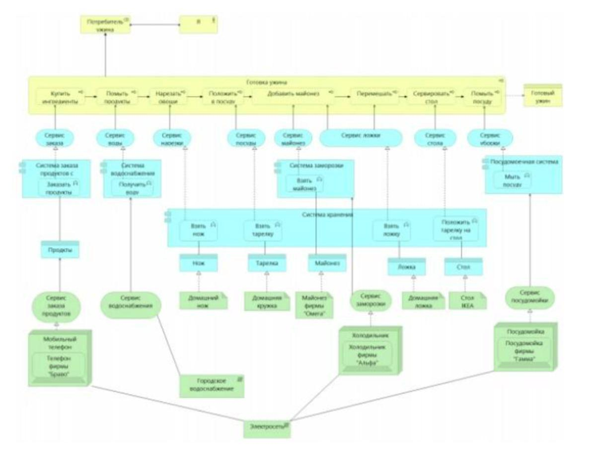

# R3.3:7 - Описание и поиск его языка

Теперь мы можем вновь поговорить об описаниях, понимая уже, как устроены языки описаний и что такое модели данных (шаблоны, языки) описаний.

Допустим, вам присылают текст. Вот его начало:

*«Работаю в компании, которая берет на себя проекты различной направленности. В штате, соответственно, сотрудники многих специализаций, а раздача заданий реализована через внутренний сервис.*

*Среди менеджеров устоялась традиция делать некий аукцион: вначале описывают проект, люди пишут, кто за сколько какую часть сделает (тимлид может писать за свою группу). Менеджер по итогам обсуждает с заказчиком сроки и цену, а среди подавших заявки отбирает тех, кто больше нравится.»*

Это описание довольно легко прочитать. Оно составлено на *естественном языке*, который знают и понимают все. Описание состоит из слов, которые вы знаете (при этом, если бы показать этот текст бабушке-пенсионерке, то все же пришлось бы пояснить значение некоторых слов, так как она вряд ли принадлежит к соответствующему семантическому сообществу). Вы можете его как-то понять (не обязательно абсолютно верно и полно, это ведь маленький кусочек текста, и контекст не очень понятен).

А вот с настоящей топографической картой так просто, может быть, и не вышло бы. Условные обозначения на профессиональных картах очень отличаются от обозначений на упрощённых картах в онлайн-сервисах. Если бы вы попытались прочитать топографическую карту без точного знания языка условных обозначений, на интуитивном уровне (*«а этот лес кажется темнее — наверное, он плотнее»*) - вы бы наверняка упустили много релевантной информации. А уж какую-нибудь карту геологических пластов - вы бы скорее всего просто не поняли.

Если инструкция по толкованию описания (*мета описание*, *описание языка*) не дана явно (как легенда, список терминов и сокращений, ссылка на стандарт или закон), толкование, как правило, либо происходит очень быстро на уровне S1 (на основе реального опыта или интуиции, иногда «*бытовой*», то есть ошибочной), либо не происходит вообще.

Инструкции для толкования может не быть у вас, но она может быть у другого агента. Может быть и так, что изначально инструкция вообще не была составлена, но кто-то ранее, исходя из прошлых сообщений и контекста, уже изучил новый язык. Или думает, что он его изучил. И кто-то другой тоже думает, что он изучил этот язык. Однако его мета-описание может быть совсем другим.

Такое случается при передаче зашифрованных сообщений, и не только в связи с самым общепринятым использованием шифрования. Так устроена дешифровка мертвых языков - иногда разные учёные читают один и тот же текст совершенно по-разному.

И вы наверняка можете представить, как что-то подобное происходит реально в вашей профессиональной деятельности! Практически во всех случаях устную речь приходится толковать - исходя из своего опыта и без точных инструкций. Люди, говоря на естественном языке (или даже на языке какого-то профессионального сообщества) не выдают инструкций: как их нужно понимать. Наоборот, если такие инструкции вдруг появляются, это часто звучит необычно: *«Я бы хотел, чтобы ты подготовил отчёт, и когда я говорю «подготовил отчёт», я имею в виду…»*.

Поэтому часто два сотрудника очень по-разному реагируют на одну и ту же услышанную ими фразу. У них просто нет явной инструкции, которая разделялась бы всеми, как толковать полученное сообщение. Каждый толкует/расшифровывает сообщение на неизвестном (или не полностью известном) языке, а затем реагирует на него - исходя из своего собственного опыта, то есть в разном контексте. И поэтому выводы делаются совсем разные.

На следующей иллюстрации приведён пример описания на специальном формализованном языке ArchiMate, и это совсем другая история.

ArchiMate - язык моделирования архитектуры предприятия, язык для визуализации бизнес- процессов. В дополнение к мета-описанию (стандарту <u>https://www.opengroup.org/archimate-licensed-downloads</u><u>)</u>, задающему сам язык ArchiMate (мета-У уровень), использующие его фирмы специально договариваются о *стиле моделирования* и пишут «*Соглашение о моделировании»* (то есть спецификацию мета-С модели). «*Соглашение о моделировании* «определяет, как в точности описывать те отношения, для которых в стандарте есть знаки в языке, есть синтаксис, но в спецификации на мета-У уровне нет однозначных правил выбора семантических структур, обеспечивающих общие подходы при подготовки и интерпретации моделей.

То есть понимание конкретных моделей (уровня экземпляров) на ArchiMate требует знания двух мета-языков: зафиксированного в стандарте языка, и зафиксированного в «*Соглашении о моделировании*», принятом конкретной группой пользователей.

Если же вы этим языком вообще не пользуетесь в работе, то вы ничего не поймете. Модели на ArchiMate не содержат даже краткой легенды, условные обозначения ArchiMate знают те, кто моделирует на этом языке. И составитель описания для конкретной компании (*модели экземпляра*) вовсе не рассчитывает, что его будет читать непрофессионал, или даже профессионал, не поддерживающий то же «*Соглашение о моделировании*».

Есть и такие описания, интерпретатор в которые практически прямо встроен внутрь, и его не нужно толковать своими мозгами. Описание сразу интерпретируется и готово для исполнения агентом. К ним относятся, например, хорошо спроектированный исполняемый тьюториал, руководство *how-to*, видео-инструкции. По сути такое описание является своего рода *программой, в* процессе исполнения оно пошагово говорит вам, что нужно делать в физическом мире, и ещё после каждого действия говорит, как в физическом мире найти и проверить на правильность получившийся результат. Хорошо сделанные интерфейсы программ/сайтов/и т.д., которые нам кажутся интуитивными, именно так и работают.
