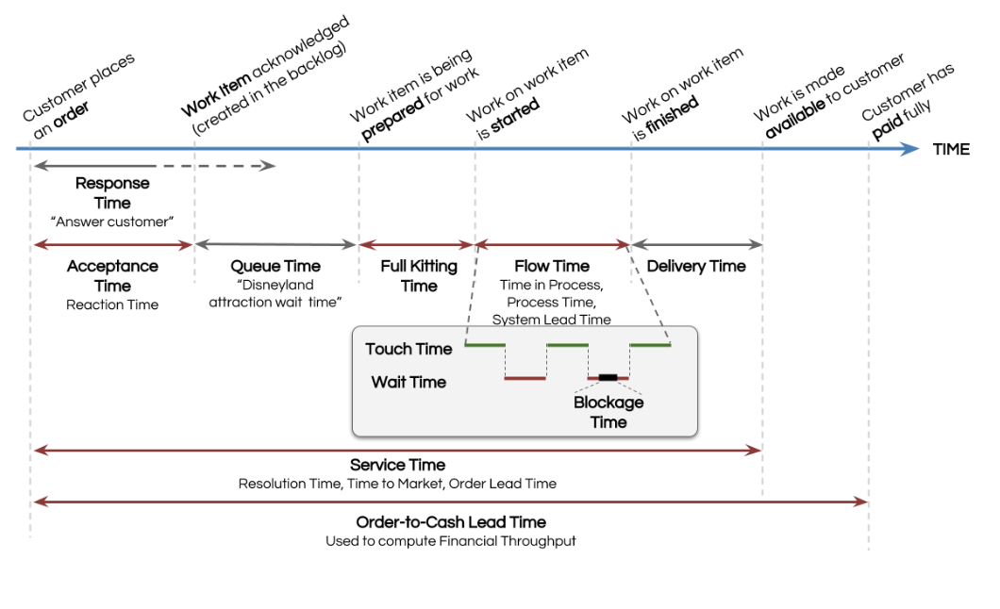

# R4.1:3 - Время в TameFlow

В учебниках по операционному менеджменту вы встретите много разных терминов, использующихся при анализе *времени работ*. Терминов избыточно много, и то же самое происходит с названиями для того, кто производит работы - *создателя/агента/сonstructor*. Для отсылки к одной и той же идее, но на разных системных уровнях, придумывается своё слово.

Так, *создателя* в операционном менеджменте будут называть и «*рабочей станцией/workstation*», и «*сервером/server*», и «*линией/маршрутом/routing*», и «*сетью/network*». При этом различие будет главным образом в системном уровне: «*сервер*» – это индивид/создатель, выполняющий работу одним методом (например, один инженер-конструктор), «*рабочая станция*» – это группа индивидов/создателей, выполняющих работу одним методом (все инженеры-конструкторы в команде), «*линия/маршрут/routing*» – это группы индивидов/создателей, выполняющие работы разными методами, но получающие на выходе один объект/вещь (команда или подразделение, которая проводит испытания опытных образцов оборудования; в состав команды входит группа инженеров-конструкторов), «*сеть/network*» – это группы индивидов/создателей, выполняющие работы разными методами и получающие на выходе разные объекты/вещи, но в рамках одного предприятия (все команды предприятия; некоторые проводят испытания опытных образцов, другие налаживают серийный выпуск оборудования, признанного перспективным). Все эти термины можно спокойно заменить словом «*создатель*», и просто каждый раз уточнять, какого именно создателя мы имеем в виду.

С временами происходит то же самое. Время обработки части объекта на одной *рабочей станции* (создателе, который может включать в себя несколько индивидов и выполняет работу одним методом над одним объектом) называют *временем обработки/Process time* (например, время, когда инженер готовит конструкторскую документацию); время обработки целого объекта/вещи группой создателей, выполняющих работу разными методами (время обработки на *линии/маршруте/routing*) называется *потоковое время/время цикла/Flow Time/Cycle Time* (например, время, за которое команда проводит испытания оборудования, оно включает в себя время на подготовку конструкторской документации). Суть понятия та же, поменялся лишь создатель, время работы которого нас интересует – авторы книг и курсов изменили название. Мы в рамках этого руководства постараемся ограничить выбор названия для времени работы создателя терминами *потоковое время/Flow Time/время цикла/Cycle Time*, чтобы подчеркнуть общее, но иногда в скобках будем приводить синонимы из учебников, которых, как вы увидите далее, довольно много.

Такая унификация/объединение позволяет получить более-менее универсальную минимальную онтологию работ предприятия, которую вы можете совершенствовать под ваши задачи, и устраняет сложности в понимании: добавление терминов не должно происходить спонтанно. Включение новых терминов в онтологию должно быть обосновано, нести некоторый практический смысл.

Ненужная избыточность терминов, обозначающих одно и то же понятие и приводящих к путанице в толковании – это лишь одна из онтологических проблем, с которыми вы столкнётесь при изучении разных учебников по операционному менеджменту (да и разных учебников по многим другим предметным областям!). Ещё одна грань той же проблемы в том, что в одном и том же учебнике похожие названия будут отсылать к объектам, которые сами авторы ввели как разные. Так, в Factory Physics время обработки части объекта на одной рабочей станции называют *время обработки/Process Time*, время обработки целого объекта/вещи на нескольких *рабочих станциях/создателях/линии* называют *потоковое время/время цикла/Flow Time/Cycle Time*, а минимальное потоковое время для *линии/маршрута/создателя* (при любом количестве *незавершенки*) называют *Raw Process Time*. Если вы уже запутались во всех этих временах, то ничего удивительного в этом нет. А ведь таких путаных описаний концептов времени в разных учебниках ещё штук 6-8!

Чтобы разобраться с этой путаницей, мы и введём минимальную онтологию: минимальное число понятий/концептов/идей, которые отсылают к одним и тем же – ключевым – объектам. Мы ограничим число используемых в минимальной онтологии терминов, чтобы не создавать лишнюю путаницу.

Начнём с понятия «*создателя*» в дисциплине операционного менеджмента. Как вы уже прочитали, разных создателей в операционном менеджменте называют и *линиями/маршрутами/line/routings*, и *рабочими станциями*, и *серверами*, и *сетями*. Мы в качестве базовых терминов, отсылающих к создателю при разбирательстве с работами, выберем ***линия/маршрут/траектория/line/routing*** для создателя, который в результате работы/преобразований/трансформаций получает законченные объекты/вещи. *Линия/маршрут/line/routing* состоит из частей (более *«мелких»* создателей), которые мы будем называть либо ***частями линии***, либо (реже) рабочими станциями. Термины «*сервер*» и «*сеть*» мы использовать не будем совсем.

Соответственно, в качестве термина, обозначающего время работы *линии/маршрута/line/routing*:: создателя, выберем термин **потоковое время/Flow Time/время цикла/Cycle Time**. Потоковое время отсчитывается от даты старта работы над объектом (дата или дата и время/timestamp *прибытия/arrival/входа* работы на линию) и до даты завершения (дата или дата и время/timestamp *выбытия/departure/выхода* готового объекта).

Представьте себе, что вы *менеджер контентной команды*. Выпускаемый контентной командной объект – клиентский кейс, упакованный в *материал* (*статью* на сайте), повышающий мастерство клиента. Клиент сталкивается с ситуацией/кейсом, в котором ему требуется правильно учесть расходы для целей бухучёта. Он идёт на сайт, читает статью, узнаёт оттуда метод учёта, который нужно применить в спорной ситуации, применяет для описания своих расходов – и не имеет никаких проблем с регулятором, проверяющим проводки. То есть, благодаря статьям растёт бухгалтерское мастерство клиентов.

Темы для статей предварительно выбираются, обсуждаются и приоритизируются. Затем берутся в работу. Дата и время/timestamp, когда эксперт берёт отобранную статью в работу (начинает писать или изучать материалы для написания) – это дата и время «входа» кейса на линию, с этого момента начинаем отсчитывать потоковое время/Flow Time/Cycle Time (событие «*начало работы линии*»). Вы иногда можете выбрать по-разному событие начала работы линии. Обычно событием начала работы линии считают *первое касание* работы операционной командой/линией – уже после того, как было выбрано, над чем именно (над какой именно темой статьи) будет работать линия в соответствии с приоритетами, проведены первые оценки работы и другие подготовительные активности.

Далее статью вычитывает редактор (содержательно), затем корректор (правит грамматические и синтаксические ошибки). После готовая статья согласовывается ставится в список на публикацию. Здесь мы можем выбрать дату и время выхода объекта из нескольких вариантов:

- Во-первых, мы можем выбрать приход конкретной статьи в состояние «*согласована/поставлена в очередь на публикацию*». Но в таком случае мы должны отдельно считать время поставки статьи клиенту/Delivery Time, должны быть сотрудники, которые ответственны за поставку, и менеджеру контентной команды нужно следить за поставкой статей. Потому что если клиент не может изучить описанный в статье кейс и применить нужный метод учёта, то с точки зрения клиента не сделано ничего, выпуск равен 0.
- Во-вторых, мы можем выбрать *событие публикации/релиза* статьи (статья должна находиться в состоянии «*опубликована и доступна клиентам*»). Временем поставки/Delivery Time в таком случае можно считать время от момента публикации до момента получения первой обратной связи от выбранного клиентского сегмента. Когда первая обратная связь получена, считаем, что статья используется клиентами для повышения мастерства.

Событие завершения работы линии выбирается с учетом того, какие объекты выпускает команда, а также с учётом устройства компании и распределения ответственности: мы должны избежать ситуации, в которой разные части разных линий считают какую-то часть путешествия объекта «не своей» – и в итоге никто ею не занимается, никто не контролирует. В случае с контентной командой такими серыми зонами могут быть именно статьи в состоянии «*готово к релизу/публикации*»: контентная команда может считать, что её работа закончена, следить за публикациями и датами этих публикаций они не обязаны. А публикаторы могут просто публиковать всё, что есть, не следить за конкретными статьями («*это не наша обязанность*») и не увидеть, что какая-то статья не была опубликована (потерялась). В итоге вроде бы никто не ответственен, но статьи нет, клиент не может её изучить.

Поэтому события начала работы и завершения работы линии надо выбирать аккуратно. Если вы выбираете события начала работы и завершения работы для нескольких линий, то имеет смысл для разных линий ставить события так, чтобы они пересекались, и в точках касания/контакта разные линии осуществляли перекрёстный контроль.

Например, для контентной команды событием *завершения* работы линии выбрать событие публикации статьи на сайте (тогда работа считается законченной), а для линии публикаторов событием *начала* работы линии – событие получения списка статей для публикации, который они должны аккуратно сверить с пришедшими для публикации статьями, чтобы ничего не потерять. Если какая-то статья не будет опубликована, то проблему смогут заметить сразу две команды.

Когда произошло событие начала работы линии, но ещё не было события завершения работы, у линии появляется *незавершёнка/work-in-progress/WIP*. Незавершёнка считается в экземплярах создаваемого объекта. Например, когда эксперт начал писать статью (произошло событие начала работы), у *команды:: линии*, частью которой является этот *эксперт:: рабочая станция:: часть линии*, появилась незавершенка в виде кейса, недоупакованного в статью, т.е. незавршёнка – это пара/кортеж *&lt;кейс, статья&gt;*. В команде иногда могут опускать часть кортежа и говорить просто «*статья*», но это допустимо только если у команды есть общее/shared понимание, что *статья:: описание* полезна тогда и только тогда, когда она описывает *реальную ситуацию (кейс)*, с которой сталкивается или столкнётся в будущем клиент, и позволяет компании-клиенту подрастить бухгалтерское мастерство сотрудников. Успешной будет так команда, которая при отборе тем статей и их написании ориентируется на реально имеющиеся проблемы (реальные кейсы), а затем изучает, насколько удалось поднять мастерство в описанных ситуациях.

*Незавершёнка* на линии начинает существовать после *события начала работы* и завершает своё существование после *события завершения работы* (например, публикации). *Потоковое время/Flow Time/Cycle Time* тоже считается с момента, когда произошло событие начала работы, и до момента, когда произошло событие завершения работы (те объект оказался выпущен). Кейс, упакованный в статью, размещён на сайте и доступен к изучению клиентами. Отсюда получаем и главное уравнение для операционного менеджера (оно называется ***закон Литтла***, подробнее его особенности и условия применимости мы ещё познакомитесь в следующих разделах этого руководства):

**WIP = Flow Time * Throughput Rate**

**Незавершёнка = Потоковое время * Выпуск**

где ***Незавершёнка*** считается в начатых, но не законченных экземплярах объектов, ***Выпуск*** – в штуках/экземплярах выпущенных объектов за период времени, ***Потоковое время*** – в тех же периодах времени (днях/неделях/часах). Разумеется, обычно имеют в виду усреднённые значения этих величин.

Допускается и альтернативное измерение WIP и выпуска в выполненных (не до конца и до конца) задачах. Но невозможно смешение единиц измерений, когда незавершёнку считаем в задачах, а выпуск – в экземплярах объектов.

*Потоковое время/Flow Time* – одна из базовых метрик операционного менеджмента. Рассчитать её можно двумя способами. Первый способ – как раз использовать *закон Литтла*, померив на протяжении какого-то времени и усреднив показатели в штуках:

**Потоковое время = Незавершёнка (шт) / выпуск (шт/день)**

Второй способ – аккуратно провести хронометраж и сложить средние значения *времени* *касания работы/Touch Time/Effective process time/te* и *времени ожидания выполнения/Wait Time/time waiting in queue/CTq*. То есть:

**Потоковое время = Время касания/непосредственного выполнения работы + время ожидания выполнения**

Идея такого расчёта заключается в том, что часто работа по методу над объектом выполняется не в один присест, в силу сочетания разных причин. Во-первых, сам метод может быть сложен для выполнения: например, на то, чтобы написать статью, может уходить 30 рабочих часов (*время касания/чистое время работы*). Во-вторых, редко удаётся работать, не отвлекаясь на другие работы, на встречи или на решение *стихийных задач*. Например, эксперт может сесть писать статью, но через 2 часа у него встреча, затем остаток дня он потратит на ответы на вопросы клиентов по предыдущим статьям (поддержка). То есть, *эксперт::часть линии/рабочая станция* коснулся статьи, поэтому с точки зрения линии - появилась *незавершёнка* и начало отсчитываться *потоковое время*. Однако, когда эксперт переключится на встречу и после на ответы на вопросы, он не будет писать статью, работа будет *ожидать выполнения* (как и в выходные и праздники). Пусть на все такие активности у него уходит 30% от его продуктивного времени, которое составляет 5 часов в день. Тогда он может посвятить статье 70% продуктивного времени, или 3,5 часа в день. Соответственно, ему потребуется 8,6 (30ч/3,5 ч) или, с округлением, 9 рабочих дней на статью. С учётом выходных потребуется 11 календарных дней. Если у эксперта не очень хорошее мастерство собранности и базовое мастерство управления личными работами, то он будет тратить даже больше времени на «*другие*» активности – не 30%, а 50%. В таком случае реальное время касания статьи в день будет 2,5 часа, а статья будет писаться 12 рабочих или 16 календарных дней. Чем хуже концентрируется эксперт на важном, тем сильнее будет растягиваться время. Как видите, точный хронометраж (которым и вы занимались в резидентуре **R1**) – дело трудозатратное. Поэтому именно закон Литтла помогает сделать первые оценки потокового времени, посчитать физически количество объектов в работе и время выпуска каждого объекта – всё же проще. А вот далее, сравнив полученную оценку с теми затратами времени, которые теоретически нужны на изготовление вещи по используемому методу, можно уже приступать к оптимизации.

Из описания метода можно сделать оценку – сколько теоретически чистого времени работы занимает изготовление вещи. Примерно столько времени изготовление и займёт, если рабочим станциям реально удаётся работать сфокусированно над задачей по созданию объекта. Это и есть чистое *время выполнения/время касания/Touch Time*).

Но есть ещё то время, которое незавершёнка ждёт, чтобы часть *линии/рабочая станция:: создатель* вернулся к ней и доделал её. И в первую очередь фокус внимания операционных менеджеров должен быть именно на сокращении этого *времени ожидания/Wait Time*. Ведь чистое *время выполнения/время касания* уменьшить сложнее, для этого требуется изменение *методов работы,* их совершенствование с переобучением сотрудников, замена части линий и т.п. Это требует *инвестиций* в изменение методов, часто достаточно серьёзных. А для минимизации *времени ожидания/Wait Time* нужно не что-то *добавить*, а *убрать*: минимизировать число одновременно находящихся в работе проектов и задач, убрать лишние встречи и т.п. – всё то, что вы делали в резидентуре **R1** по **Распожаризации**, когда изучали принципы собранности и планирования. Теперь вы можете сказать, на что именно воздействовали: вы уменьшали время ожидания выполнения для важных задач, в рамках которых создаются нужные объекты.

Однако *потоковое время* – не единственная метрика времени в онтологиях работ. Наиболее общую схему, описывающую времена, за которыми можно следить операционным менеджерам, описал Стив Тендон в книге ***The Book of TameFlow***:

Схема описывает метрики времени *линии::создателя*, которые могут быть интересны операционному директору, управляющему предприятием именно как конвейером. Предлагается считать следующие метрики:

- **Время ответа/Response time** – время от получения запроса до ответа покупателю/ время обратной связи. Обычно интересно службе поддержки.
- **Время приема заказа на работу/Acceptance Time** – время от получения запроса на заказ до приема заказа внутри предприятия как конвейера.
- **Время в очереди/Queue Time** – время ожидания заказа в очереди на обработку. В этот момент работа операционной команды, ответственной за выполнение заказа:: линии ещё не началась, заказ всего лишь попал в очередь.
- **Время предварительной подготовки/Full Kitting Time** – время, когда проводятся подготовительные активности: заказ на создание объекта приоритизируется, оценивается, проводятся при необходимости исследования, выбирается и моделируется метод работы.
- **Потоковое время/Flow Time/Cycle Time** – время, в которое работа непосредственно выполняется (получаем экземпляры объекта, которые пойдут клиенту). Включает в себя время выполнения/время касания/Touch Time и время ожидания/Wait Time и находится в фокусе внимания операционного менеджера линии;
- **Время поставки/Delivery Time** – время поставки результата клиенту;
- **Время обслуживания/сервисное время/Service Time/время поставки на рынок/Time To Market** – время от получения заказа до поставки клиенту. Сумма времен: времени приема заказа, времени в очереди, потокового времени и времени поставки;
- **Полное время/время до конвертирования заказа в деньги/Order-to-Cash Lead Time** – время от получения заказа на работу до получения денег (с подписанием актов приемки-передачи и прочих). Крайне интересно финансисту:: роль и топ-менеджерам:: должность, потому что используется для расчёта финансовой скорости выпуска, те скорости конвертирования заказов в деньги.

Вы можете использовать эти метрики для расчёта времени работы *предприятия-как-конвейера:: создателя*. Однако будьте аккуратны при сопоставлении метрик, данных в учебнике Тендона, с метриками из других учебников: есть различия в прикладных онтологиях, предлагаемых, например, в ***TameFlow*** и ***Factory Physics***.

В частности, на схеме указано, что *потоковое время/Flow Time* называется ещё *Time in Process, Process Time, System Lead Time*. Эти названия лучше не использовать, потому что в других учебниках операционного менеджмента они отсылают к другим метрикам. Так, *Process Time/время обработки* в учебнике ***Factory Physics*** соответствует *Touch Time/время касания* в учебнике Тендона, так как не включает в себя *время ожидания в очереди*; а вот *Cycle Time/время цикла* из учебника ***Factory Physics*** как раз соответствует *потоковому времени/Flow Time*. Название *System Lead Time* тоже лучше не использовать, потому что *Lead Time* в учебнике ***Factory Physics*** и других, опирающихся на ***Factory Physics***, отсылает не к *реальному* времени выполнения работ, а к *предполагаемому менеджментом*. *Lead Time* – это либо оценка того, сколько времени займет выполнение работ, основанная на исторических данных, либо (чаще) *желательная* оценка, основанная на *хотелках* менеджеров (в лучшем случае – на теоретической оценке метода). *Lead Time* обычно константа, которая загружается в ERP и MRP системы для того, чтобы оценить время выполнения. Лучше не путать *реальное время выполнения работ* и *оценку*, тем более *хотелку*.
