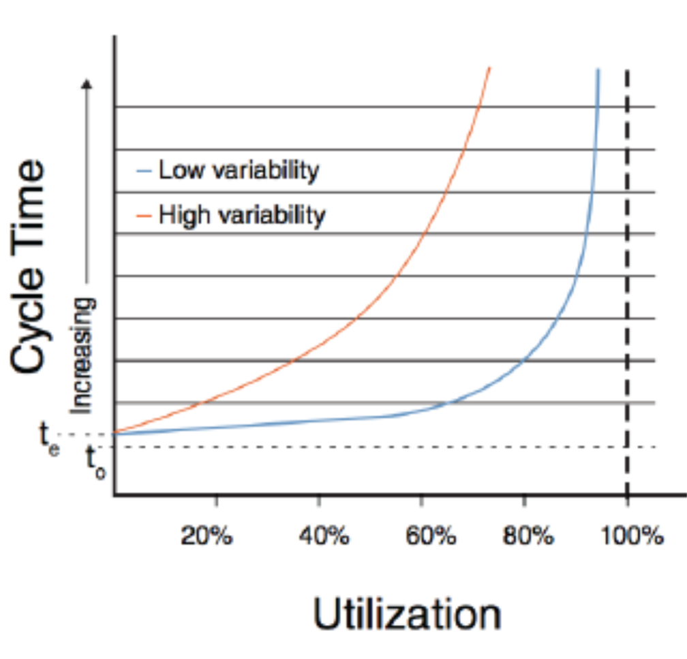

# R4.1:9 - Принципы физики предприятия

Итак, мы обсудили, что:

**Производственная мощность/capacity** ***всегда*** **выше, чем реальный выпуск/throughput предприятия** (при условии, что создатель находится в стабильном состоянии).

Это один из основополагающих принципов *физики предприятия*. Иными словами, производственная мощность задаёт предел, ограничение сверху на выпуск предприятия. И если мы хотим в долгосрочном периоде значительно увеличить выпуск и сохранять его стабильным, нам придётся в какой-то момент *увеличить долгосрочную производственную мощность/capacity*.

Это кажется очевидным. В самом деле, если *сотрудник::рабочая станция* может не отвлекаясь стабильно выполнять 3 сложные задачи в день, то усреднённый реальный выпуск на долинном периоде будет не 3 задачи в день, а меньше, например, 2-2,5. Будут дни, когда у сотрудника будут несколько встреч в день, дни, когда придётся ждать ответа, дни, когда он не выспится и будет плохо соображать. За счет собранности сотрудника и грамотного проектирования организации (включая проектирование обратной связи) можно *уменьшить* долгосрочные потери выпуска, но не *убрать их полностью*. Если бы можно было полностью избавиться от потерь выпуска, и реальный выпуск/Throughput на длинном периоде времени был бы равен производственной мощности, это бы означало, что мы живём в мире без изменчивости. Но вы знаете, что это не так.

Однако при планировании работ мы постоянно пытаемся опровергнуть этот принцип, планируя задач даже больше, чем физически можем выполнить сами (или чем могут выполнить наши сотрудники). Иногда это делается из-за собственных проблем с мастерством в операционном менеджменте, иногда – из-за давления начальства, которое не хочет ничего слышать о реальных сроках и объемах работ. В итоге получается имитация бурной деятельности, а опровергнуть принцип – не получается. Поэтому его следует воспринимать буквально как «*закон физики*» и не пытаться называть сроки выполнения работ, для которых нужно работать на предельной скорости (или со 100% загрузкой). Если начальство требует, можно в крайнем случае сказать ему приемлемую цифру, но *для себя* реальное выполнение работ всё равно планировать исходя из принципов физики предприятия.

Разумеется, для этого надо знать производственная мощность/capacity производственной линии, на основании знания методов, измерений и достоверных оценок, моделирования, и, не в последнюю очередь, опыта!

Второй важный принцип физики предприятия:

**Нелинейное увеличение времени выполнения работ/потокового времени/Flow Time/Cycle Time при увеличении загрузки производственной мощности/capacity utilization рабочей станции.**

Загрузка производственной мощности рабочей станции позволяет отследить, как быстро рабочая станция обрабатывает пришедшие к ней наборы предметов работ/sets of work items, или как рабочая станция справляется с нагрузкой/workload. Это необходимо чтобы определить - какая станция является ограничением (самой медленной станцией)?

Рабочая станция может выполнять работы медленно из-за особенностей того метода, которым она работает. Например, работы по составлению моделей будут выполняться при прочих равных медленнее, чем работы по критике моделей, потому что в одном случае вы делаете всё с нуля, а во втором – ищете недостатки в принесенном описании. Аналогично, работы по составлению статьи автором будут, скорее всего, выполняться медленнее, чем работы по редактуре и корректуре статей. Это означает, что производственная мощность/capacity автора меньше, чем у редактора.

Если производственная мощность (предельный/максимальный потенциальный выпуск за период времени) зависит от особенностей применяемого метода, то, чтобы ускорить рабочую станцию с наименьшей производственной мощностью, нужно что-то изменить в методе её работы. Например, автор может изменить метод составления статей: подключить ИИ для генерирования шаблонов текста (на основе своих ранее написанных статей), а затем осуществлять авторский надзор за написанием текстов, исправлять ошибки ИИ, менять подачу текста при необходимости, и т.п.

Однако можно столкнуться с тем, что (благодаря изменению метода) производственная мощность автора поднялась на ~30% (до 1 статьи в неделю), но выпуск контентной команды *не увеличился*. Это может произойти потому, что на самом деле автор, как рабочая станция, не был ограничением команды! Да, может быть автор медленнее всего выполняет работы по своему методу; однако авторов в команде 5, а редактор – 1. Как в таком случае вычислить ограничение? Тут помогает показатель *загрузки производственной мощности/сapacity utilization* каждой рабочей станции: он показывает, как соотносится «*входящий*» поток предметов работ (он же «*входящая нагрузка*») и производственная мощность станции:

**Загрузка производственной мощности = Входящая нагрузка / Производственная мощность**

**Capacity utilization = Incoming flow / Capacity**

Показатель *загрузки производственной мощности* рабочей станции позволяет учесть не только особенности метода, влияющие на время выполнения работ (за это отвечает знаменатель), но и реальную нагрузку на рабочую станцию (за это отвечает числитель).

Как использовать этот показатель? Оцениваем для начала производственную мощность рабочей станции. Например, у автора статей она равна 0,83 статьи в неделю или 1,66 статей за 2 недели. Далее смотрим, как реально работает автор. Допустим, он передал *статью::предмет работ* редактору на 10-й календарный день после даты (или даты и времени) старта статьи, и немедленно взял в работу следующую статью: начал набрасывать структуру, подбирать материал (то есть выполнено касание работы, начало отсчитываться потоковое время для следующей статьи). В таком случае его «входящий поток» за 2 недели – это 2 статьи: одну он передал, вторую начал. Но производственная мощность у него – 1,66 статьи за 2 недели. Тогда загрузка производственной мощности равна 2/1,66, или ~120%. И тут у вас должен сработать сигнал: *что-то не так!* Загрузка не должна быть выше 100%, происходит что-то не то!

Действительно, автор сдаёт одну статью редактору и немедленно берёт в работу вторую, но далее происходит следующее: автору прилетают переделки по первой статье, однако он уже в фокусе работает над второй, поэтому откладывает правки. Выпуск первой статьи задерживается на неопределённое время по второму принципу физики предприятия: при увеличении загрузки производственной мощности потоковое время производственной линии растёт нелинейно. Причём чем ближе вы к 100% загрузке, тем больше рост! Особенно серьёзные последствия наступят при высокой изменчивости/variability работ по данному методу (то есть когда метод сам по себе проявляет неустойчивость, время работы по нему колеблется), как показано на следующей диаграмме.

Последствия решения взять немедленно в работу вторую статью могут быть даже серьёзнее, чем просто задержка выпуска первой статьи. На самом деле это может привести к тому, что у автора нет времени на:

- *Обучение* – инвестирование в повышение своего мастерства.
- *Поиск конфигурационных коллизий* – то есть, статей, выпущенных другими контентными командами и предлагающих *другой* метод решения проблемы бухгалтера или юриста. Если не отслеживать такие коллизии вовремя и не разбиратеься с ними заранее, то можно получить, недовольство клиентов (юристов или бухгалтеров), необходимость срочно и аврально тратить время на выработку единой позиции.
- *Эксперименты*, например, эксперименты с использованием нейросеток в работе, исследования клиентов (необходимое для более глубокого понимания языка клиента, на котором предстоит писать, составления модели клиента, чтобы правильно доносить информацию, и так далее).

Если агенту не хватает времени на подобные действия, то сложно говорить о реальном повышении качества работы, улучшении методов работы, и так далее. Вы (и ваши сотрудники) всё время будут жить от аврала к авралу – и даже не пытаться устранять его причины.

Поэтому, если обнаружено, что автор как рабочая станция загружен более чем на 100%, надо менять принципы его работы (метод работы): пока статья не перешла в состояние, в котором переделок автору уже не прилетит, он не берёт в работу новую статью. Для автора *сигналом* о том, что можно брать в работу новую статью, является событие перехода статьи в состояние «*опубликовано*», или «*одобрено к публикации*», или «*одобрено редактором*». Пусть это событие происходит через 5 (календарных) дней после передачи статьи редактору. В таком случае в течение двух недель автор касается не двух статей, а одной статьи. Его загрузка падает до примерно 60% (1/1,66), выходит, что автор просто ждёт, пока не придёт сигнал о том, что можно брать в работу новую статью. Но пока он, ждёт, он может:

- Проходить обучение, чтобы повысить квалификацию в мастерстве (прикладном или фундаментальном).
- Найти конфигурационные коллизии между отправленной редактору статьей и уже опубликованной статьей на портале – и поднять вопрос о выработке единой позиции. Может даже составить черновик общей позиции, который затем будет критиковать совместно с коллегами.
- Провести предварительную подготовку/Full Kitting для следующей статьи: заранее поискать конфигурационные коллизии и озаботиться их разрешением (не постфактум после написания статьи), подобрать список источников информации и составить план исследования, начать читать подобранную информацию и составлять заметки/заготовки будущей статьи.
- Проводить эксперименты по использованию нейросеток в работе, участвовать в клиентских исследованиях для понимания моделей клиентов, языка их общения.

При этом автор не забывает, что приоритет всё равно у невыпущенной статьи: если приходят переделки – их надо внести быстро (на такие задачи зарезервировано 30% времени – это ***буфер***, мы скоро поговорим о нём подробнее). Остальное время уходит не на «текучку», а как раз на инвестиционные работы, которые затем дадут улучшение качества предметов работ (и возможность брать с клиентов больше денег за это).

Однако загрузка автора на 60% может не устраивать: если автор – ограничение в команде, то выпуск всей остальной команды будет ограничен. Поэтому мы хотели бы иметь более высокую загрузку автора. Как этого достичь? Можем прикинуть: в неделю производственная мощность составляет ~0,83 статьи, значит, за месяц она составит примерно 3,569 cтатьи (0,83 * 4,3 недели в месяц). Тогда мы можем выбрать ближайшее целое число, которое будет меньше 3,569 – это 3. Если автор будет брать в работу 3 статьи в месяц (а не 2), то загрузка будет высокой (3/3,569 = 84%), но всё ещё меньше 100%. (Мы ожидаем, что за месяц он сможет написать 2 статьи, которые будут опубликованы, и 1 начнёт). Далее надо будет вычислить событие, которое станет сигналом для автора брать в работу следующую статью. Это должно быть такое событие, после которого правки *возможны, но маловероятны*. Если вы выберете событие, где правки уже невозможны, например, событие «*публикации*», то вы выбрали слишком позднее на временной линии событие и потеряли время в ограничении. Если вы выберете событие слишком раннее (например, как мы обсудили выше, «*событие передачи статьи редактору»*), то вы рискуете сместить фокус внимания автора на новую статью, и со старой (находящейся ближе к выходу с линии!) он будет работать по «*остаточному принципу*», растягивая сроки внесения правок. Поэтому подбираем событие, где правки именно что возможны, но уже маловероятны и/или несущественны по времени – с одной стороны. А с другой – это должно быть такое событие, частота наступления которого позволит автору взять в работу 3 статьи в месяц (и сдать 2).

Аналогичным образом нужно считать загрузку производственной мощности всех рабочих станций в производственной линии и, если она превышает 100%, уменьшить её.

Только после этого вы сможете сравнить загрузку производственной мощности ваших рабочих станций и вычислить станцию с самой высокой загрузкой – это и будет ваше **ограничение**, работу которого надо оптимизировать в первую очередь. Внезапно может оказаться, что станция с самой высокой загрузкой сейчас – это редактор(ы). Как это может быть, если из-за особенностей метода работы авторов обычно выполняются дольше?

Из-за *рабочей нагрузки/work load*, то есть большого потока «входящих» предметов работ. Одному редактору сваливаются статьи сразу 3 авторов одновременно. Его производственная мощность – 4 статьи в неделю, поэтому загрузка равна ¾ или 75% – больше, чем 60% у автора. Тогда именно редактор является ограничением, на редакторе *«застрянут»* невыпущенные статьи. Cкорость выпуска/Throughput Rate статей производственной линии (контентной команды) будет равна скорости выпуска статей редактором. Если вас не устраивает текущая скорость выпуска, надо будет работать в первую очередь с редактором, а также c рабочей станцией прямо перед ним и сразу после него. Внимание управленцев должно фокусироваться на ограничении и его окрестностях.

Вспомним снова про закон Литтла, который нужно применять там, где мы имеем дело с очередями. Изначально он формулировался в теории массового обслуживания так: среднее количество объектов в очереди равно средней скорости прибытия объектов в очередь, умноженной на среднее время ожидания в очереди (ожидания до обслуживания):

**Average Items in Queue = Average Arrival Rate * Average Wait Time in Queue**

Наша формулировка *WIP = Throughput Rate * Average Flow Time* – это его переформулировка для потоков работ. Однако есть одна тонкость: в изначальной формулировке учитывалась *скорость входа объектов*, а Throughput Rate описывает *скорость выхода*. То есть мы работаем в предположении, что ***скорость входа объектов*** равна ***скорости выхода**,* или, другими словами, что *новые задачи берутся в работу только по когда рабочая станция выполнила предыдущую работу и освободилась*. Именно этот принцип мы уже давно (начиная с резидентуры **R1**) объявляли основополагающим, во многих формах: как запрет на *мультизадачность*, как работу над одной задачей в «*один присест*» и т.п. Именно тогда можно считать, что объекты работ не накапливаются *внутри* рабочей станции (линии) и *«скорость входа»* можно приблизительно заменить на «*скорость выхода*».

Отсутствие мультизадачности является основным ***условием применимости*** закона Литтла. Он даёт не совсем точную, но полезную оценку времени выполнения проекта, если его приоритет не меняется, и вы продолжаете выполнять задачи по этому проекту регулярно. Если рабочая станция сначала выполняет работы по проекту регулярно в режиме *«первого приоритета»*, а потом переводит этот проект в режим *«третьего приоритета»* и выполняет работы лишь тогда, когда есть свободное время, или точечно/нерегулярно, то закон Литтла для проекта в целом перестаёт работать – смена приоритетов даёт тот же эффект, что и иные переходы к *мультизадачности*.

Вообще оценки длины очереди и времени работы перестают быть надежными при любом изменении правил работы с очередью. Вы должны помнить лучшие практики в этой предметной области (вернитесь опять к материалам руководства R1 для их повторения):

- Взятое в работу после предварительной подготовки должно быть выполнено.
- Метод приоритизации при выборе проектов и задач должен соблюдаться.
- Приоритизация должна выполняться по всей очереди (никаких задач и проектов-зайцев).

Если это выполняется, то сильно увеличиваться количество незавершёнки/WIP не будет, а средний *возраст* незавершёнки будет стабилен, то есть *«технические»* и прочие *долги* будут отсутствовать или поддерживаться на одном уровне, не увеличиваясь). Если вы обнаруживаете рост незавершёнки (например, накопление незавершённых изделий между рабочими станциями) – это всегда означает, что одно из ограничений достигло предела загрузки мощности, для него перестало работать планирование, и это ограничение надо ликвидировать.

Выпуск, незавершёнка и потоковое время/Flow Time должны считаться в одних и тех же единицах измерения. Разумеется, необходимо не путать время, не совмещать показатели *«в день»*, *«в месяц»*, и *«в год»*. А вот для *выпуска* и *незавершёнки* лучше использовать *натуральные показатели* (*штуки)*.

Расчёт в деньгах тоже имеет смысл, но в основном при моделировании потоков, покидающих границу предприятия. Тогда мы можем считать вещи *в штуках* (ленточные конвейеры для шахт, проданные копии ПО), а можем *в поступивших деньгах за штуки*.

А вот при иных бизнес-моделях (если мы выпускаем статьи, то это наши объекты, но это не те вещи, за каждую из которых поступают деньги от клиентов), то расчёт в деньгах для операционного менеджера этой производственной линии не имеет смысла и уведёт внимание менеджеров в сторону. Здесь достаточно расчётов в штуко-днях.

Итак, уменьшение незавершёнки приводит к уменьшению среднего времени выполнения работ, именно поэтому те действия, которые вы выполняли в течение первых недель работы по руководству R1, позволили вам ускориться. Стали выполняться условия применимости закона Литтла, ваше среднее время выполнения работ уменьшилось, а выпуск увеличился. Модель позволяет формально описать – почему так происходит.

Эти модели применимы и на уровне линий/потоков, но при одном условии: надо уменьшать незавершёнку именно для станции-ограничения. Пока вы не начали моделировать потоки работ и считать мощность и загрузку - вы просто не знаете, какая именно станция ограничивает выпуск. Конечно, и до того, как вы её нашли, вы можете уменьшать незавершёнку на всей линии (для всех включённых в неё рабочих станций), где она заметна. Всегда можно уменьшить скорость входа/arrival rate новых задач, сделав её равной скорости выполнения/скорости выхода/departure rate. Это позволит вам ещё до нахождения ограничения уменьшить незавершёнку в целом, то есть высвободить омертвлённый в ней капитал.
