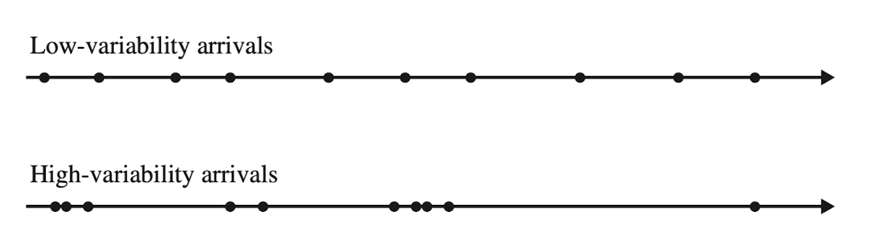
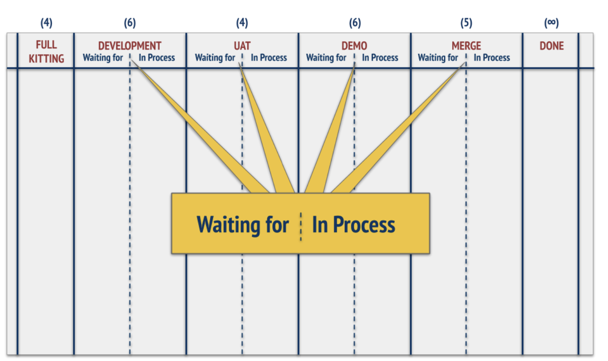
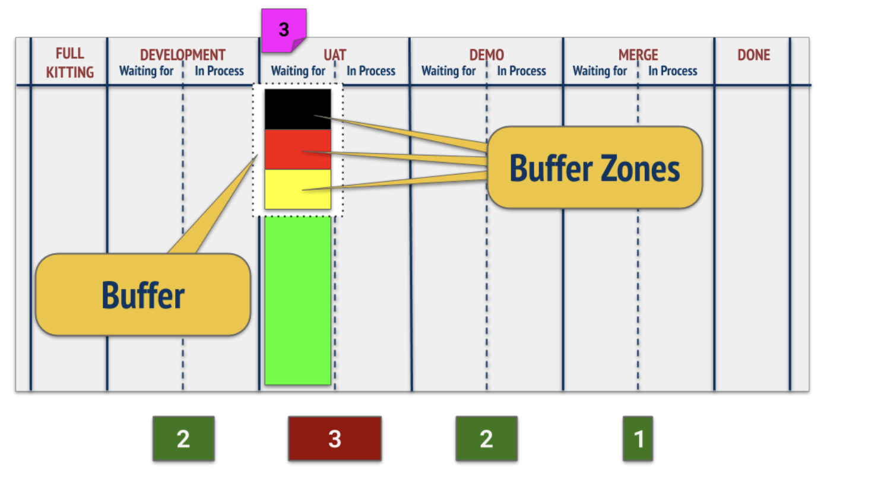
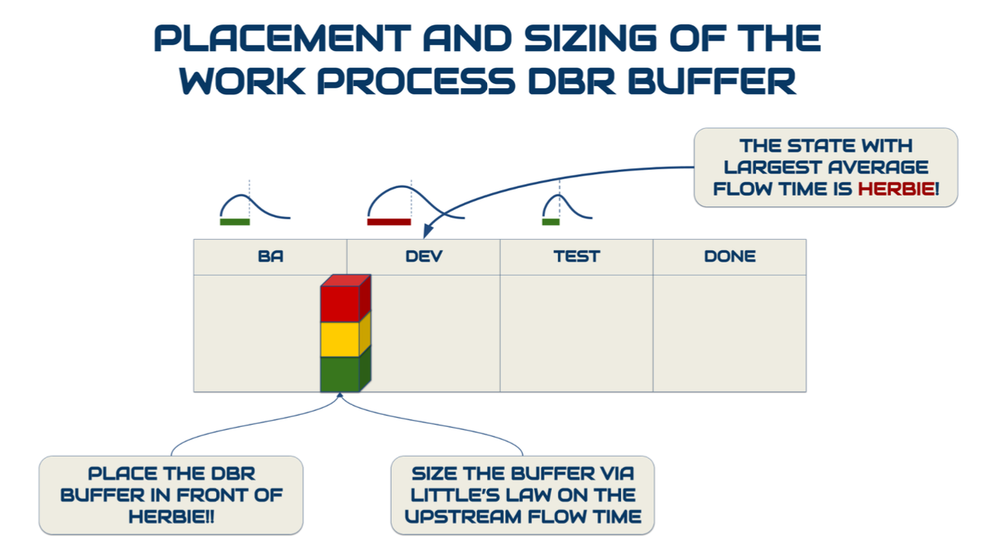
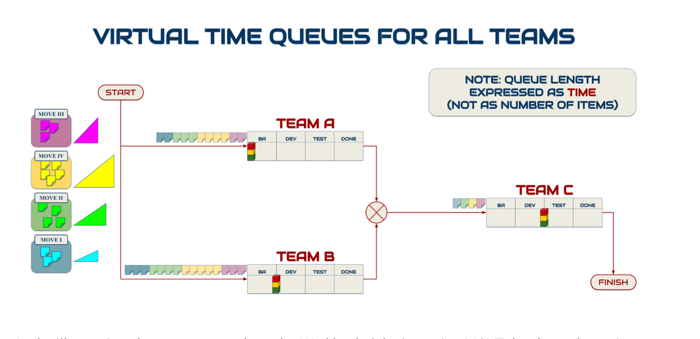
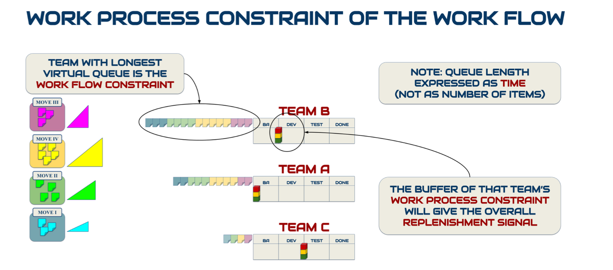

# R4.1:10 - Использование буферов для компенсации изменчивости

Lля компенсации изменчивости (независимо от её источников - разрывы в спросе и предложении, неустойчивость при преобразовании или создании) операционный менеджер может использовать важнейший инструмент: **буфер**. Именно активно управляя буферами, операционный менеджер может не допускать уменьшения или замедления выпуска.

Расчёт *загрузки производственной мощности/сapacity* utilization для рабочих станций позволяет увидеть, какая из них является **ограничением/узким местом** производственной линии. Обычно это станция с самой высокой загрузкой. В дальнейшем все **сроки выполнения работ** необходимо считать именно с учетом потокового времени самой загруженной станции.

Но пока предприятие будет работать, на нём и вокруг него всегда будет что-то меняться. Будут приходить и уходить клиенты, сотрудники; будут меняться приоритеты менеджмента, законодательство, по которому работает компания. И даже выполнение работ квалифицированным сотрудником по хорошо известному методу не будет всегда проходить одинаково: в один день работу удастся выполнить легко и быстро, а в другой кто-то забудет предоставить информацию (и её надо будет добыть), отвалится Интернет, в середине работы заболит зуб, и т.п. Поэтому акты выполнения работ будут уникальными, отличающимися друг от друга, и это повлияет на загрузку, скорость и время выполнения, иногда существенно. Работа предприятия как конвейера характеризуется **изменчивостью/variability**.

Изменчивость как математическая величина – это мера *неодинаковости* объектов какого-то класса. Возьмём двери, произведённые на одном предприятии. Если мы замерим длину, ширину и высоту с точностью до миллиметра или даже точнее, то наверняка окажется, что размеры не совпадают точь-в-точь, а немного отличаются. Мы можем посчитать, насколько отличаются параметры, и затем вычислить, укладываются ли они в допустимые отклонения/допуски по производственному стандарту – ГОСТ 475-2016 «Блоки дверные деревянные и комбинированные» (*1-3 мм для дверных блоков разных размеров*). Если параметры изменяются очень мало и укладываются в допустимые отклонения, это говорит о качественном производстве.

Работа по методу может демонстрировать изменчивость по времени по разным причинам. По шкале случайность-предсказуемость отклонения могут быть очень предсказуемыми. Например, если вы ставите задачи сотрудникам, но не планируете время на задачи контроля сделанного, то *внезапно для вас* появится *внеплановая* задача, влияющая на вашу нагрузку. Но то, что для вас как операционного менеджера *выглядит* случайностью, ею не является: внезапной эта задача появилась из-за пропущенного менеджерского действия (отсутствия знания, что такое действие надо выполнить). Ещё в резидентуре R1 было задание на выявление *скрытых работ*, пропущенных из-за отсутствия внимания к ним или знания, что их надо выполнять. Выведение таких задач из класса «*скрытых*» в класс «*запланированных*» позволяет инженерам-менеджерам повысить предсказуемость нагрузки.

Но что-то действительно может происходить абсолютно случайно, операционный менеджер не способен заранее предусмотреть все проблемы. Вы не можете предсказать обрыв проводов и отключение света в офисе, а это тоже повлияет на сроки выполнения работ. Чем выше ваше мастерство как операционного менеджера, тем меньше будет случайностей, которые вы не могли предусмотреть, но они всё равно останутся, и будут всё более экзотическими. То есть по мере прироста знаний вы будете передвигаться вправо по шкале случайности-предсказуемости изменчивости.

Неустранимая изменчивость тем выше, чем больше в работе ***случайности**/**неопределённости***. На производственных предприятиях, производящих *типовую продукцию*, степень неопределённости результатов куда ниже, чем у компаний, ориентированных на *интеллектуальный труд* и производящих продукцию при помощи не станков, но мозгов своих сотрудников.

Изменчивость предприятия-как-конвейера/рабочей станции/производственной линии у компаний одного типа будет выше относительно компаний другого типа, и это зависит от стратегических выборов компании. Когда вы делаете серийные межкомнатные двери, вы можете пойти и пощупать уже произведённые экземпляры из предыдущих партий, зафиксировать методы, посмотреть ГОСТы, описывающие стандарты для производства, составить достаточно точные модели и менять их нечасто. Когда вы делаете двери на заказ, у вас увеличивается неопределённость: конвейер должен гибко подстраиваться под параметры (например, производить очень высокие двери для домов с потолками 3+ метра), соответственно, потребуется больше переналадок оборудования, выше требования к подготовке сотрудников. А есть предприятия, которые создают продукты, почти целиком зависящие от интеллекта сотрудников, то есть, от качества белкового вычислителя сотрудника, обученного решать проблемы, которые ранее не решал ни (как минимум) он, ни (как максимум) никто другой. Степень изменчивости процессов таких производственных линий сильно выше.

Изменчивость отдельных станции и изменчивость целых линий/потоков/flows cвязаны между собой. С одной стороны, каждая отдельная станция вносит в производственную линию дополнительную неопределённость: она может выйти из строя, уйти в отпуск (если это человек), плохо работать, что увеличивает её потоковое время/время выполнения работ.

Соответственно, следующая после неё станция получит рабочий продукт/результат выполнения работ чуть позже. Эта *скорость входа объектов или задач*/*Arrival rate/Incoming flow*, привносит изменчивость, внешнюю по отношению к отдельной станции. *Скорость входа объектов или задач*, как вы помните, является параметром для расчёта загрузки станции:

**Загрузка производственной мощности = Входящая нагрузка / Производственная мощность**

На реальную загрузку станции будет влиять как её собственная изменчивость (возможные отклонения от capacity, предельной скорости выпуска станции), так и накопленные до неё отклонения (*изменчивость потока/flow variability*).

С методами расчёта изменчивости и учёта их при планировании работ вы можете познакомиться в соответствующей литературе (крайне рекомендуется): *Factory Physics, Wallace J. Hopp, Mark L. Spearman; Supply Chain Management, Wallace J. Hopp.* Но сейчас нам важно само понимание физического смысла изменчивости и того, как её наличие влияет на выпуск.

Потоковая изменчивость и приводит к уменьшению выпуска по сравнению с той ситуацией, когда все части конвейера всегда работают стабильно, на предельной скорости, без каких-либо проблем. Тем самым изменчивость затрудняет получение реальных прогнозов сроков выпуска. Именно эту изменчивость можно компенсировать/смягчить при помощи **буферов**.

**Буфер** – специальный объект (ресурс) в операционном менеджменте, который позволяет смягчить влияние изменчивости на выпуск. Буферы бывают 3 типов:

- Буфер ***товарно-материальных запасов/inventory*** создаётся, когда объект в состоянии «*готов*» (или «*частично готов*») появляется до того, как предъявлен спрос на него (товар *предзаказан/backordered*), то есть, товар изготовлен и ждёт заказа.
- Буфер ***ресурсов/производственной мощности*** создаётся, когда производственная мощность имеющихся ресурсов (отдельных рабочих станций или линии в целом) превышает потребность, определяемую средним выпуском.
- Буфер ***времени*** создаётся, когда на производство заказа закладывается дополнительное время, и следующие заказы (спрос на товары или услуги) планируются с учётом этого времени.

***Буфер товарно-материальных запасов*** обычно есть у компаний, производящих товары, а не услуги - можно запасти готовые автомобили или полуфабрикаты, но нельзя запасти раны в травматологии. Но можно запасти побольше готовых статей (т.е. средств прибавки мастерства у клиентов), и пока не публиковать их, отложить про запас на случай, если эксперты не смогут вовремя выдать другой актуальный материал (однако возникает риск того, что эти статьи устареют!). Вам нужно подумать, возможен ли у вас такой буфер, и, если вы не работаете с поставкой товаров, то он скорее не нужен, расходы на его создание и поддержку могут быть больше, чем выгода, проще сосредоточиться на двух других типах буферов.

Но если для вашей компании буферы товарно-материальных запасов имеют смысл, то нужно при помощи экспериментов найти оптимальные места размещения таких буферов в производственной линии и требуемое количество изделий в них. Вы можете выбрать поддерживать небольшой запас *«готовой продукции»*, как это делает «Макдональдс»: популярные/ходовые продукты, например, картошку, готовят заранее «*про запас*» и складывают на подогреваемые подносы, откуда картошку можно быстро насыпать в упаковку для клиента, что позволяет компании поддерживать высокую скорость доставки/delivery (это одно из выбранных компанией стратегических преимуществ, которое поддерживается операционным решением по размещению буфера). В ресторанах «Бургер Кинг» пошли по другому пути: чтобы отличаться от «Макдональдса», сосредоточились на предоставлении клиенту более широкого выбора и возможностей *«персонализировать»/кастомизировать* заказ под себя. Этот стратегический выбор привёл к тому, что «Бургер Кингу» пришлось отказаться от поддержки запаса готовых гамбургеров: неизвестно, закажет ли такой гамбургер клиент, или предпочтёт «кастомизировать» даже ходовую позицию и, поскольку продуктовая линейка шире, пришлось бы поддерживать более большой запас готовой продукции питания, а она быстро портится. Поэтому приходится собирать гамбургеры из частей на ходу. Чтобы при этом не слишком замедлять выдачу заказов, «Бургер Кинг» увеличил размер буфера другого типа – *буфера производственной мощности*.

***Буфер производственной мощности/capacity*** – второй тип буферов, который используется сравнительно редко. Менеджеры часто озабочены «*эффективностью использования ресурсов компании*» и делают не то, что нужно для повышения прибыли, а то, что видно и легко контролировать – «*режут издержки*». Простой путь - уменьшить количество рабочих станций (например, команд) и загрузить их на 100%, чтобы «*отрабатывали зарплату*». Но с какого-то момента эта политика увеличивает время выполнения работ/Flow Time, вместо того, чтобы уменьшать его! И чем *выше* *изменчивость* процессов, тем быстрее и больше начнут растягиваться сроки выполнения! Вы уже видели это на графике зависимости времени выполнения от загрузки станции/capacity utilization:

При *низкой* изменчивости оптимальная загрузка станций плановой работой (кроме станции-ограничения!) обычно колеблется в диапазоне 60-80% и после достижения 80% время начинает резко расти. В проектах с высокой изменчивостью (где регулярно приходится менять список задач) оптимальная загрузка станций скорее находится в диапазоне 40-60% и время начинает очень резко расти после 60%. Дело в том, что из составляющих *потокового времени/Flow Time* изменчивость затрагивает в основном не *время касания/Touch Time*, а *время ожидания/Wait Time* (вы помните, что *Flow Time = Touch Time + Wait Time*).

А для рабочих станций (кроме ограничения, где происходит накапливание «незавершенки»), *время ожидания/Wait Time* может быть оценено как:

**Wait Time = Variability * Utilization * Effective process time**

**Время ожидания = Коэффициент вариации * Загрузка * Эффективное время обработки**

Это очень огрублённый вариант уравнения Кингмана (*Kingman Equation),* которое тоже даёт только полезную приближённую оценку. Примите эту формулу без доказательства, её основной смысл для нас – показать, какие именно параметры и как влияют на время ожидания.

***Коэффициент вариации*** в данном уравнении оценивает изменчивость входящего потока: как часто рабочая станция получает «*на вход*» (то есть во входную очередь) новые предметы работ/work items и как меняется время между приходами:

***Загрузка*** в данном уравнении – это показатель загрузки, рассчитанный как объяснялось выше.

**Эффективное время обработки/effective process time**– это время от события «*предмет работ попал в начало (верх) очереди*» (перед ним никаких предметов работ нет) и до события «*завершения работ над предметом работ*» (или «*предмет работ передан следующей рабочей станции и от неё не получены доделки*»). Например, для автора это время от момента, когда одна статья ушла редактору, но вторая еще не взята в работу, потому что не поступил сигнал (ушедшая статья ещё не «*одобрена к публикации*») и до события «*вторая статья одобрена к публикации*». Напомним, что все наши модели физики предприятия работают в предположении отсутствия мулитизадачности!

Как видите, *время ожидания* увеличивается, если коэффициент вариации высокий, то есть изменчивость потока сильная. Чтобы это компенсировать, надо уменьшать загрузку рабочих станций, и это действие доступно операционному менеджеру простым способом – увеличив количество рабочих станций, создавая *избыток ресурсов*, то есть *буфер производственной мощности*.

Другой вариант – это менять методы работы, уменьшая эффективное время обработки. Можно автоматизировать выполнение типовых операций, чтобы рабочая станция была не человеком или группой людей, а машиной, платить за дополнительный машинный ресурс в долгосрочном периоде выгоднее, чем за дополнительный человеческий. Сегодня увеличить производственную мощность рабочей станции (а также буфер производственной мощности) за счет нейросетей относительно недорого. Но это, как мы обсуждали, доступно исполнителям других менеджерских ролей: методологу, лидеру и т.п.

Если операционный менеджер хочет получить максимальную скорость выпуска через создание буфера производственной мощности, то приходится платить за избыточные производственные мощности старого типа, и при этом их недогружать. Тогда и появляется возможность компенсировать резкие изменения.

Какие есть способы реализовать этот буфер в компаниях, ориентированных на интеллектуальный труд? Только держа на рабочих местах (на регулярной основе или временно) чуть больше людей, чем нужно в среднем. Например, в периоды высокой нагрузки привлекать фрилансерам, доплачивать сотрудникам за работу по выходным. Ещё один способ – повышать кросс-функциональность, т.е. тренировать сотрудников на выполнение работ по ранее не знакомым им методам. Допустим, разработчики обычно не занимаются тестированием, но могут (в случае перегруза тестировщиков) написать автотесты. Если выпуск ограничен рабочей станцией, работающей по методу тестирования, вы можете попросить часть разработчиков исполнить роли тестировщиков, и это может быть выгоднее, чем ждать, пока тестировщики справятся с нагрузкой. Даже несмотря на то, что временные тестировщики будут менее опытными, они могут выполнить часть работ, а остаток (проверку/контроль и исправление ошибок) будет провести быстрее, и релиз выйдет на неделю раньше, чем если бы разработчики не переключились на другую роль (не перешли временно в рабочую станцию тестирования).

Наконец, **Буфер времени** – самый популярный и часто используемый буфер. Если менеджер не выбирает сознательно доплатить за «*лишний*» ресурс или сделать запасы, то изменчивость можно компенсироваться ***только*** увеличением запланированного времени исполнения, хотите вы того или нет. Тогда ваши обещания по выпуску будут в среднем исполняться в срок, при этом отдельные периоды *«ударного»* перевыполнения плана будут компенсироваться периодами непредвиденных задержек и срывов.

В случае использования буфера времени ждать будет клиент/заказчик: сроки исполнения заказа по договору для него увеличиваются, хотя по факту многие заказы будут выполняться быстрее. Это может быть использовано к вашей выгода через включение в договор *премии за досрочное выполнение заказа*, но не в каждой отрасли и не каждый заказчик готов её платить. Однако использование динамических буферов позволит вам максимально удовлетворять спрос клиентов и поддерживать их довольными, но в то же время не брать на себя невыполнимых обязательств перед руководством.

Ресурсы всегда ограничены, части предприятия и путешествующие через них объекты подчиняются законам *физики предприятия*. Обсуждающийся здесь закон можно сформулировать как **«Заплати сейчас или плати потом» / «Pay Me Now or Pay Me Later»**: если вы не выберете *заранее и сознательно* какую-то комбинацию буферов и *не заплатите за неё*, то вы заплатите позже одним или несколькими последствиями:

- Потерей выпуска.
- Увеличением сроков / времени выполнения работ.
- Увеличением запасов.
- Потерей производственной мощности.
- Ухудшением клиентского обслуживания.

В TameFlow, который описывает операционный менеджмент именно для компаний, ориентированных на интеллектуальный труд/knowledge work все три типа буферов присутствуют, но описаны немного по-другому.

Во-первых, есть буфер типа **«Барабан-Буфер-Канат»/буфер ББК/Drum-Buffer-Rope Buffer/DBR Buffer**. Это оригинальное название для ***буфера товарно-материальных запасов***, предназначенного для того, чтобы ваше *ограничение* (самое медленное из бутылочных горлышек), которое и ограничивает выпуск, работало на максимуме (близко к 100% загрузке – это единственная из рабочих станций, которая может работать с такой загрузкой без угрозы для всей линии). Буфер ББК позволяет обеспечить стабильность выпуска: ограничение работает бесперебойно. Достигается это за счёт того, что команды начинают пользоваться усовершенствованными версиями *Канбан-досок*[^1] – досками «*Барабан-Буфер-Канат*»[^2]:

*Бэклог задач* не показан на картинке выше. В *бэклоге* лежат все задачи, над которыми планируется когда-либо поработать. Для релиза отбирается какое-то количество фич и багфиксов, из бэклога отбираются задачи, которые нужна для этого. Отобранный набор готовится к работе (*проводится предварительная подготовка/Full Kitting*): продумывается, что именно пойдет в работу, нужно ли ещё что-то сделать, чтобы задачи можно было взять в работу, и так далее. Отобранные задачи попадают в колонку «*Full Kitting*» и в дальнейшем выполняются.

В названиях колонок отражено название методов работ рабочих станций, через которые пройдут отобранные задачи (*development, user acceptance testing/UAT,* и т.п.). Каждый метод соответствует какой-то рабочей станции, работающей по этому методу. Можно определить время, в течение которого одна задача путешествует по всей доске, и можно рассчитать *среднее время/Average Flow Time*, которое задача проводит в одной колонке (соответствующей какой-то рабочей станции). Можно посмотреть, где оно будет максимальным – это и есть самая медленная рабочая станция в рамках команды. (Если рассчитать загрузку всех рабочих станций в производственной линии и выбрать станцию с наибольшей загрузкой, то станция с наибольшим средним потоковым временем и станция с наибольшей загрузкой должны совпасть.) Перед этой станцией нужно создать очередь (буфер) задач на выполнение, она никогда не должна ждать работу. Если эта станция будет ждать, это приведёт к потере выпуска.

Пусть у вас контентная команда, и вы нашли ограничение внутри неё. Если это автор – тогда у автора должна быть очередь из одобренных / согласованных тем для статей (темы для статей как предметы работ прошли *предварительную подготовку/Full Kitting*: отобраны и согласованы), чтобы автор, получив сигнал (например, сигнал об одобрении написанной статьи), смог сразу взять в работу следующую статью.

Для этого буфера может установить *минимальное* количество задач, но он точно не имеет максимального. Рассчитать минимальный размер буфера можно по закону Литтла WIP = Throughput Rate * Flow Time для предыдущих станций перед ограничением. Далее надо будет следить за состоянием буфера: если он исчерпывается, то скоро ограничение начнёт простаивать, что приведет к потерям выпуска команды. Кроме того, следующая задача «на вход» в команду подаётся лишь тогда, когда ограничение взяло в работу какую-то из задач из буфера. Если разработчики (в данном случае - самая медленная станция) берут в работу задачу из бэклога, то посылается сигнал о том, что «*на вход*» в команду можно подать следующую задачу (обработкой которой займутся сперва бизнес-аналитики/BA, после чего положат её в буфер). Аналитики и тестировщики могут и простаивать, ожидая, пока разработчики возьмут следующую задачу, а вот простой разработчиков должен быть минимальным (помним, что 100% загрузки все равно не должно быть даже у ограничения).

Следующий тип буфера в TameFlow – ***буфер производственной мощности***. Пусть для реализации проекта требуется совместная работа нескольких команд. Для расчёта сроков и скорости выпуска нужно знать, какая команда самая загруженная (где максимальная загрузка команды как рабочей станции/capacity utilization), и как лучше управлять ресурсом этой команды. Для этого мы должны проявить ***очередь*** перед каждой командой: очередь релизов, очередь спринтов или MOVEs (minimal outcome-value target, в отличие от спринта ограничивающий не время выполнения, а минимальный размер выпускаемого объекта или количество таких объектов)[^3]. Далее подсчитать, сколько времени у команды займет обработать всю имеющуюся очередь. Команда, которая справится со своей очередью последней, и есть бутылочное горлышко (на уровне подразделения), а её самая медленная рабочая станция будет выступать ограничением для всего проекта[^4]:

Чтобы вычислить такое ограничение, нужно будет отмоделировать ту часть конвейера, через которую пройдет реализуемый проект. То есть, нужно будет отмоделировать производственную линию с командами-рабочими станциями (см визуальное представление выше). Далее надо подсчитать время обработки очереди перед командой и выбрать самую медленную команду. Далее спуститься на уровень команды и, рассматривая уже команду как производственную линию, найти оргзвено/группу серверов как самую медленную рабочую станцию, ограничивающую выпуск и скорость реализации проекта. И далее все новые задачи по реализуемым в такой конфигурации проектам запускать только по сигналу *«взятия новой задачи в работу»* ограничением:

После чего можно будет последовательно выполнять каждый релиз, определяемый по MOVE.

Наконец, третий тип буфера – ***буфер времени***. В TameFlow он называется ***CCPM-style buffer/MOVE Buffer*** или ***буфер критической цепи/буфер релиза***. Его определяют, используя имеющиеся данные об очередях (мы уже проявили все очереди при помощи экзокортекса команды). Очереди *релизов/задач на спринт/MOVE* будем считать *«незавершёнкой»/WIP*. У нас есть данные, как быстро мы можем перерабатывать/transform/process незавершёнку такого типа (исторические данные о скорости выпуска). Методы прогноза времени выпуска и расчета буфера подробно описаны в книге The Book of TameFlow, за деталями рекомендуется обратиться к ней.

Что важно помнить при любых действиях с *буфером времени*: буфер всегда закладывается в конец. В случае проекта (или релиза) буферное время закладывается единым блоком под конец проекта или релиза, оно начинает исчерпываться когда заканчивается основное запланированное время каждой задачи, и все рабочие станции работают так, как будто этой подстраховки у них нет. Если вы планируете себе несколько задач в течение дня, вы сперва оцениваете запланированное время, далее оцениваете буфер для каждой задачи (в простейшем случае – как 20% от планового времени), но затем нужно сложить время всех буферов, и это общее буферное время отнести на конец дня, чтобы убедиться, что все задачи действительно уместились в один день. Можно попробовать уменьшать итоговый буфер процентов за 20 по сравнению с чистой суммой, такое планирование может оказаться ещё точнее и удобнее, если изменчивости разных задач – независимые величины.

В любом случае исполнять задачи надо так, как будто буфера нет, но в случае задержки выполнения задачи надо начинать списывать буферное время. Такое управление буфером времени позволяет точнее планировать, брать на себя более реалистичные обязательства, и выпускать объекты в среднем быстрее.

[^1]: https://www.youtube.com/watch?v=rk4hfjutZAk
[^2]: Chapter 11 Flow Efficiency, DBR and TameFlow Boards, The Book of the TameFlow, Steve Tendon
[^3]: Если мы работаем спринтами, то мы фиксируем временной период (например, неделя), а дальше выполняем работы, которые умещаются в неделю и позволяют выпустить объект, например, релиз (он не фиксирован). Если мы работаем по методологии MOVEs, мы фиксируем минимальный размер объекта и/или количество объектов. Например, считаем, что в следующий релиз должны войти фича №4, багфиксы №5 и №6 точно; время выполнения не фиксировано, но мы гибко учитываем дедлайны. О том, как работать при помощи MOVEs, можно прочитать в The Book of TameFlow. Работа при помощи MOVEs чуть сложнее для освоения, чем работа спринтами, но в долгосрочном периоде позволяет добиться лучших результатов, так как при работе спринтами решение самых сложных проблем всё время будет откладываться в долгий ящик, даже если они выгодны, так как решение сложных проблем требует много времени.
[^4]: У этой команды также должна оказаться самая высокая загрузка.
