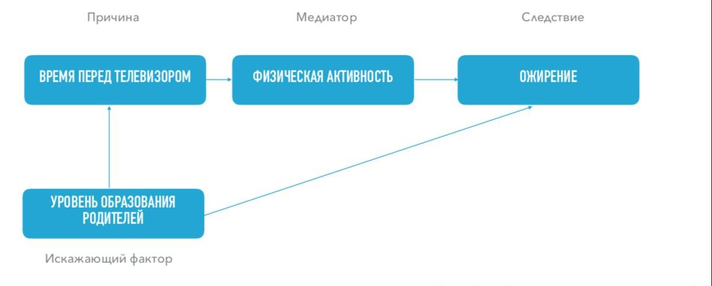
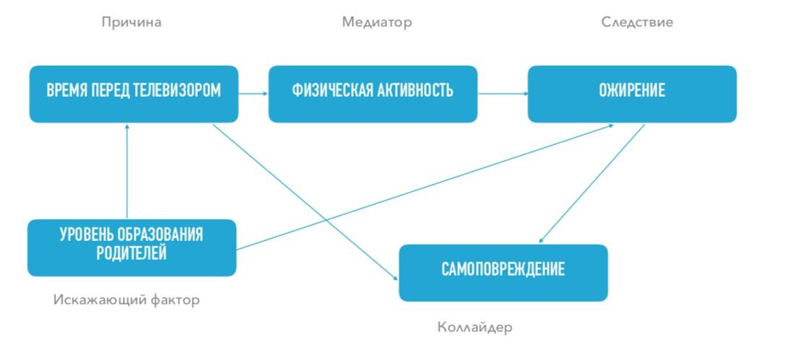

# R4.3:4 - Основные элементы графа причинности

Познакомимся теперь с основными приемами построения ***схем причинно-следственных связей***, (***причинно-следственных диаграмм, графов причинности***). Такие диаграммы строятся при решении проблем для отображения экспертных знаний и догадок (гипотез), путём логического анализа, и *не основываются* на предварительно собранных данных.

Их можно использовать далее как раз для организации сбора данных, направленного на проверку именно сформулированных гипотез. Графы также используются для построения прогнозов (включая получение ответов на контрфактические вопросы), для принятия решений о каком-то действии, и ещё - когда в коммуникации мы хотим создать хорошее объяснение и убедить в нём другого агента.

**Граф причинности** ***(ациклический направленный граф)**.*

Уточним эти слова. Граф состоит из *узлов графа* и соединяющих их *стрелочек*.

**Узлами графа** (квадратиками с подписями) представлены **События::4D физические объекты** (*состояния и/или изменения* каких-то фрагментов мира). Подписи событий могут быть сформулированы в форме **факторов**, но тогда они должны легко интерпретироваться как *обобщенные события*:

Например:

«*Время перед телевизором*» значит «*Некто проводит время перед телевизором*»

«*Ожирение*» значит «*Некто страдает ожирением*»

Лучше стараться использовать для подписей именно формулировки *в форме событий*.

**Стрелочки** между событиями – это **связи причина-следствие**, стрелочка идёт от причины к следствию. «*Направленный граф*» означает именно это – что у каждой связи есть направление.

События в графе причинности расположены **последовательно**, и если пойти по стрелочкам, то **нельзя вернуться** к тому событию, от которого ты начал. В графе причинности нет циклов, он «*ациклический*».

Мы видим граф с двумя узлами-событиями, который показывает, что существует причинно- следственная связь между событиями. Событие *«Человек проводит время перед телевизором*», как мы предполагаем, является причиной для следствия *«Этот человек страдает ожирением*».

**Медиаторы**

Причинно-следственная связь между двумя событиями должна быть подтверждена данными собранными при наблюдениях и в экспериментах. Но мы уже обсуждали, что лучшие объяснения – это те, где механизм причинно-следственной связи продемонстрирован явно. Это значит, что связь между причиной и следствием должна в идеале иметь эпистемический статус «*очевидно*» при нужном уровне подробности, и с учётом сделанных допущений.

Как мы обсуждали, если мы не можем показать механизм связи, то, возможно, связи и нет. Если мы не знаем, *как это работает*, то, возможно, *это и не работает*.

Если механизм связи недостаточно ясен, то его можно улучшить стандартным способом – увеличить детализацию объяснения. Для этого мы используем приём вставки нового события между причиной и следствием. Это событие должно быть более понятным (*очевидным*) следствием исходной причины, и одновременно более понятной (*очевидной*) причиной для исходного следствия. То есть это – *событие-механизм*, с помощью которого реализуется связь.

Событие, которое мы ставим между причиной и следствием, мы назовём **медиатором (М)** [h](https://ru.wikipedia.org/wiki/Медиация_в_статистике)[ttps://ru.wikipedia.org/wiki/Медиация_в_статистике](https://ru.wikipedia.org/wiki/Медиация_в_статистике).

На нашем графе причина — *много времени, проводимого перед телевизором*; следствие — *ожирение*.

Для подтверждения нашей исходной гипотезы мы вставляем в граф медиатор (промежуточное событие, объясняющее механизм получившейся связи). Им может быть *недостаток физической активности*.

Заметим, что введение медиатора в том числе побуждает нас изучить и обратную связь: мы можем предположить, что связь существует ровно в обратном направлении – человек с излишним весом ограничен в своих активностях, поэтому проводит много времени дома, и делать ему особо нечего, кроме как смотреть телевизор.

Благодаря наличию медиатора мы можем легче проверить нашу гипотезу.

Например, если мы обнаружим, что люди с лишним весом прекрасно находят себе занятия за пределами своего дома – это аргумент в пользу того, что верна именно наша исходная гипотеза.

Мы также можем предположить другой медиатор, и даже цепочку медиаторов.

Например: *человек проводит много времени перед телевизором*, поэтому *человек загружен страшными новостями*, поэтому *у человека стресс*, поэтому *он начинает много есть*, поэтому *человек толстеет*. То есть дело может быть совсем не в физической активности.

Медиатор необходимо искать для каждой причинно-следственной связи, кроме тех, в которых связь и впрямь *очевидна*.

Например, *на тело в пустоте действует сила притяжения* – поэтому *тело движется в направлении действия этой силы.* Тут трудно уже придумать событие-модератор, с учётом нашей картины мира (*мы в мире с ньютоновской механикой*) – связь очевидна.

**Искажающие факторы**

Событие, которое является причиной и для причины, и для следствия — **искажающий фактор (ИФ)**. Ещё одно название для этого ***– спутывающая переменная***, [h](https://ru.wikipedia.org/wiki/Спутывающая_переменная)[ttps://ru.wikipedia.org/wiki/Спутывающая_переменная](https://ru.wikipedia.org/wiki/Спутывающая_переменная))

На графе приведён новый узел - искажающий фактор: *уровень образования родителей*.

Если уровень образования родителей высокий, то (1) у человека меньше шансов подсесть на смотрение телевизора; (2) у человека больше шансов приобрести здоровые пищевые привычки, тем самым у него меньше риск ожирения.

Если *уровень образования родителей* низкий, то наоборот.

Если мы примем это объяснение, то связь между просмотром телевизора и ожирением превратится в ассоциацию, между этими событиями не будет причинно-следственной связи. Оба события будут следствием третьего, скрытого от нас при непосредственном наблюдении.

Для дальнейшего прояснения механизма связи между искажающим фактором и событиями, на которые он влияет, тоже можно попробовать вставить медиаторы, ведь по отношению к событиям, на которые он влияет, искажающий фактор — это причина. Медиаторы (механизмы влияния) искажающего события на каждое событие исходной цепочки получатся, скорее всего, разными.

Например:

«*У родителей низкий уровень образования*»::ИФ — «*они много работают на тяжёлой работе*»::М — «*у них не хватает времени на занятия с ребёнком*»::М – «*они подсаживают его смотреть телевизор*»

«*У родителей низкий уровень образования*»::ИФ — «*они не знают основ детской диетологии*»::М — «*у ребёнка вырабатывается привычка к мусорной еде*»::М – «*у ребёнка высокий риск ожирения*»

Обнаружение искажающего фактора порождает сомнение в гипотезе о причинно-следственной связи между исходными событиями. Мы уже не можем утверждать, что изучаемая причинная связь реально существует, и мы возвращаемся к вопросу о вмешательстве: если мы оставим неизменными все остальные факторы и будем менять причину в нашей исходной гипотезе – будет ли меняться следствие? Поэтому искажающие факторы связаны с поиском альтернативных гипотез, причём в две стороны. Найденный искажающий фактор может стать источником новой гипотезы, дать вам новую *первопричину* проблемы. Но и альтернативные гипотезы могут оказаться вовсе не альтернативными, а действующими совместно, то есть превратиться в искажающие факторы.

Если физически убрать телевизор из дома человека, исключить другие сидячие развлечения, и лишить его доступа к другим источникам плохих новостей – похудеет ли он? Нет, если его ожирение есть следствие привычки с детства к мусорной пищи.

**Коллайдер**

Событие, которое является следствием и для события-причины, и для события-следствия — называется **коллайдер (К)**, [h](https://ru.wikipedia.org/wiki/Коллайдер_(статистика))[ttps://ru.wikipedia.org/wiki/Коллайдер_(статистика)](https://ru.wikipedia.org/wiki/Коллайдер_(статистика)).

Например:

Если *человек проводит много времени перед телевизором*, то есть *риск развития у него самоповреждающего поведения*.

И если *человек страдает ожирением*, то *есть риск развития у него самоповреждающего поведени,* независимо от того, сколько времени он проводит перед телевизором!

Между событиями и получившимся коллайдером также хорошо бы разместить медиаторы, если мы хотим пояснить механизм появления там причинно-следственных связей.

«*Человек проводит много времени перед телевизором*» — «*Человек плохо социализируется*»::М — «*У человека развивается самоповреждающее поведение*»::К.

«*Человек страдает ожирением*» — «*Человек стесняется других*»::М— «*Человек плохо социализируется*»::М — «*У человека развивается самоповреждающее поведение*»::К.

В этом примере мы можем обнаружить даже два коллайдера, следующих в цепочке один за другим.

Рассуждая логически, наличие коллайдера не влияет на то, как связаны в нашей гипотезе причина и следствие, ведь это всего лишь еще одно следствие дальше по цепочке. Однако обнаружив коллайдер – следует быть очень осторожным при анализе данных и сборе статистики. Коллайдер ведёт себя иначе, чем цепочка через медиатор или пара связей от искажающего фактора. Сам по себе коллайдер ничего не портит: две независимые причины, имеющие общее следствие, так и остаются независимыми, и влияние их друг на друга через коллайдер невозможно.

Но если мы ставим эксперименты, и по какой-то причине ограничиваем выборку теми случаями, где следствие-коллайдер наступило, то между причинами возникает связь, которой в реальности нет: если для попадания в выборку достаточно любой из двух причин, то при отсутствии одной из них мы автоматически получаем подтверждение наличия второй. Это называют *ошибкой коллайдера* или *эффектом достаточного объяснения*.

Представим себе, что гипотеза о физической активности не верна, а гипотеза об образовательном уровне родителей – верна. Для подтверждения этого нужно доказать, что время перед телевизором и ожирение при одинаковом уровне образования родителей не связаны друг с другом, между ними нет ассоциации. Однако что будет, если мы по какой-то причине (например, доступности данных) проведём это исследование в нервно-психиатрической клинике, где лежат пациенты с самоповреждениями? Мы обнаружим связь ожирения и времени перед телевизором, но совсем в другую сторону: среди этих пациентов будет относительно мало тех, кто страдает и тем, и другим. Ведь чтобы попасть в клинику, достаточно только одной причины.

Обнаружение того, что наше ***следствие само по себе является коллайдером*** исходной причины (из гипотезы) и ещё какого-то события – заставляет нас включить это событие в модель как возможную альтернативную причину, и далее планировать наблюдения и эксперименты с учётом присутствия в графе ещё одного пути. Вспомните, что мы уже обсуждали такой механизм, когда говорили о типах причин.

Например, если бы мы изучали причинно-следственную связь между просмотром телевизора и склонностью к самоповреждающему поведению, обнаружение ожирения как второй возможной причины самоповреждающего поведения превращает его в коллайдер, и мы уже не можем планировать сбор информации без учёта этого фактора ожирения.

А раз эти две возможные причины (время у телевизора и ожирение) могут ещё и находиться в причинно-следственной связи между собой, наш граф ещё усложняется.
