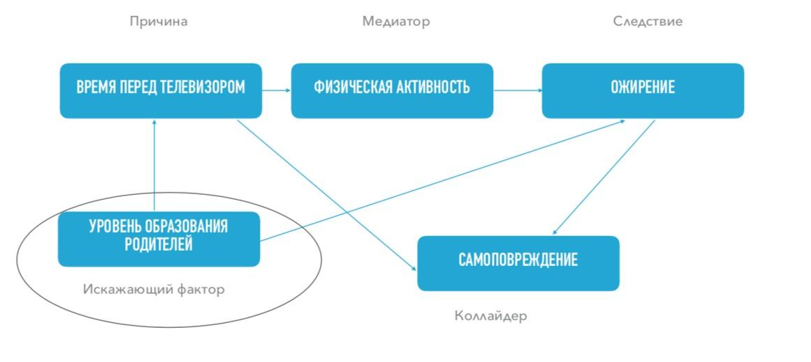
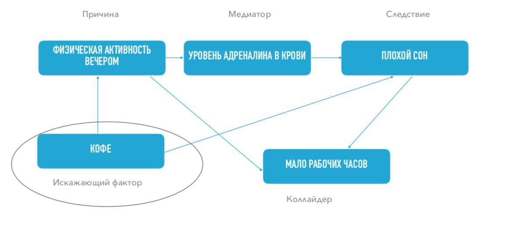

# R4.3:5 - Как работать с графами причинности

Строгие вычисления по графам с использованием статистических данных проводятся продвинутыми методами дисциплины «Теория вероятности». Графы причинности – это пример так называемых *байесовских сетей*, и для работы с ними нужно понимание алгебры событий, условных вероятностей, распределений и прочих понятий этой дисциплины. Здесь мы смогли только рассказать вам об основных принципах, и предлагаем получать дальнейшую информацию из учебной и научной литературы.

Однако работать с графом можно и без математических познаний! Мы начинаем с события (изменения мира или состояния мира), которое нам интересно понять, объяснить, предсказать, или изменить. Это может быть причина, следствия которой мы хотим обнаружить (и, возможно, поменять), но это может быть и следствие, причину которого мы хотим найти (и, возможно, убрать). Помните, что мы разделяем исследования, направленные на понимание текущего положения вещей (как правило, *негативного*), и исследования, направленные на изменение ситуации путём вмешательства (как правило, *позитивного*).

Напомним ещё один важный тезис из предыдущего подраздела: нам нужна понятная формулировка, отражающая суть вопроса/проблемы, являющейся предметом нашего исследования. Из формулировки должно быть ясно, как минимум:

- о каком событии идёт речь;
- какое иное событие мы ищем: его причину или его следствие;
- мы хотим что-то объяснить или поменять?

Примеры возможных вопросов для исследования:

- Почему сотрудники недовольны нашей компанией сейчас?
- Будут ли сотрудники довольны нашей компанией через год, если всё оставить как есть?
- Как сделать так, чтобы сотрудники были довольны нашей компанией? (Это вопрос о вероятном будущем мире, о необходимых действиях, которые приведут к другому состоянию сотрудников.)
- Почему у Васи ожирение?
- Как сделать так, чтобы Вася похудел?
- Почему упали продажи нашей компании?
- Почему сотрудник Вася стал работать в два раза лучше?
- Почему этот показатель деятельности растет?
- Какие последствия вызовет данное вмешательство в работу отдела?

Далее мы формулируем гипотезы о связях попавших в фокус нашего внимания событии с возможными причинами или следствиями, которые нам необходимо проверить.

Примеры возможных гипотез для исследования:

- Сотрудники недовольны нашей компанией потому, что у нас нет бесплатного кофе.
- Если оставить всё как есть, ключевые сотрудники в течение года уволятся.
- Чтобы сотрудники чтобы были довольны компанией, надо дать им абонементы в спортзал.
- У Васи ожирение потому, что он постоянно смотрит телевизор.
- Чтобы Вася похудел, надо дать ему абонемент в спортзал.
- Продажи нашей компании упали из-за того, что конкурент выпустил удобное приложение для заказа сепулек.
- Сотрудник стал работать в два раза лучше потому, что ему дали абонемент в спортзал.
- Этот показатель деятельности растет из-за данного вмешательства в работе отдела.
- Данное вмешательство в работу отдела вызовет рост такого-то показателя.

События и их причинно-следственные связи, составляющие наши гипотезы, вносятся в граф причинности сперва так, как они пришли нам в голову. Далее вокруг них мы начинаем добавлять другие события (*медиаторы, искажающие факторы, коллайдеры*) и связывать их в том виде и порядке, в котором их обнаруживают и предлагают эксперты в исследуемой предметной области.

Теперь вам должно быть понятно, что построение графа причинности является основной практикой *доэкспериментальной аргументации* в исследованиях, которую мы обсуждали ранее.

Построенный из экспертных и логических соображений граф причинности позволяет проверить характер связей между основными интересными нам событиями (причинами и действиями) — является ли связь причинно-следственной, или имеются другие варианты объяснения происходящего или прогноза на будущее.

Одно из важных применений графа – найти *искажающие факторы*, при необходимости сделать на них поправку, защититься от них. Искажающий фактор является причиной для изначальных причины и следствия, его обнаружение может сообщить нам, что связь между событиями совсем не такая, как нам изначально казалось. Помним, что искажающих факторов может быть несколько.

На искажающий фактор можно попытаться повлиять, чтобы повлиять на связь между двумя событиями: зафиксировать, проконтролировать при экспериментах. Если мы можем поставить эксперименты так, чтобы искажающий фактор был зафиксирован – мы можем получить значимые подтверждения нашей гипотезы о причинно-следственной связи между исходными событиями.

Например, если в группе людей, чьи родители имеют один и тот же уровень образования, выявлена сохраняющаяся зависимость между временем, проводимым перед телевизором и ожирением – влияние искажающего фактора не подтверждается, исходная гипотеза остаётся хорошим кандидатом на объяснение.

Еще пример гипотезы: *наверное, человек плохо спит потому, что он много двигается вечером.*

Событие «*физическая активность вечером*» — предполагаемая причина.

Событие «*плохой сон*» — предполагаемое следствие.

Мы хотим исследовать, связаны ли эти события причинно-следственной связью; связаны ли они какой-то другой связью; или они не связаны вообще. Основываясь на этом, мы хотим принимать дальнейшие решения (улучшить сон, например).

В первую очередь мы ищем медиатор, который можно вставить между этими событиями. Без обнаружения медиатора такие разные события, выделяемые по разным параметрам - не могут быть причиной и следствием, для этого нужен механизм связи. Можно предположить, что медиатор тут – уровень адреналина в крови. От физической активности он повышается, из-за чего потом сложно уснуть. «*Потренировались вечером*»::причина — «*не можете уснуть*»::следствие, потому что «*адреналина слишком много*»::медиатор.

Затем попробуем поискать искажающий фактор. Что-то, что может влиять и на вашу физическую активность вечером (на желание позаниматься), и на способность быстро уснуть. Например, это может быть кофе или другие стимуляторы. Соответственно: «*выпили кофе после обеда*»::ИФ — «*захотелось потренироваться вечером*»; «*выпили кофе после обеда*»::ИФ — «*не можете спокойно уснуть вечером*». Кофе — и причина вашей активности вечером, и причина плохого сна.

Можно найти и коллайдер, то есть общее следствие и вечерних тренировок, и плохого сна. Например, коллайдером будет низкая производительность (мало продуктивных рабочих часов): «*Вы тренируетесь вечером*» — «*раньше уходите с работы*». «*Вы плохо спите*» — «*на работе не можете собраться и теряете производительность*». Провалы на работе — могут быть следствием как вечерних тренировок, так и плохого сна. Но вспомните про опасность коллайдеров! Пусть и вечерние тренировки, и плохой сон независимо ведут к низкой производительности на работе. В широкой группе сотрудников связи между тренировками и сном не обнаружится. Но если мы будем изучат только тех, у кого производительность низкая (думая, что мы должны решать их проблемы в первую очередь), мы обнаружим, что те, кто *не тренируется* чаще *плохо спят*, — и рискуем принять этот артефакт отбора за несуществующую связь между тренировками и сном.

Однако обнаружение коллайдера расширяет вашу объясняющую модель, позволяет увеличить число способов её возможного применения, протягивая цепочку следствий дальше.

В целом полезность причинно-следственного графа состоит в том, что граф позволяет делать предсказания о том, как поведут себя данные, и эти предсказания можно подтвердить или опровергнуть. Поэтому граф — не картинка, а полноценная фальсифицируемая гипотеза.

Правила проверки самого графа на коррекнтность простые и работают на трёх знакомых вам конструкциях:

- ***Цепочка*** через ***медиатор***: если зафиксировать медиатор (запретить изменяться соответствующему фактору), то связь причины и следствия должна исчезнуть.
- ***Вилка*** от ***искажающего фактора***: если зафиксировать (запретить изменяться) искажающий фактор, то связь между двумя его следствиями должна исчезнуть.
- Связи между двумя причинами одного ***коллайдера*** быть не должно, но она появится, если зафиксировать сам коллайдер.

Например: в графе зафиксировано , что телевизор влияет на ожирение только через недостаток физической активности, а образование родителей влияет на оба эти события. Отсюда следует проверяемое предсказание: в группе людей с одинаковым образованием родителей и одинаковым уровнем активности связь между телевизором и ожирением должна пропасть. Допустим, мы проверили ,и связь не пропала. Значит, граф неполон: есть путь, который не включён в граф, например, цепочка через страшные новости, стресс и переедание. Данные не сказали вам, какой именно путь вы забыли, но сказали, что забыли.

Контрфактические рассуждения тоже проводятся с помощью графа - путём исключения (фиксации значения) из модели какого-то его элемента. Это называется на языке статистики *«контроль по переменной».* Проводить контрфактические рассуждения по вашим предпосылкам и по найденным вами фундаментальным исходным причинам – полезно всегда. А вот прежде, чем проводить контрфактическое рассуждение по добавленному вами в граф промежуточному узлу - проверьте, чем именно он является. По *искажающему фактору*  проверку контрфактическим рассуждением проводить нужно, по *коллайдеру* — нельзя, это создаст ложную связь. По *медиатору* — тоже нельзя, это перекроет тот самый путь влияния, который вы изучаете.

Ещё несколько советов:

- **Формулируйте события (факторы) всегда заземлённо, следите за типами объектов.** Тип сущности в причинном графе — событие/фактор, и это должны быть какие-то идентифицируемые состояния или процессы в реальном или в возможном мире, то есть 4D объекты, или их узкие классы. Абстрактные сущности не слишком пригодны для причинно-следственного анализа!
- **Формулируйте с расчетом на то, что это потом придется измерять количественно**. Даже если вы не будете потом делать сложные расчёты, это помогает заземляться и делать объяснения фальсифицируемыми.
- Для каждого узла в графе определяйте его роль: **искажающий фактор**, **медиатор** или **коллайдер**.
- Если в графе возникли **циклы**, или если вы думаете, что вы можете найти медиаторы, действующие **и в том, и в другом направлении** - проверьте референцию используемых терминов и избавьтесь от размытых понятий.

Например: в вашем графе появились события «*сотрудники делают компанию благополучной — компания делает сотрудников довольными — довольные сотрудники делают компанию благополучной»* — и так далее. Расшифруйте понятия «*благополучный*» и «*довольный*», замените их на заземлённые и измеримые показатели. Сразу станет ясно, что плести такую цепочку до бесконечности – просто невозможно.
